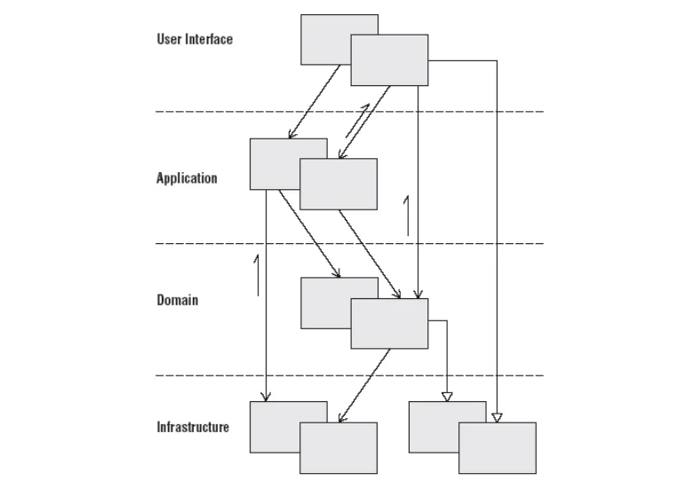

# DAO와 Repository

우테코 미션을 진행하다보면 유행?이 되는 논쟁이 있습니다. 그 중에 하나가 Repository와 DAO의 차이점 입니다. 당시 미션을 진행할 때는 “그냥 부르는 명칭의 차이가 아닌가?” 라는 생각을 했었습니다. 그리고 지금 이 시점에서 어느 정도 Repository와 DAO의 차이에 대해서 설명할 수 있을 것 같은데요. 이번 글에서는 제가 생각하고 있는 Repository와 DAO의 차이점에 대해서 정리를 해보고자 합니다.

## DAO란 무엇일까??

`DAO`는 Data Acess Object의 약자이며, J2EE에서 최초로 등장한 개념입니다. 인터페이스를 활용한 API를 제공하여 어플리케이션 계층과 퍼시스턴스 계층을 분리하기 위해서 만들어진 패턴이라고 할 수 있습니다. **하나의 데이터베이스 테이블에 대한 저수준의 CRUD 책임을 가지기 때문에, 한 테이블 당 1 : 1로 매핑**되어서 만들어집니다.

그렇다면 이 `DAO`는 왜 만들어지게 되었을까요?? 어플리케이션을 개발하다보면 영구한 저장소가 필요하게 됩니다. 흔히 저희가 데이터베이스라고 명칭하는 것들을 말하는데요. 이러한 데이터베이스는 저희가 아는 종류만 해도 매우 다양하게 존재합니다. 이러한 데이터베이스에 접근하기 위해서 각 데이터베이스에서 제공하는 Public API를 통해서 접근을 하게 됩니다.

하지만 이러한 데이터베이스 API를 직접적으로 사용하게 되면 몇가지 문제가 발생할 수 있습니다.

일반적으로 데이터베이스의 종류로 MySQL을 사용하게 됩니다. 이때 데이터베이스 운용 가격의 문제로 Maria DB로 변경해야 한다고 요구사항이 발생했다면, 우리는 이때까지 MySQL에서 제공하는 API로 작성된 로직을 전부 변경해야하는 문제가 발생하게 됩니다. 이는 어플리케이션 계층과 퍼시스턴스 계층에 속한 MySQL 관련 로직이 **직접적으로 강하게 연결되어 있어 변경에 취약하다는 점이 문제**라고 할 수 있습니다. 이는 객체지향적 관점에서 보더라도 `OCP`를 위반하였다고 할 수 있습니다.

이러한 문제를 `DAO`를 통해서 해결할 수 있습니다. 앞서서 설명했듯이 데이터베이스 구현체를 그대로 사용하지 않고 인터페이스를 통해 API를 추상화 함으로써, **실제 구현체가 변경되더라도 어플리케이션 계층을 변경하지 않아도 되는 효과**를 가질 수가 있습니다.

## Repository란 무엇일까??

그렇다면 `Repository`는 무엇일까요?? **도메인 주도 설계**에서 정의한 `Repository`는 다음과 같습니다.

> 전역적인 접근이 필요한 각 객체 타입에 대해 메모리상에 해당 타입의 객체로 구성된 컬렉션이 있다는 착각을 불러 일으키는 객체를 만든다. 잘 알려진 전역 인터페이스를 토대로 한 접근 방법을 마련하라. 객체를 추가하고 제거하는 메서드를 제공하고, 이 메서드가 실제로 데이터 저장소에 데이터를 삽입하고 데이터 저장소에서 제거하는 연산을 캡슐화하게 하라. 특정한 기준으로 객체를 선택하고 속성값이 특정 기준을 만족하는 완전히 인스턴스화된 객체나 객체 컬렉션을 반환하는 메서드를 제공함으로써 실제 저장소와 질의 기술을 캡슐화하라. 실질적으로 직접 접근해야 하는 AGGREGATE의 루트에 대해서만 REPOSITORY를 제공하고, 모든 객체 저장과 접근은 REPOSITORY에 위임해서 클라이언트가 모델에 집중하게 하라.
>

여기서 우리가 주목해야 할 부분은 **객체로 구성된 컬랙션**과 **캡슐화** 라고 생각합니다. 일반적인 웹 어플리케이션 아키텍쳐를 살펴보겠습니다. 여기서 `Repository`는 어느 계층에 속한다고 말할 수 있을까요??



우리가 개발하고 있는 프로젝트에서 `Repository`는 데이터베이스에 데이터를 저장하기 위해서 사용되게 됩니다. 그러면 **퍼시스턴스(Infrastructure) 계층**에 속한다고 말할 수 있을 것 같습니다. 하지만 **도메인 주도 설계**에서는 `Repository`는 **객체의 상태를 관리하는(CRUD) 저장소이기 때문에 도메인 계층에 속한다**고 말하고 있습니다. 그렇다면 무엇 때문에 우리는 `Repository`가 퍼시스턴스 계층에 속한다고 생각했던 걸까요??

우리는 대부분의 프로젝트에서 JPA를 사용하고 있습니다. 이때 JPA를 통해서 데이터베이스에 접근하기 위해서 우리는 `JpaRepository`라는 객체를 상속받아 `XXXRepository`를 구현해 사용을 하고 있습니다. 이 부분 때문에 우리는 `**Repository`가 퍼시스턴스 계층에 속한다고 생각**하게 됩니다.

하지만 생각해보면 우리는 어플리케이션 계층에서 비즈니스 로직을 작성할 때 `Repository` 내부가 어떻게 구현되어 있는지 모르고 사용을 합니다. 단순히 **Public API를 통해 나와있는 그 기능을 사용할 뿐**입니다. 예를 들면, `save()` 메서드가 존재하면 해당 객체를 저장하는 기능이구나, `find()` 메서드가 있으면 해당 객체를 조회하는 기능이구나 와 같이 생각하는 것 처럼 말입니다. (물론 이론상 그렇다는거고 실제로는 JPA의 동작방식을 이해해야 한다고 개인적으로 생각합니다.)

이처럼 내부 구현을 몰라도 어플리케이션 계층에서 사용이 가능한 이유는 `Repository`가 `Interface`로 구성이 되어 있기 때문입니다. 내부 구현체를 숨김으로써 **어플리케이션 계층에서는 도메인의 상태만 관리하는 기능을 수행하도록 API를 제공**하고, 실제 구현체에서는 **해당 도메인을 영속화하는 기능을 수행하기 위해 인프라 스트럭쳐와 관련되 모듈들을 Import 하여 기능을 동작**한다고 할 수 있습니다. 즉, 정리하면 우리가 사용하는 관점에서 `Repository`의 `Interface`는 도메인 레이어, `Repository`의 구현체는 퍼시스턴스(영속성) 레이어에 속한다고 할 수 있습니다.

## Dao와 Repository의 차이

지금까지 내용을 통해 `DAO`와 `Repository`의 핵심적인 차이점에 대해서 정리를 하면, `**DAO`는 데이터베이스의 테이블과 1 : 1 매핑이 되는 저수준의 CRUD 기능**을 제공한다고 할 수 있습니다. `Repository`는 도메인에 대해서 CRUD 기능을 제공하며 이러한 도메인은 데이터베이스 테이블과 1 : 1 매핑이 되는 것이 아닌 하나의 개념 단위를 묶인 것(Aggregate)이라고 할 수 있습니다. 즉, `Repository`의 구현체에서는 여러개의 `DAO`를 조합하는 방식으로 하나의 개념을 군집화하여 구현할 수도 있다 할 수 있습니다.

```java
public class OrderRepositoryImpl extends OrderRepository {

    private final OrderTableDao orderTableDao;
    private final OrderDao orderDao;
    // 생략..
}
```

사실 `DAO`를 사용하더라도 도메인에서 사용하는 `Repository Interface`와 같이 구현하면 충분히 `Repository`와 동일하게 사용을 할 수 있다고 생각합니다. 하지만 애초에 `DAO`와 `Repository` 설계의 목적 자체가 다르다고 생각을 하기 때문에 목적에 맞게 사용을 하는 것이 좋다고 생각합니다. 어쩌면 JPA에서 `JpaRepository` 라는 이름을 통해서 `Repository`를 제공하고 있기 때문에 `Repository`르 명명되는 것들이 자연스럽게 된 것 같기도 합니다

## 참고

- [https://johngrib.github.io/wiki/pattern/repository/](https://johngrib.github.io/wiki/pattern/repository/)
- [https://www.baeldung.com/java-dao-vs-repository](https://www.baeldung.com/java-dao-vs-repository)