## 들어가기 전에..

데이터 접근 기술에 관련된 개발 효율성은 `JPA`를 알기 전과 후로 나뉜다고 할 수 있습니다. 그만큼 `JPA`는 개발자에게 많은 도움을 주는 도구라고 할 수 있습니다. 하지만 그만큼 잘못 사용하면 독으로 다가올 수도 있는 도구인데요.

이번 글에서는 `JPA`를 사용함으로써 겪었던 문제들을 소개하기 전, 먼저 그에 대한 개념을 설명하고 각각의 문제사항에 대해서 공유해보는 시간을 가져보겠습니다.

## 영속성 컨텍스트

영속성 컨텍스트는 `Entity`를 논리적인 개념으로 영구히 저장하는 환경을 말합니다. 이러한 영속성 컨텍스트는 **엔티티 매니저를 통해서 접근**할 수가 있습니다. 엔티티 메니저는 **하나의 쓰레드마다 하나의 엔티티 메니저가 대응(하나의 트랜잭션 단위라고 봐도 됨)**되며 내부적으로 `DB Connection Pool`을 사용해서 `DB`에 접근을 수행합니다.

이렇게 관리되는 영속성 컨텍스트는 4가지 상태의 생명주기(Transient, Managed, Detached, Removed)로 분류할 수 있습니다.

### 문제 상황 - 왜 SELECT 쿼리가 발생하는 걸까?

예전에 프로젝트를 하던 도중, `UUID`를 `Entity`의 ID 값으로 설정해야 하는 경우가 있었습니다. 해당 `Entity`를 기반으로 비즈니스 로직을 작성하고 이에 기반한 테스트 코드도 무사히 잘 작동하는 것을 보고 안심하고 다른 작업을 수행하려고 하는데 이상한 점을 발견할 수 있었습니다.

```java
Hibernate: 
    select
        studyLog0_.id as id1_0_0_,
        studyLog0_.name as name2_0_0_ 
    from
        studyLog studyLog0_ 
    where
        studyLog0_.id=?

Hibernate: 
    insert 
        into
            studyLog
            (name, id) 
        values
            (?, ?)
```

위와 같이 `INSERT` 작업 전, `SELECT` 쿼리가 한번 발생한 후 `INSERT`가 수행되는 문제를 확인할 수 있었습니다.

### Spring Data JPA에서의 save() 처리 방식

Spring Data JPA의 `SimpleJpaRepository`는 `JpaRepository`를 구현하는 구현체로 제공되는 기본적인 `CRUD`가 어떻게 동작하는지 확인을 할 수 있습니다.

여기서 코드를 확인해보면, 새로운 객체를 생성할 때는 `persist()`, 객체를 수정할 때는 `merge()`를 호출하여 인스턴스의 영속성 관리를 해주고 있는 것을 확인할 수 있습니다.

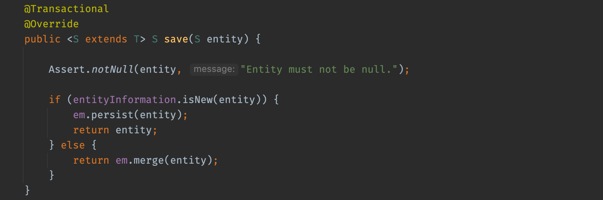

코드를 보면 `entityInformation.isNew()` 라는 메서드가 존재합니다. isNew() 메서드는 새로운 Entity를 판단하기 위해서 ID 값을 확인하는데 기본 전략을 다음과 같습니다.

- ID 타입이 객체 타입일 때 : null
- ID 타입이 기본 타입일 때 : 0

이를 통해서 `Entity`를 식별하는 값인 ID 값의 존재 여부를 파악한 뒤, `persist`와 `merge`를 선택해 수행한다고 할 수 있습니다.

여기서 문제가 되는 점은 바로 `entityInformation.isNew()` 부분이였습니다. 일반적인 경우 `@GeneratedValue(strategy = *IDENTITY*)`를 사용하기 때문에 ID 값이 `null` 이여서 `persist` 가 수행이 되었습니다. 하지만 지금과 같이 ID 값이 이미 존재하기 때문에 `merge`가 수행된 것이였습니다.

`merge`는 영속성 컨텍스트의 1차 캐시에 해당 식별자가 있는지 확인하고 없는 경우 `database`를 조회하는 작업을 수행합니다. 즉, 해당 경우에는 `UUID`이기 때문에 1차 캐시에 동일한 값이 없으므로 **무조건적으로 `SELECT` 쿼리가 한번 발생하게 되는 구조**라고 할 수 있습니다.

### 문제 해결 방법

다행이도 `JPA`에서는 `Persistable` 인터페이스를 재정의해서 문제를 해결할 수 있습니다.

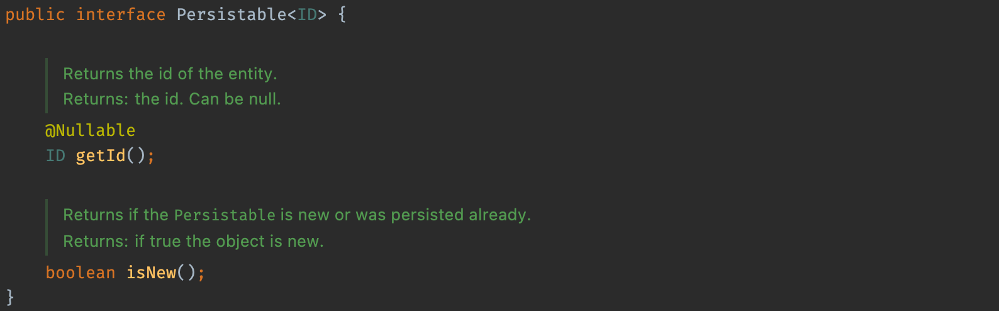

`isNew()` 메서드를 재정의해서 새로운 엔티티 확인 여부를 개발자가 직접 정의할 수 있도록 구현을 할 수 있습니다.

```java
@Getter
@NoArgsConstructor(access = AccessLevel.PROTECTED)
public class StudyLog implements Persistable<String> {
    @Id
    private String uuid;

    @CreatedDate
    private LocalDateTime createdDate; 

    public Item(String id) {
        this.id = id;
    }

    @Override
    public boolean isNew() {
        return createdDate == null; 
    }
}
```

이렇게 구현을 하게 될 경우 원하는 대로 `INSERT` 쿼리가 한번만 나가는 것을 확인할 수 있습니다.

```java
Hibernate: 
    insert 
        into
            studyLog
            (name, id) 
        values
            (?, ?)
```

## Flush

`entityManager.commit()`을 호출하게 되면 JPA의 영속성 컨텍스트에 있는 객체들이 DB로 반영되게 됩니다. 하지만 실제로는 `commit()` 메서드가 `flush()` 메서드를 호출해 이를 반영하는 것입니다.

`Flush`는 영속성 컨텍스트의 내용을 `DB`에 반영하는 것을 말하며, 정확하게는 `쓰기 지연 SQL` 저장소에 있는 `SQL` 쿼리가 `DB`로 보내주는 역할을 한다고 할 수 있습니다.

`Flush`가 호출되는 상황은 크게 다음과 같습니다.

- 트랜잭션에 commit이 발생할 때
- EntityManager의 flush 메서드를 호출했을 때
- JPQL 쿼리가 실행될 때 - (정확하게 말하면 틀린말)

### 문제 상황 - 왜 데이터베이스에 반영이 안되지..?

변경감지를 통해서 해당 객체의 데이터 값을 변경해야 하는 비즈니스 로직을 작성해야 했었습니다. 다음과 같이 테스트 코드를 작성하고 비즈니스 로직을 완성하였습니다. (예시를 위해 코드를 간단하게 변경하였습니다)

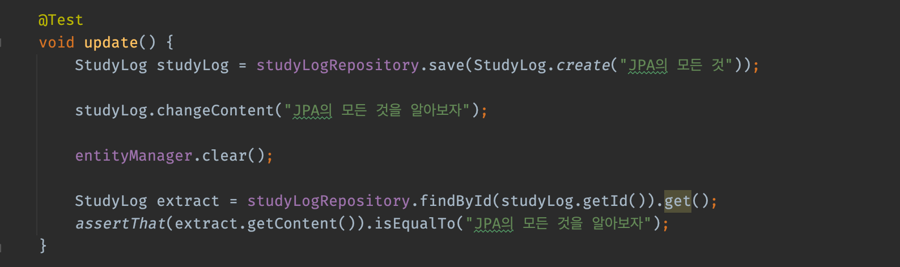

하지만 테스트가 실패하는 것을 확인할 수 있었습니다.

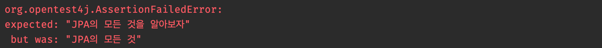

그런데 또 웃긴상황인건 실제 프로덕션 코드에서는 정상적으로 로직이 동작하는 것을 확인할 수 있었습니다. 그렇다는 것은 실제 프로덕션 코드는 문제가 없고 테스트 코드를 잘못 작성했다는 얘기였습니다. 하지만 아무리봐도 코드 자체는 문제가 없어보였습니다.

### Flush의 동작 방식을 다시 학습하자 ㅠㅠ

`Flush` 호출 상황에 대한 검색을 해보면 위에서 언급된 다음 3가지 상황이 나오게 됩니다.

- 트랜잭션에 commit이 발생할 때
- EntityManager의 flush 메서드를 호출했을 때
- JPQL 쿼리가 실행될 때

그렇다면 테스트 코드에서는 이러한 조건을 하나라도 만족하는 것이 있을까요?? 눈치 채셨겠지만 해당 조건을 만족하는 코드가 존재하지 않습니다. 실제 프로덕션 처럼 `commit`을 하는 과정이 없기 때문입니다.

### 해결 방법

해결방법은 간단했습니다. 아까 말한 것 처럼, 실제 프로덕션에서는 `Transaction`이 끝나는 시점에 `commit`이 이루어지기 때문에 `Flush`가 호출되었습니다. 테스트 코드는 이러한 과정이 없기 때문에 직접 `Flush`를 날려주는 코드를 작성해주면 됩니다.

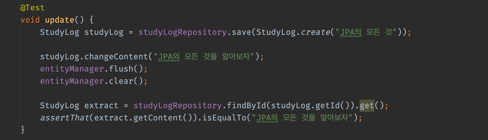

### 문제 상황 - 왜 데이터베이스에 반영이 안되지 22..?

프로젝트 중, 한 메서드에서 도메인의 카운트를 감소하고 다른 도메인에서 논리적 삭제를 해주는 코드를 작성해야 했었습니다. 역시 다음과 같이 테스트 코드를 작성하기 비즈니스 로직을 완성하였습니다. (예시를 위해 코드를 간단하게 변경하였습니다)

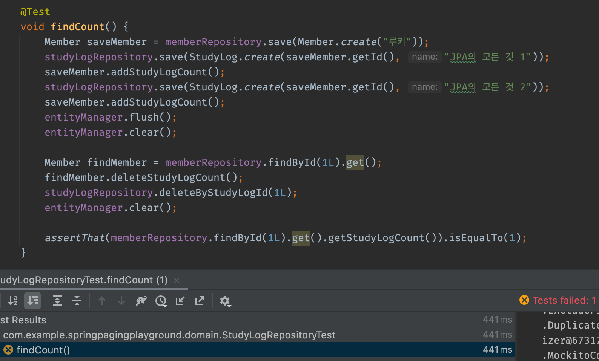

`JPQL` 쿼리가 실행되기 때문에, 당연히 `Flush`가 발생할 것이라 생각했지만, 로그를 확인해보니 예상과 다르게 `Flush`가 동작하지 않는 것을 확인할 수 있었습니다.

### JPQL은 해당 쿼리와 관련이 있는 엔티티만 플러시를 한다

`Flush` 호출 상황에 대한 블로그 검색을 해보면 대부분 `JPQL` 쿼리가 실행될 때 `Flush`가 호출되어 있다고 작성되어 있습니다. 하지만 `Hibernate Docs`를 살펴보면 다음과 같이 작성되어 있습니다.

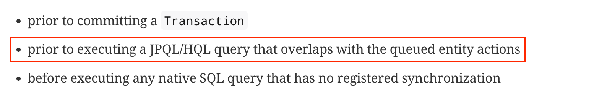

현재 위의 코드에서는 영속성 컨텍스트에서 `Member - StudyLog`간의 `Entity Actions`가 존재하지 않습니다. 즉, 위에서 말한 `Flush`가 호출되는 상황에서  `JPQL` **쿼리가 실행될 때 Flush가 호출된다** 라는 말은 엄밀히 말하면 잘못된 말이라고 할 수 있습니다.

### 해결 방법

해결 방법은 간단합니다. 다음과 같이 영속성 컨텍스트에 `Flush` 처리를 해주면 됩니다.

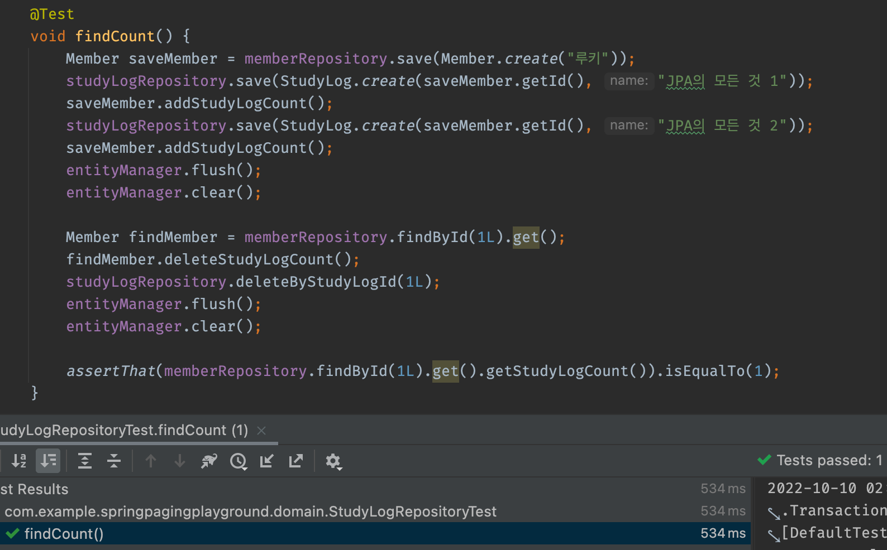

하지만 과연 프로덕션 코드에서 이렇게 `Flush`를 직접 호출하는 것이 올바른 방법인지에 대해서는 아직 의문점을 가지고 있는 상태입니다. 더 좋은 방법이 있다면 그 방법을 통해서 문제를 해결할 것 같습니다.

해당 문제를 해결하면서 들었던 생각은, 가끔 간접참조를 통해서 각 `Entity`들을 설계하는 경우가 많은데 해당 경우에 **영속성 컨텍스트의 상태가 어떻게 관리가 될 것**인지 항상 고려하고 사용해야 할 것 같습니다.

## N + 1

`N + 1` 은 **조회 시 1개의 쿼리를 생각하고 설계를 하였으나 생각하지 못한 조회의 쿼리가 N개가 추가적으로 발생하는 문제**를 말합니다. JPA의 경우 객체에 대해서 조회를 하게 되면서, 다양한 연관관계들의 매핑에 의해 관계가 맺어진 다른 객체가 함께 조회되는 경우 `N + 1` 이 발생하게 됩니다.

### 문제상황 - 즉시 로딩에서의 N + 1 문제점

1 : N 관계를 가지고 있는 엔티티 관계가 있다고 가정하겠습니다. 1에 해당하는 엔티티에 대해서 전체 조회를 위해 Spring Data JPA의 `findAll()` 메서드를 이용해서 조회를 하게 되면 N + 1 문제가 발생하게 됩니다.

### 작성된 JPQL은 결과를 반환할 때 연관관계까지 고려하지 않는다

위처럼 `findAll()` 쿼리 메서드를 호출할 경우 `select x from Table x` 라는 `JPQL`로 번역이 되게 됩니다. `JPQL`은 결과를 반환할 때 해당 엔티티의 연관관계를 고려하지 않습니다. 즉, SELECT 절에 지정된 엔티티만 조회를 하게 됩니다.

이렇게 엔티티 조회를 한 후, JPA는 조회한 엔티티의 내부 연관관계를 확인합니다. 현재 연관관계가 즉시로딩으로 설정되어 있기 때문에 연관된 엔티티를 검색하면서 N번의 쿼리가 발생하게 됩니다.

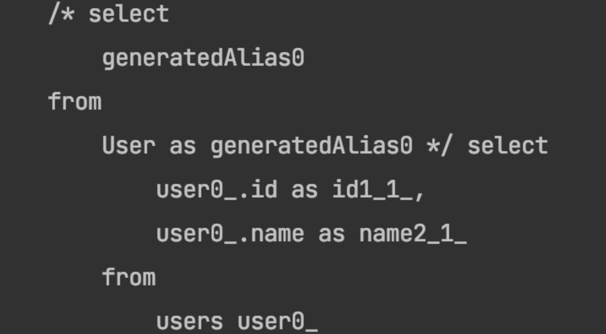

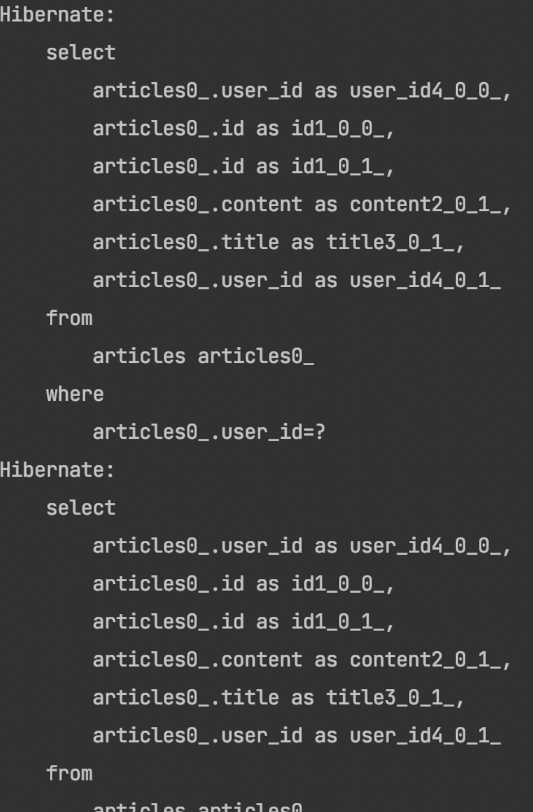

### 문제상황 - 지연 로딩에서의 N + 1 문제점

역시 동일하게 1 : N 관계를 가지고 있는 엔티티 관계가 있다고 가정하겠습니다. 지연 로딩으로 설정하였기 때문에 연관된 객체를 사용하는 시점에 조회를 하게 됩니다. 이 때문에 N + 1이 발생하지 않는다고 생각할 수 있지만, 상황에 따라서 N + 1 문제가 발생하게 됩니다.

### 지연 로딩은 연관된 객체를 프록시로 가진다.

지연 로딩을 사용한 상태에서 `findAll()` 쿼리 메서드를 호출할 경우 역시 동일하게 `select x from Table x` 라는 `JPQL`로 번역이 되게 됩니다. 이 때 SELECT 절에 지정된 엔티티만 조회하여 정보를 가져오게 되고, 연관관계가 맺어진 엔티티는 프록시로 가져오게 됩니다. 이 때문에 처음에는 N + 1 이 발생하지 않지만, 추후에 연관관계가 맺어진 엔티티를 조회한다면 프록시가 아닌 실제 엔티티를 가져오기 위해 조회쿼리가 발생해 N + 1 이 발생하게 됩니다.


### 해결 방법

N + 1 문제를 해결하기 위해서는 `FetchJoin`, `BatchSize`, `EntityGraph`총 3가지 방법을 통해서 문제를 해결할 수 있습니다.

저는 `FetchJoin`과 `BatchSize`를 각 상황에 맞게 적절하게 섞어서 사용하기로 하였습니다. `EntityGraph`를 고려하지 않은 이유는 `Join` 방식이 `Left Outer Join`으로 강제된다는 점 때문에 좀 더 상황에 맞게 대처가 가능한 나머지 방법들을 사용하여서 문제를 해결하였습니다.

> FetchJoin을 통한 해결방법
>

FetchJoin은 SQL에서 사용하는 조인의 종류가 아니고 JPQL에서 성능 최적화를 위해 제공하는 기능입니다. FetchJoin을 통해 연관된 엔티티나 컬렉션을 한 번에 같이 조회를 할 수 있습니다.

```java
@Query("select distinct u from User u left join fetch u.articles")
List<User> findFetchAll();
```

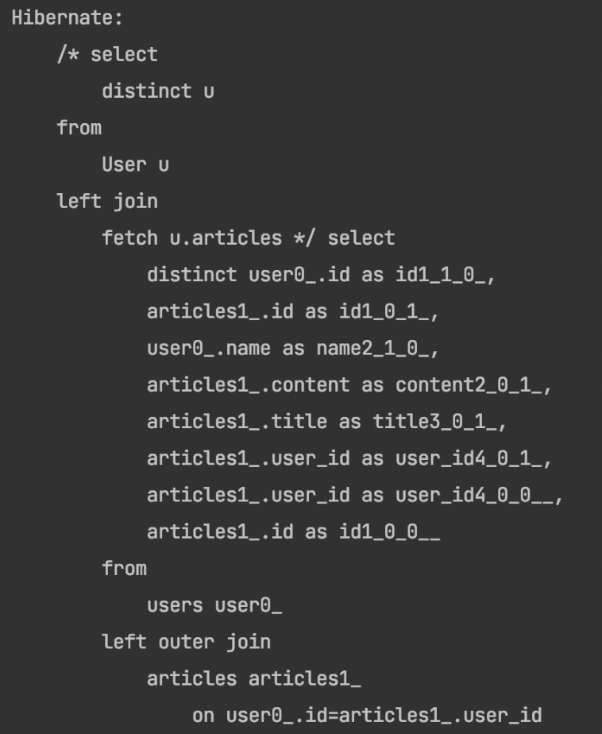

> BatchSize를 통한 해결방법
>

하이버네이트가 제공하는 `org.hibernate.annotations.BatchSize` 어노테이션을 이용하면 연관된 엔티티를 조회할 때 지정된 사이즈 만큼 SQL의 IN절을 사용해서 조회합니다. 즉, 연관관계가 있는 엔티티를 조회하면 IN 절을 통해 한번에 조회하게 되어 총 1 + 1의 쿼리가 발생하게 됩니다.

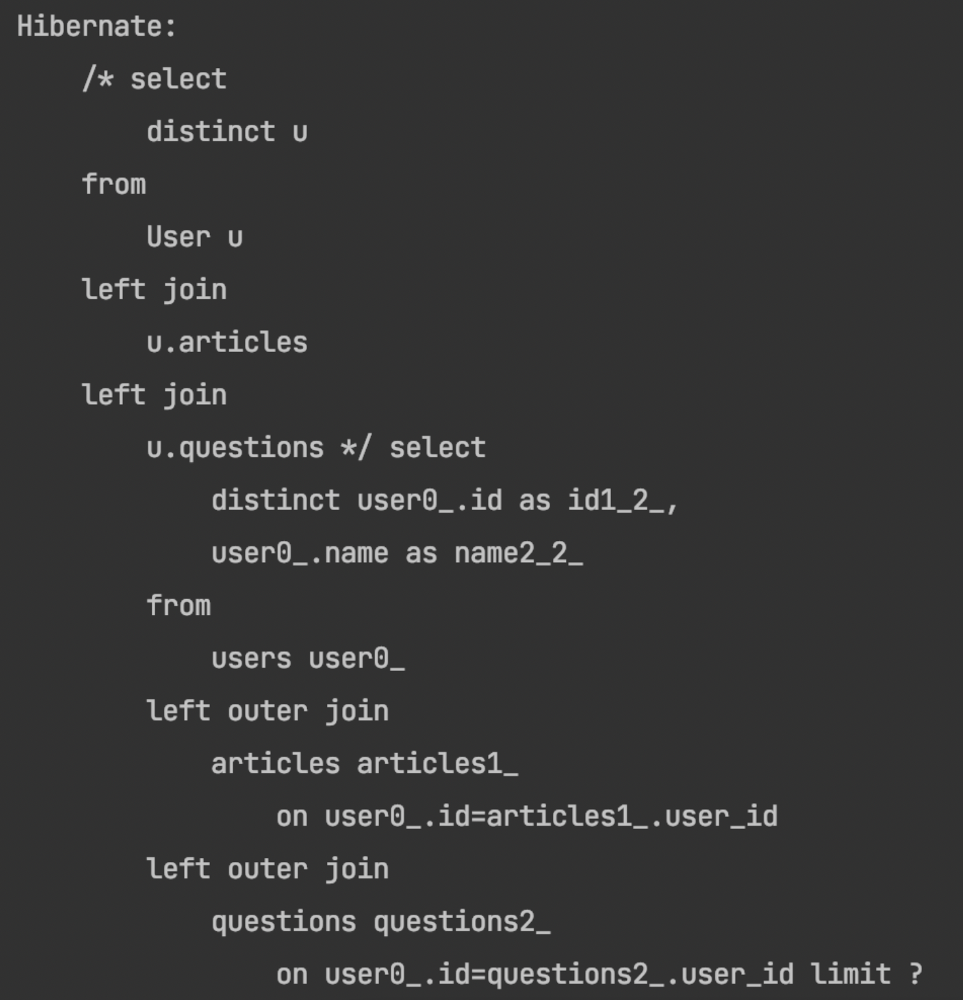

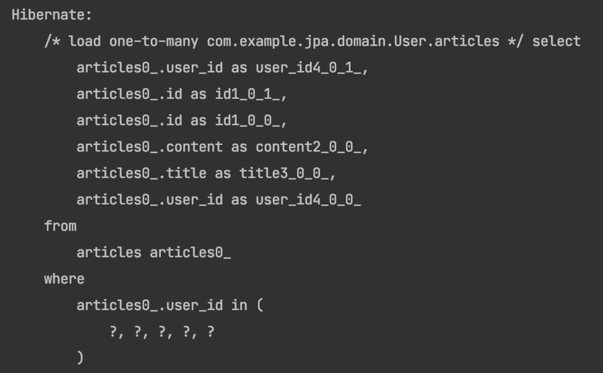

### 추가적인 문제 상황 - 일대다 관계에서의 페이지네이션

1 : N 관계에서의 N + 1 문제 해결과 동시에 페이지네이션까지 고려해야 한다면 `FetchJoin`이 불가능합니다.

RDMS 관점에서 보면 일대다 관계는 `Collection Join`이 되기 때문에 드라이빙 테이블을 기준으로 드리븐 테이블의 값들이 중복되게 됩니다. 이렇게 조회 값들이 중복된 상태에서  `Collection Fetch`를 해서 `Paging`을 하긴했지만 `applying in memory` 즉, 인메모리를 사용해서 조인을 하는 방법을 사용하기 때문입니다. **이 방법은 `OOM`이 발생할 확률이 매우 높아서 사용을 하면 안됩니다**.

그렇기 때문에 페이징을 적용해야 하는 경우 `BatchSize`로 해결하는 방법이 사실상 가장 좋은 해결책입니다.


## 마무리

지금까지 제가 `JPA`를 사용하면서 경험했던 트러블 내용들을 한번 정리해보았습니다. `JPA`는 정말 편리하게 개발을 도와주어 개발 능률을 올려주는 도구이기도 하지만 잘못된 사용시 원인 파악이 힘들어 오히려 능률을 떨어트리는 양날의 검같은 도구인 것 같다는 생각이 사용하면 할수록 드는 것 같습니다. 앞으로도 `JPA`를 항상 조심해서 사용해야겠다는 생각을 하면서 글을 마치겠습니다.

> 참고한 곳
>
- [https://docs.jboss.org/hibernate/orm/5.4/userguide/html_single/Hibernate_User_Guide.htm](https://docs.jboss.org/hibernate/orm/5.4/userguide/html_single/Hibernate_User_Guide.html)