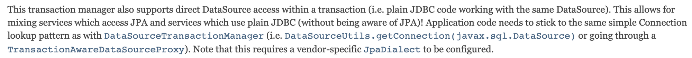
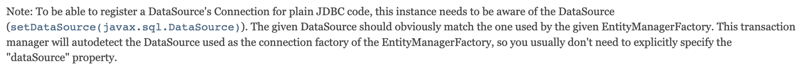

스프링은 트랜잭션 처리에 대한 추상화를 제공하기 때문에 제공되는 **PlatformTransactionManager**(정확하게는 AbstractTransactionManager)를 기준으로 여러 형태의 트랜잭션 제공 기술들을 사용할 수 있도록 기능을 제공하고 있습니다.

직접 **JpaTransactionManager**를 확인해보면, JDBC를 사용하기 위해서는 **DataSourceTransactionManager**를, JPA의 구현체인 Hibernate에 대한 트랜잭션을 사용하기 위해서는 **HibernateTransactionManager**를, JPA에 대해서는 **JpaTransactionManager**를 지원하고 있습니다.

여기서 문득 궁금증이 생겼던 점은 프로젝트에서 JPA와 JDBC를 둘다 사용하고 있음에도 불구하고 **TransactionManager**를 변경하는 작업을 해준적이 없다는 점입니다.

## JpaTransactionManger는 JDBC도 지원을 한다.

놀랍게도 **JpaTransactionManager**는 동일한 데이터베이스에 대해 JPA 형태의 접근 방식과 JDBC 형태의 DB 접근 방식이 섞여 있는 하나의 기능에 대해 온전한 트랜잭션을 제공하고 있습니다.

이는 **JpaTransactionManager**의 API 명세에서도 확인할 수 있습니다.



즉, JPA와 JDBC가 하나의 트랜잭션 내에서 동일한 데이터베이스만 바라보고 있다면 이들을 묶어서 트랜잭션으로 처리해줄 수 있다는 점입니다.



## DataSourceTransactionManager만 사용한다면?

그렇다면 JDBC를 처리하는 방법인 **DataSourceTransactionManager**만 사용한다면 어떨까요?? 한번 테스트를 통해서 이를 확인해보도록 하겠습니다.

먼저 **DataSourceTransactionManager**를 빈으로 등록해주는 작업을 수행해주겠습니다.

```java
@Configuration
@EnableJpaAuditing
@EnableJpaRepositories(
    basePackages = "com.playground.transactionManager",
    transactionManagerRef = "jpaTransactionManager"
)
@EnableTransactionManagement
public class DatabaseConfig {
    @Bean
    public PlatformTransactionManager datasourceTransactionManager(final DataSource dataSource){
        DataSourceTransactionManager dataSourceTransactionManager = new DataSourceTransactionManager();
        dataSourceTransactionManager.setDataSource(dataSource);
        
        return dataSourceTransactionManager;
    }

    @Bean
    public PlatformTransactionManager jpaTransactionManager(final EntityManagerFactory entityManagerFactory) {
        JpaTransactionManager jpaTransactionManager = new JpaTransactionManager();
        jpaTransactionManager.setEntityManagerFactory(entityManagerFactory);
        
        return jpaTransactionManager;
    }
    
    @Bean
    public LocalContainerEntityManagerFactoryBean entityManagerFactory(final DataSource dataSource) {
        LocalContainerEntityManagerFactoryBean emf = new LocalContainerEntityManagerFactoryBean();
        emf.setJpaVendorAdapter(jpaVendorAdapter());
        emf.setDataSource(dataSource);
        emf.setPersistenceUnitName("persistenceJpa");
        emf.setPackagesToScan("com.playground.transactionManager.*");
        emf.setJpaProperties(additionalProperties());

        return emf;
    }

    // JpaVendor, Properties 등등 생략...
}
```

그리고 실제 테스트를 수행하는 메서드에 `@Transactional` 애노테이션에 **DataSourceTransactionManager** 를 사용하도록 작업을 수행해줍니다.

```java
@RequiredArgsConstructor
@Service
public class TestJdbcTransactionManagerService {

    private final JdbcTemplate jdbcTemplate;
    private final MemberRepository memberRepository;

    @Transactional(transactionManager = "datasourceTransactionManager")
    public Long create() {
        // 생략...
    }
}
```

그리고 테스트를 수행해보면 다음과 같은 에러가 발생하는 것을 확인할 수 있습니다.

```java
Caused by: java.lang.IllegalStateException: 
    Already value [org.springframework.jdbc.datasource.ConnectionHolder@19f0c22e] 
    for key [HikariDataSource (HikariPool-1)] bound to thread [Test worker]
        at org.springframework.transaction.support.TransactionSynchronizationManager.bindResource(TransactionSynchronizationManager.java:193)
        at org.springframework.orm.jpa.JpaTransactionManager.doBegin(JpaTransactionManager.java:421)
```

즉, 결론적으로 **JpaTransactionManager** 를 통해서는 JPA와 JDBC를 둘다 사용할 수 있지만, **DataSourceTransactionManager** 만으로는 JDBC만 사용을 할 수 있습니다.

## 참고

- [https://docs.spring.io/spring-framework/docs/current/javadoc-api/org/springframework/orm/jpa/JpaTransactionManager.html](https://docs.spring.io/spring-framework/docs/current/javadoc-api/org/springframework/orm/jpa/JpaTransactionManager.html)
