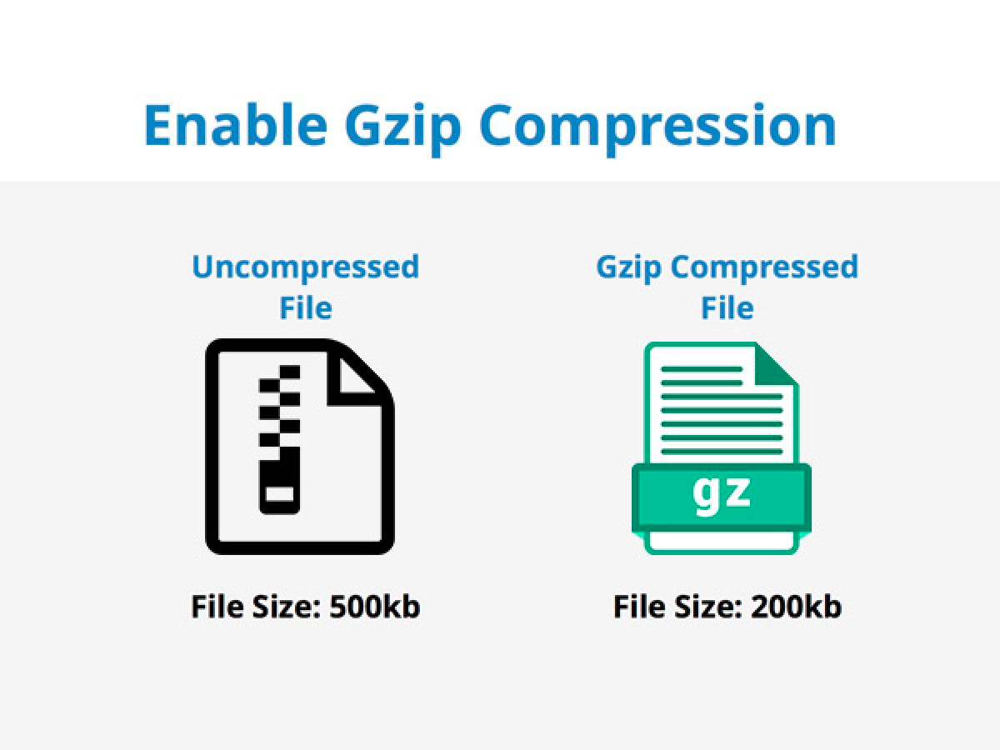
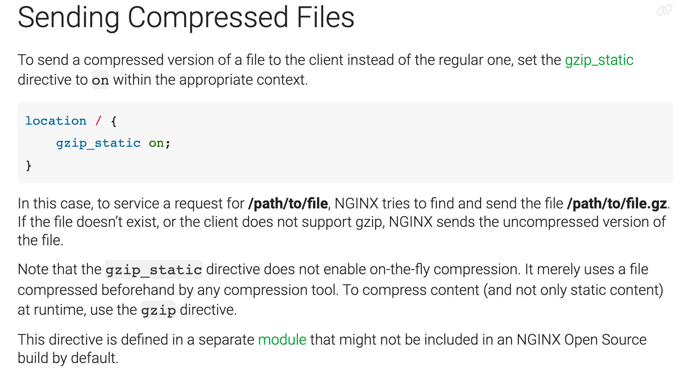
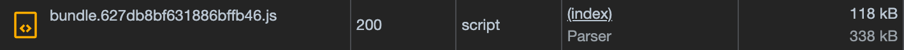
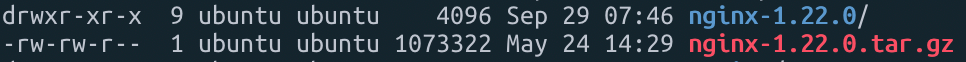
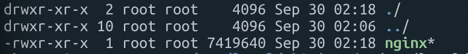
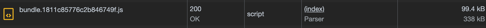
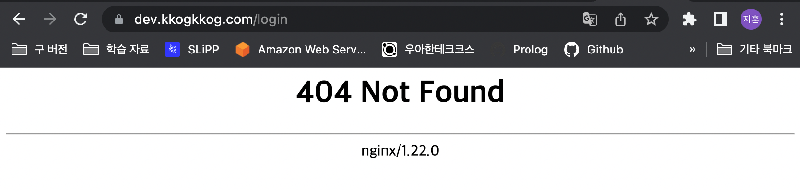
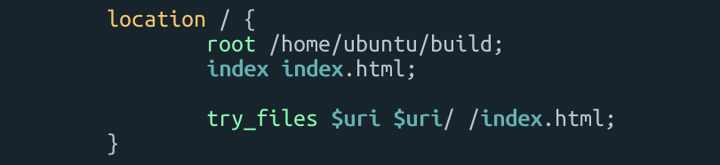
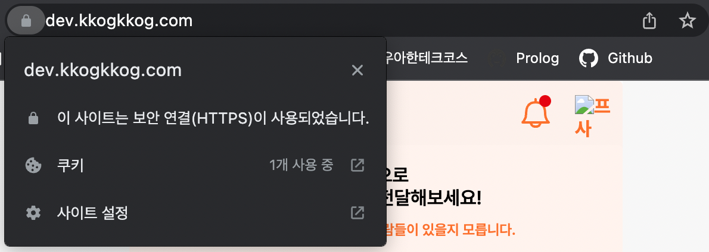

## 문제 상황

5차 데모를 앞두고 프론트 팀의 요구사항으로 다음과 같은 요구사항을 확인할 수 있었습니다.


프론트 팀에서는 최적화 대상 중에 하나로 `bundle.js` 에 압축을 하기로 하였고, 이를 위해서 `gzip`으로 압축을 하기로 결정을 하였습니다.



일반적으로 보통 `Nginx`에서 `gzip`으로 압축을 처리할 수 있기 때문에, 압축 설정을 해주면 다음과 같이 압축이 된 것을 확인할 수 있습니다.


하지만 저희 프론트 팀은 내부적으로 압축을 최적화해서 `build` 파일을 보내주기 때문에 압축된 파일을 사용하도록 `Nginx`를 설정해야 했습니다.

이를 사용하기 위해 `Nginx Docs`를 살펴보던 도중, 다음과 같은 내용을 확인할 수 있었습니다.



내용을 간단하게 정리하자면, 압축된 파일 버전을 사용하지 않고 일반 파일 버전을 사용하고 싶은 경우 `gzip_static` 설정을 `on` 으로 변경해주면 된다는 내용이였습니다. 즉, 저희는 내부적으로 이미 최적화된 파일을 보내기 때문에 **일반 파일 버전을 보내주는 해당 설정을 적용하면 저희가 원하는 결과**를 얻을 수 있을 것이라 생각했습니다.



하지만 불행하게도 결과는 동일했습니다. 처음에는 설정 파일을 잘못 작성해서 그런것이라 생각해 `Nginx` 설정을 지우고 다시 작성하기를 반복해 보았지만, 기존과 동일한 결과를 보여주었습니다. 이때 무언가 잘못됨을 깨닫고 공식문서를 꼼꼼하게 읽어보니 마지막 문장을 발견할 수 있었습니다.


해당 설정은 **기본적으로 `Nginx` 오픈소스 빌드에 포함되지 않을 수도 있으며 별도의 모듈에 정의되어 있다는 내용**이였습니다. 결국 일반적인 오픈소스로는 이를 사용할 수 없었고, 수동으로 `Nginx`를 설치하고 필요한 모듈을 붙여주기로 결론을 내렸습니다.

## 우당탕탕 Nginx 컴파일 설치

### 컴파일 환경 만들기

먼저 `Nginx`의 코어 및 모듈들의 동작에 필요한 라이브러리와 기본 패키지에서 제공하는 모듈을 사용할 수 있게 개발자 패키지와 컴파일러가 필요했습니다. 다음 명령어를 통해 이를 수행할 수 있습니다.

```bash
apt-get install make libperl-dev libpcre3 libpcre3-dev zlib1g zlib1g-dev openssl libssl-dev libxml2-dev libxslt1-dev libgd-dev libgeoip-dev google-perftools libgoogle-perftools-dev gcc g++
```

그리고 `Nginx` 사이트에서 `Nginx`파일들을 다운 받습니다.

```bash
wget http://nginx.org/download/nginx-1.22.0.tar.gz
tar -zxf nginx-1.22.0.tar.gz
cd nginx-1.22.0
```



`Nginx`까지 다운을 받았다면, `Nginx`의 환경설정을 진행해줍니다. 기본 패키지에서 제공하는 모든 기능과 모듈, 실행 파일 위치와 각 기능에 필요한 디렉토리를 설정하는 것을 포함하도록 설정 파일을 작성합니다. **여기서 유의해야 할 점은 `Nginx`는 새로운 모듈을 추가해주기 위해서 재컴파일**을 해야 합니다. 저는 향후 번거롭지 않도록 패키지에 포함된 모든 모듈을 사용할 수 있도록 작성을 합니다.

```bash
./configure \
--sbin-path=/usr/local/sbin/nginx \
--conf-path=/usr/local/nginx/nginx.conf \
--pid-path=/var/run/nginx.pid \
--with-http_ssl_module \
--with-http_v2_module \
--with-http_realip_module \
--with-http_addition_module \
--with-http_xslt_module \
--with-http_image_filter_module \
--with-http_geoip_module \
--with-http_sub_module \
--with-http_dav_module \
--with-http_flv_module \
--with-http_mp4_module \
--with-http_gunzip_module \
--with-http_gzip_static_module \
--with-http_auth_request_module \
--with-http_random_index_module \
--with-http_secure_link_module \
--with-http_slice_module \
--with-http_degradation_module \
--with-http_stub_status_module \
--with-http_perl_module \
--with-mail \
--with-mail_ssl_module \
--with-stream \
--with-stream_ssl_module \
--with-google_perftools_module \
--with-cpp_test_module \
--with-debug
```

보통 저희가 사용하는 `apt` 혹은 `apt-get`을 사용해 `Nginx`를 설치하게 되면, 설정 파일이 위치하는 디렉토리가 `/etc/nginx`에 위치하게 됩니다. 하지만 수동으로 설치를 해주게 되면 `/usr/local/nginx`에서 위치하게 됩니다.

**(만약 `Let’s Encrypt`를 사용한다면 해당 설정은 조금 문제가 있기 때문에, 밑의 트러블 슈팅을 참고하시면 됩니다!!)**

해당 설정 입력 후 실행을 하게 되면, 특별한 문제가 없을 경우 설정 관련 옵션들이 추가되며 컴파일을 할 준비가 끝나게 됩니다.

### Nginx 컴파일하기

이제 `make` 명령어를 통해서 컴파일을 시작합니다.

```bash
sudo make
```

역시 컴파일도 문제가 없다면 다음과 같은 화면을 만날 수 있습니다.


컴파일도 문제가 없다면 이제 설치를 진행합니다.

```bash
sudo make install
```

설치에 문제가 없다면, 이제 `Nginx`를 실행할 수 있습니다. 아까의 환경 설정에서 지정한 설정 파일 경로로 이동한 후,  `nginx.conf`에서 원하는 대로 `Nginx`를 설정한 다음 서비스를 시작하면 `Nginx`를 구동할 수 있습니다.

```bash
# Nginx 폴더 위치 찾기
find . -name "*nginx*"

# Nginx 설정 파일인 nginx.conf로 이동 (sudo vim을 활용해 설정 수정)
cd /usr/local/nginx

# Nginx 서비스 시작
/usr/local/sbin/nginx
```



그리고 압축하고자 하는 `bundle.js`가 잘 전달되었는지 확인을 해보면…



드디어!! 정상적으로 압축된 파일이 넘어온 것을 확인할 수 있습니다!!

> 참고. Nginx 서비스 명령어
>

```bash
# Nginx 서비스 시작
sudo /usr/local/sbin/nginx 

# Nginx 서비스 정지
sudo /usr/local/sbin/nginx -s stop 

# Nginx 서비스 재시작
sudo /usr/local/sbin/nginx -s reload 

# Nginx 서비스 설정 파일 syntax 테스트
sudo /usr/local/sbin/nginx -t
```

## 트러블 슈팅하기

압축 파일 전송까지 잘 되었기 때문에 모든 기능이 정상적으로 잘 동작할 것이라 생각했지만, 아쉽게도 그러지 못했습니다.

### URL로 직접 접근할 경우 발생하는 404

처음으로 마주한 문제는 특정 페이지로 이동할 경우 404가 발생하는 상황이 있었습니다.



404가 발생한다는 것은, 라우팅 경로가 문제가 있다는 의미이므로 `location` 설정을 수정해주어야 했습니다. 그래서 다음과 같이 해당 경로의 파일을 찾지 못할 경우 최상위 `html`인 `/index.html`로 이동하는 설정을 추가해주면서 404 문제를 해결할 수 있었습니다.



### HTTPS 미적용

404 까지 해결되었기 때문에 더 이상의 문제는 없을 것이라 생각했으나, 다음과 같이 `HTTPS`가 적용되지 않은 것을 확인할 수 있었습니다.


분명 설정 파일에는 `HTTPS`를 위한 설정이 다 되었기 때문에 적용이 되어야 했지만, 다음 화면처럼 적용이 되지 않은 것을 확인할 수 있었습니다. 몇번의 검색끝에 그 이유를 알 수 있었는데, 원인은 `nginx.conf`가 저장되는 위치가 다르기 때문이였습니다.

위에서 설명했듯이 기존처럼 `apt`, `apt-get`을 통해서 `Nginx`를 설치하게 되면 `/etc/nginx` 에 위치하게 되지만, 수동으로 설치하면 `/usr/local/nginx` 에 위치하게 됩니다. 여기서 문제는 저희가 `HTTPS` 적용을 위해서 사용하는 `Let’s Encrypt`가 `/etc/nginx` 를 기준으로 설정이 적용된다는 점입니다.

결국 기존과 동일하게 적용을 해주기 위해서 다음과 같이 `nginx.conf`의 설정 위치를 변경해주는 환경 설정 옵션을 작성하고, 기존과 동일하게 설치 작업을 다시 진행주었습니다.

```bash
# 기존의 nginx.conf 위치
--conf-path=/usr/local/nginx/nginx.conf \

# 변경할 nginx.conf 위치
--prefix=/usr/share/nginx \
--conf-path=/etc/nginx/nginx.conf \
--error-log-path=/var/log/error.log \
--http-log-path=/var/log/access.log \
```

```bash
# 변경된 설정
./configure \
--sbin-path=/usr/local/sbin/nginx \
--prefix=/usr/share/nginx \
--conf-path=/etc/nginx/nginx.conf \
--error-log-path=/var/log/error.log \
--http-log-path=/var/log/access.log \
--pid-path=/var/run/nginx.pid \
--with-http_ssl_module \
--with-http_v2_module \
--with-http_realip_module \
--with-http_addition_module \
--with-http_xslt_module \
--with-http_image_filter_module \
--with-http_geoip_module \
--with-http_sub_module \
--with-http_dav_module \
--with-http_flv_module \
--with-http_mp4_module \
--with-http_gunzip_module \
--with-http_gzip_static_module \
--with-http_auth_request_module \
--with-http_random_index_module \
--with-http_secure_link_module \
--with-http_slice_module \
--with-http_degradation_module \
--with-http_stub_status_module \
--with-http_perl_module \
--with-mail \
--with-mail_ssl_module \
--with-stream \
--with-stream_ssl_module \
--with-google_perftools_module \
--with-cpp_test_module \
--with-debug
```

여기까지 완료한다면 기존과 동일하게 서비스를 적용할 수 있으며 `gzip` 까지 깔끔하게 적용된 것을 확인할 수 있습니다.



> 참고자료
>

[https://docs.nginx.com/nginx/admin-guide/web-server/compression/](https://docs.nginx.com/nginx/admin-guide/web-server/compression/)