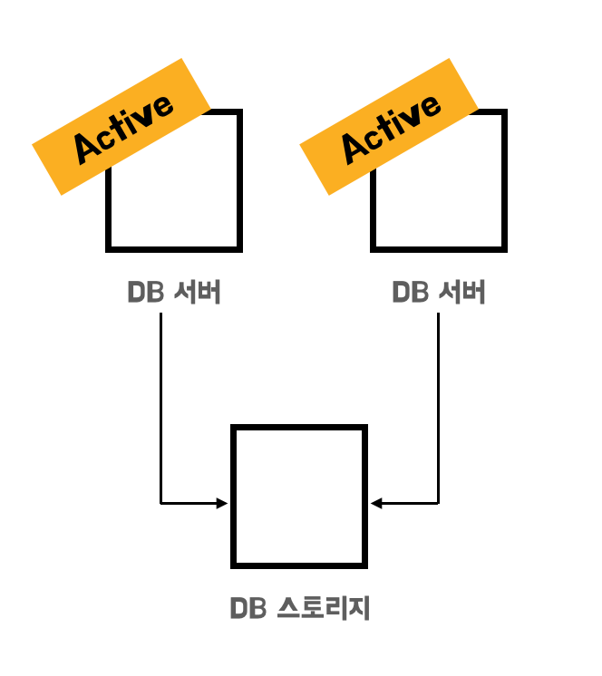
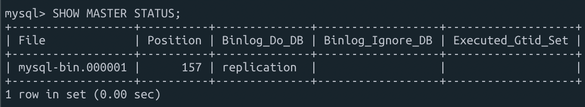
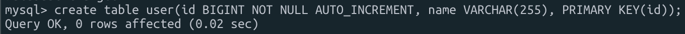
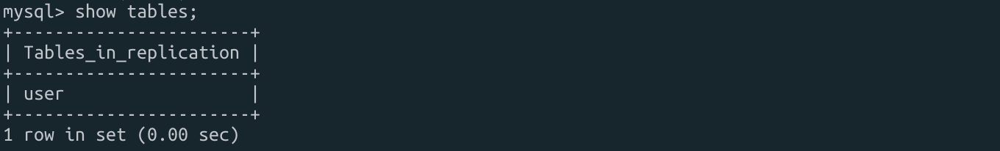
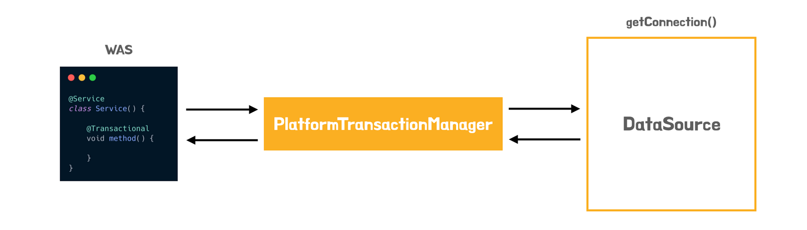
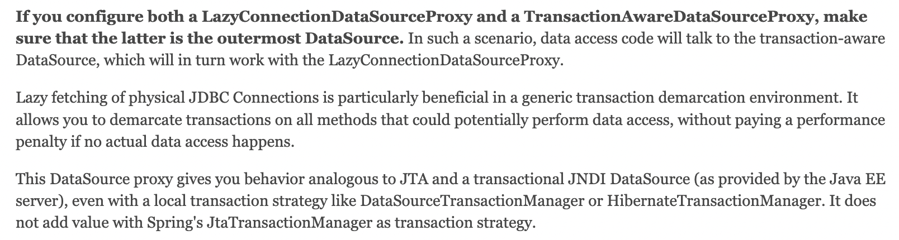
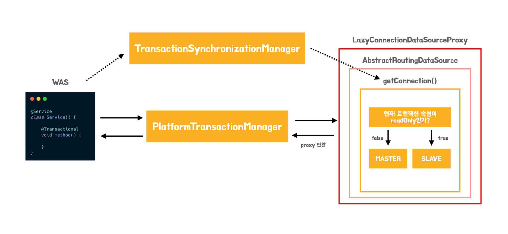
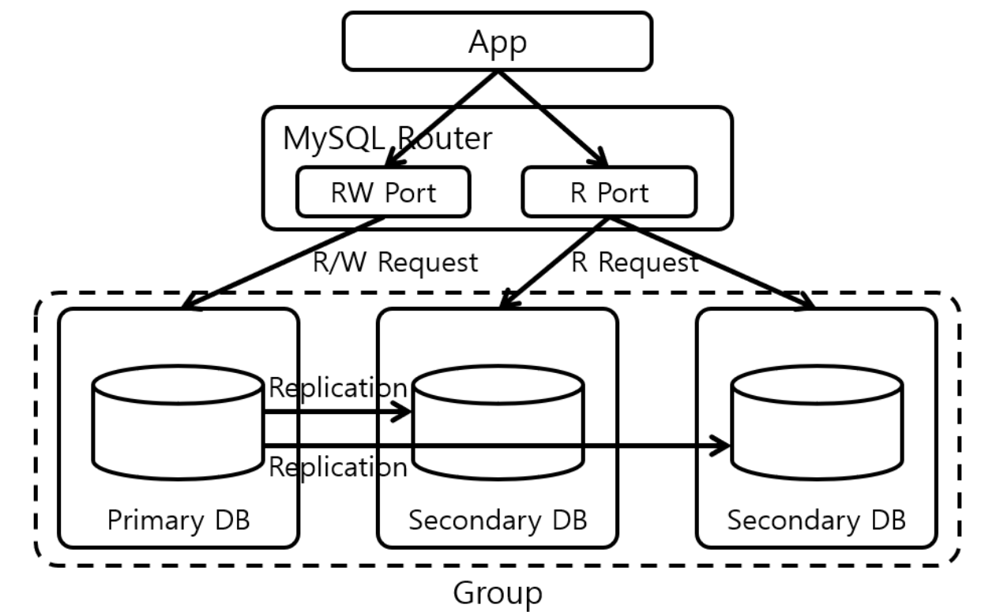

## 사용배경

현재 진행하고 있는 프로젝트에서 쿠폰 시스템을 만들고 있습니다. 현재 시스템상 내부 인원들만 사용을 하고 있기 때문에 부하에 대한 문제를 걱정하지 않아도 되지만, 해당 시스템이 실제 상용서비스가 되어 많은 사용자들이 사용한다고 가정한다면 분명 서버와 DB에 많은 부하가 오게 될 것입니다.

이번 글에서는 **부하 분산 중 DB에서의 처리 방법을 한번 고민**해보고자 합니다. 그리고 고민의 결과와 적용한 과정에 대해서도 함께 작성해보려고 합니다.

## DB 성능 확장 방법

DB의 성능을 높이기 위해서는 `Scale up` 또는 `Scale out` 하여 성능을 높여야 합니다. 현재 진행하는 프로젝트에서는 `Scale up`을 하기 위한 자원을 제공받을 수 없는 상황이기 때문에, `Scale up`은 고려하지 않고 `Scale out`을 적용하기로 결정했습니다.

DB를 `Scale out`하는 방법은 `Clusterning`과 `Replication`으로 구분할 수 있습니다. 한번 각각의 방법에 대해서 알아보도록 합시다.

### Clustering

`Clusterning`은 DB 서버를 2대 이상, DB 스토지리를 1대로 구성하는 형태입니다. **DB 서버 2대를 모두 `Active` 상태로 운영한다면, DB 서버 1대가 죽더라도 다른 DB 서버 1대는 살아있어 서비스를 정상적**으로 할 수 있습니다. 또한 DB 서버를 여러대로 두게되면, 트래픽을 분산하여 감당하게 되어 CPU와 Memory 부하가 적어지는 장점이 존재합니다.



하지만, **DB 서버들이 하나의 DB 스토리지를 공유하기 때문에 DB 스토리지에 병목이 생기는 단점**이 존재합니다.

이를 해결하기 위해서 DB 서대 2대 중 1대를 `Stand-by` 즉, 사용대기 상태로 두어 단점을 보안할 수 있습니다. **`Stand-by` 상태의 서버는 `Active` 상태의 서버에 문제가 생겼을 때, `Fail Over`를 하여 상호 전환을 하여 장애에 대응**을 할 수 있습니다. 이를 통해서, DB 스토리지에 대한 병목 현상도 해결할 수 있습니다.


하지만, **`Fail Over`가 발생하는 시간 동안은 손실이 존재하며, DB 서버 비용은 그대로인데 가용률이 1/2가 된다는 단점이 존재**합니다.

또한, `Clustering`이 가지는 본질적인 **문제로 DB 스토리지에 문제가 발생하면, 데이터를 복구할 수 없다는 치명적인 문제**가 존재합니다.

### Replication

`Replication`은 각 DB 서버가 각자 DB 스토리지를 가지고 있는 형태입니다. 그리고 이를 실시간으로 동기화하면서 트래픽을 여러 MySQL 서버로 분산시켜주기 때문에 데이터베이스로 인한 병목 현상을 개선할 수 있습니다.


`Master`와 `Slave`로 구성된 구조는 `Master` 서버에는 INSERT, UPDATE, DELETE 작업이 전달되고 `Slave` 서버에는 SELECT 작업을 전달합니다. `Slave`는 결국 `Master` 서버에서 복제된 데이터이기 때문에 데이터의 조작이 발생할 수 있는 INSERT, UPDATE, DELETE 작업은 `Master`로 전달이 되고 조회만을 하는 SELECT 작업은 `Slave` 서버를 통하여 진행하게 됩니다.

위의 그림에서는 `Slave` 서버가 하나뿐이지만 서비스에 맞게 `Slave` 서버를 여러 개로 설정할 수도 있습니다. **데이터베이스에서 발생하는 대부분의 쿼리는 조회인 SELECT인데 이러한 것을 `Slave` 서버를 통해 분산하여 처리할 수 있으니 좀 더 성능 향상을 가져갈 수 있습니다**.

MySQL에서의 `Replication` 동작과정을 조금 더 자세히 살펴보면 다음과 같습니다.

1. 사용자가 INSERT, UPDATE, DELETE 쿼리를 `Master` 서버로 요청하면, `Master` 서버는 이를 처리하고 `Master` 서버에서 일어나는 모든 변경 이력들을 **바이너리 로그 스레드**를 사용해서 **바이너리 로그**에 저장한다.
2. `Slave` 서버에서 변경 내역을 요청하면 `Master` 서버의 바이너리 **로그 덤프 스레드**가 바이너리 로그들을 읽어서 `Slave` 서버로 데이터를 전달한다.
3.  `Slave` 서버의 **Slave I/O 스레드**가 요청한 변경 내역들을 `Slave` 서버의 **릴레이 로그**에 저장합니다.
4. 최종적으로 `Slave` 서버의 **Slave SQL 스레드**가 **릴레이 로그**에 기록된 데이터들을 읽어서 `Slave` 서버에 적용합니다.

> 바이너리 로그란?
>

`Master` 노드에서의 `DDL` or `DML` 가운데 데이터의 구조나 내용을 변경하는 모든 쿼리 문장과 이력을 기록하는 논리적인 로그를 말합니다.

전체적인 흐름은 다음 도식과 같습니다.


### 그래서.. 어떤 선택을?

결론적으로 `DB Scale out`을 하는 방법으로 `Replication`을 선택하기로 했습니다. 이렇게 구성하게 될 경우 DB 스토리지를 여러개로 두기 때문에, 데이터 복구를 못하는 상황을 어느정도 방지할 수 있으며, `Clustering`과 다르게 DB 가용률을 최대로 가져갈 수 있다는 장점을 가져갈 수 있다고 생각했기 때문입니다.

여기서 고민인 점은 `Slave DB`를 몇대로 설정하는가 입니다. 현재로써는 서비스 사용자가 많지 않기 때문에 `Master 1`, `Slave 1` 구조로 선택해도 문제가 없습니다. 하지만 현재 진행하는 설계는 다수의 사용자를 고려하여 진행하고 있기 때문에 추후 확장에 용이하도록 **N개의 Slave DB를 기준으로 설계**를 하기로 하였습니다.


실제 프로젝트에는 `Master 1`, `Slave 2` 로 구성하여 작업을 진행하였습니다.

## MySQL 설정

### Master, Slave DB Server 사전 작업

MySQL은 기본적으로 `127.0.0.1` 즉, 로컬 호스트에서만 접속할 수 있는데 아래와 같이 MySQL 설정을 변경하여 외부에서 접속이 가능하도록 변경을 해야합니다. 다음과 같이 변경을 하면 됩니다.

```bash
vim /etc/mysql/mysql.conf.d/mysqld.cnf

bind-address           = 0.0.0.0
mysqlx-bind-address    = 0.0.0.0
```

### Master DB Server 작업

기본적인 데이터베이스 부터 한번 생성해보도록 하겠습니다. 먼저 `Master DB`에 대한 데이터베이스를 생성합니다.

```java
CREATE DATABASE test;
```

테스트할 테이블이 있어야 하기 때문에 테이블도 생성해 줍니다.

```java
CREATE TABLE user(
	id BIGINT NOT NULL AUTO_INCREMENT,
	name VARCHAR(255),
	PRIMARY KEY(id)
);
```

`Replication` 에 필요한 전용 MySQL 계정을 생성해주고, `Replication` 권한을 부여해 줍니다. 이 계정은 `Slave` 서버에서 `Master` 서버에 접근할 때 사용이 됩니다.

```java
CREATE USER 'replication'@'%' IDENTIFIED BY 'password';
GRANT REPLICATION SLAVE ON *.* TO 'replication'@'%';
```

그리고 MySQL 설정 변경을 위해 `my.cnf` 파일로 이동하여 값을 수정해줍니다.

```bash
sudo vim /etc/mysql/my.cnf
```

```java
[mysqld]
max_allowed_packet=1000M
server-id = 1
log-bin = mysql-bin
binlog_format = ROW
max_binlog_size = 500M
sync_binlog = 1
expire-logs-days = 7
binlog_do_db = test
```

설정들의 세부 값들은 다음과 같습니다.

- max_allowed_packet : 서버로 질의하거나 받게되는 패킷의 최대 길이를 설정
- server-id : 서버의 ID, 레플리케이션 토플리지(연결된 망)에서는 고유한 각각의 서버 ID를 가져야 함
- log-bin : 바이너리 로그 파일 경로 → (/var/lib/mysql/mysql-bin.XXXXXX**)** 형식으로 저장
- binlog_format : 바이너리 로그의 저장 형식을 지정. STATEMENT, ROW, MIXED 3가지 중 하나를 선택이 가능
    - 해당 설정중 `ROW`를 선택. 그 이유는 현재 `InnoDB`를 사용 중이며, 트랜잭션 격리 수준이 `READ COMMITTED`일 경우 `ROW` 기반 로깅만 사용이 가능.
- max_binlog_size : 바이너리 로그의 최대 크기
- sync_binlog : N개의 트랜잭션 마다 바이너리 로그를 디스크에 동기화 시킬지 결정. 설정한 1은 안정적이지만, 가장 느린 설정임
- expire-logs-days: 바이너리 로그가 만료되는 기간 설정
- binlog_do_db : 레플리케이션을 적용할 데이터베이스 이름 설정

설정이 끝났으면 MySQL을 재시작 해줍니다.

```bash
sudo systemctl restart mysql
```

그리고 `Master`의 상태를 확인해 잘 반영되었는지 확인합니다.

```java
SHOW MASTER STATUS:
```



> 중요!
>

레플리케이션에서는 이 `File`과 `Position` 값으로 `Master - Slave` 서버 동기화가 진행이 됩니다. 또한`File`과 `Position`은 데이터베이스에서 어떤 작업을 할 때마다 변경이 됩니다. `Master DB`의 해당 정보들을 `Slave DB`에서 기입해서 사용하기 때문에, 항상 확인 후 `Master - Slave` 연동을 진행해야 합니다.

### Slave DB Server 작업

이어서 위에서 설명했던 내용을 바탕으로 `Slave DB`를 설정해 줍니다.

```java
$ vim /etc/mysql/my.cnf

[mysqld]

max_allowed_packet=1000M
server-id = 2
log-bin  = mysql-bin
binlog_format   = ROW
max_binlog_size = 500M
sync_binlog     = 1
expire-logs-days= 7
slow_query_log = 1
read_only = 1
```

설정을 변경했기 때문에 역시 MySQL을 재시작 해줍니다.

```bash
sudo systemctl restart mysql
```

그리고 `Master DB`와 동일한 데이터베이스를 하나 만들어 줍니다. (Replication을 적용하면 데이터베이스도 복재가 될 것이라 생각했는데, 계속 복재가 되지 않는 오류가 발생해서 Slave DB에서도 동일한 데이터베이스를 생성해주었습니다)

```java
CREATE DATABASE test;
```

그리고 최종적으로 `MySQL`에서 아래 쿼리를 실행해주면 됩니다. 여기서 `MASTER_LOG_FILE`과  `MASTER_LOG_POS` 값은 아까 `Master DB STATUS`에서 나온 값으로 설정을 하면 됩니다.

```java
RESET SLAVE;

CHANGE MASTER TO MASTER_HOST='xxx.xxx.x.xxx', // private IP
        MASTER_USER='replication',
        MASTER_PASSWORD='password',
        MASTER_LOG_FILE='mysql-bin.00000x',
        MASTER_LOG_POS=157;

START REPLICA;
```

지금까지 잘 설정이 되었다면, `Master DB` 서버에서 테이블 생성과 데이터 생성을 해보면 바로 `Slave DB` 서버에 잘 반영되는 것을 확인할 수 있습니다.

[Master DB]



[Slave DB]



## SpringBoot 설정

DB 서버를 `Master - Slave` 로 이중화 하였으므로, `SpringBoot`에서 사용하는 `DataSource`도 `Master - Slave`를 각각 사용해야 합니다. 이를 구현하기 위한 방법으로 `@Transactional` 애노테이션의 속성을 이용하여 `readOnly = false`인 트랜잭션은 `Master DataSource`를, `readOnly = true`인 트랜잭션은 `Slave DataSource`를 사용하도록 설정해 주겠습니다.

### application.yml 설정

저는 `Master 1`, `Slave 2` 를 바탕으로 `Replication`을 구성했기 때문에 3개의 `DataSource`에 대한 설정을 작성해주어야 합니다. 여기서 하나 유의해야 할 점은 일반적인 `DataSource` 등록 방법과는 과정이 조금 달라진다는 점입니다.

하나의 `DataSource`만 사용하는 경우에는 `SpringBoot AutoConfiguration`을 통해서 자동으로 빈으로 만들어져 관리되었지만, 2개 이상의 `DataSource`를 사용하는 경우에는 개발자가 직접 빈을 만들어서 사용해야 합니다.

```yaml
spring:
  datasource:
    master:
      username: master
      password: password
      driver-class-name: com.mysql.cj.jdbc.Driver
      jdbc-url: jdbc:mysql://XXX.XXX.XXX.XXX:3306/test
    slave1:
      username: slave1
      password: password
      driver-class-name: com.mysql.cj.jdbc.Driver
      jdbc-url: jdbc:mysql://XXX.XXX.XXX.XXX:3306/test
	slave2:
      username: slave2
      password: password
      driver-class-name: com.mysql.cj.jdbc.Driver
      jdbc-url: jdbc:mysql://XXX.XXX.XXX.XXX:3306/test
```

### DataSource 빈 등록

```java
@Configuration
public class DataSourceConfig {

    private static final String MASTER_SERVER = "MASTER";
    private static final String SLAVE1_SERVER = "SLAVE1";
    private static final String SLAVE1_SERVER = "SLAVE2";

    @Bean
    @Qualifier(MASTER_SERVER)
    @ConfigurationProperties(prefix = "spring.datasource.master")
    public DataSource masterDataSource() {
        return DataSourceBuilder.create()
                .build();
    }

    @Bean
    @Qualifier(SLAVE1_SERVER)
    @ConfigurationProperties(prefix = "spring.datasource.slave1")
    public DataSource slave1DataSource() {
        return DataSourceBuilder.create()
                .build();
    }

    @Bean
    @Qualifier(SLAVE2_SERVER)
    @ConfigurationProperties(prefix = "spring.datasource.slave2")
    public DataSource slave2DataSource() {
        return DataSourceBuilder.create()
                .build();
    }
}
```

다음과 같이 각 DB 서버에 대응되는 `DataSource` 타입의 빈을 등록하면 됩니다.

위의 코드를 보면, `@Qualifier` 애노테이션을 사용한 것을 확인할 수 있습니다. 일반적으로 같은 타입 (여기서는 DataSource)의 빈이 2개 이상 등록된 경우 스프링은 어떤 빈을 주입해야 하는지 모릅니다. 이를 해결하기 위해서 `@Qualifier` 애노테이션을 사용하여 **이름을 기반으로 한정자를 명시하여서, 주입받을 빈을 지정**할 수 있도록 만들면 됩니다.

추가적으로 `@ConfigurationProperties` ****애노테이션을 사용한 것을 확인할 수 있습니다. 해당 애노테이션을 사용하면 `application.yml`에 명시한 여러 설정 중, 특정 `prefix`에 해당하는 설정 값을 자바 빈에 매핑할 수가 있습니다.

### AbstractRoutingDataSource

스프링은 `Multi DataSource` 환경에서 여러 `DataSource`를 묶고 분기해주기 위해서 `AbstractRoutingDataSource`라는 추상 클래스를 지원합니다.

`AbstractRoutingDataSource` 를 살펴보면 다음과 같이 구성되어 있는 것을 확인할 수 있습니다.


```java
public abstract class AbstractRoutingDataSource extends AbstractDataSource implements InitializingBean {

	@Nullable
	private Map<Object, Object> targetDataSources;

	@Nullable
	private Object defaultTargetDataSource;

	private boolean lenientFallback = true;

	private DataSourceLookup dataSourceLookup = new JndiDataSourceLookup();

	@Nullable
	private Map<Object, DataSource> resolvedDataSources;

	@Nullable
	private DataSource resolvedDefaultDataSource;

	public void setTargetDataSources(Map<Object, Object> targetDataSources) {
		this.targetDataSources = targetDataSources;
	}
	...

	protected DataSource determineTargetDataSource() {
		Assert.notNull(this.resolvedDataSources, "DataSource router not initialized");
		Object lookupKey = determineCurrentLookupKey();
		DataSource dataSource = this.resolvedDataSources.get(lookupKey);
		if (dataSource == null && (this.lenientFallback || lookupKey == null)) {
			dataSource = this.resolvedDefaultDataSource;
		}
		if (dataSource == null) {
			throw new IllegalStateException("Cannot determine target DataSource for lookup key [" + lookupKey + "]");
		}
		return dataSource;
	}
	...
}
```

위의 코드를 보면 `setTargetDataSources()`라는 메서드를 통해 `Map`을 전달합니다. 이때 `Map`의 `Value`로는 `DataSource`를 전달합니다. 전달된 `DataSource`는 `Map`의 `Key`를 통해서 찾을 수 있습니다.

또한 `determineTargetDataSource()`메서드를 보면 실제로 사용된 `DataSource`를 결정합니다. 내부 코드를 확인해보면 `determineCurrentLookupKey()` 라는 메서드를 사용해서 가져올 `DataSource`의 `Key`를 결정합니다.

실제 저희가 이를 활용하기 위해서 `AbstractRoutingDataSource` 를 상속받는 구체 클래스를 만들어서 위에서 언급한 `determineCurrentLookupKey()`메서드를 오버라이드하여 트랜잭션의 `readOnly` 값에 따라 다른 `DataSource` 의 `Key`를 반환하도록 구현하겠습니다.

```java
public class RoutingDataSource extends AbstractRoutingDataSource {

    private RoutingCircular<String> routingCircular;

    @Override
    public void setTargetDataSources(final Map<Object, Object> targetDataSources) {
        super.setTargetDataSources(targetDataSources);

        routingCircular = new RoutingCircular<>(
                targetDataSources.keySet().stream()
                        .map(Object::toString)
                        .filter(key -> key.contains("slave"))
                        .collect(Collectors.toList())
        );
    }		

    @Override
    protected Object determineCurrentLookupKey() {
        boolean isReadOnly = TransactionSynchronizationManager.isCurrentTransactionReadOnly();

        if (isReadOnly) {
            return routingCircular.getOne();
        }
        return "master";
    }
} 
```

해당 코드를 보면, `TransactionSynchronizationManager`의 `isCurrentTransactionReadOnly()`라는 메서드를 사용하였는데, 이를 통해서 현재 트랜잭션의 `read-only` 여부를 확인할 수 있습니다.

### Slave DB의 다중화 처리

위의 코드에서는 한가지 설명하지 않은 부분이 있습니다. 바로 `setTargetDataSources()`과 관련된 설명인데요. 저는 **`Slave DB`를 2개 이상 사용하려고 하기 때문에 `readOnly` 속성만으로는 이를 해결할 수 없습니다**. 이를 해결하기 위해서 `Slave DB`를 번갈아서 사용하도록 기능을 추가해주도록 하겠습니다.

```java
public class RoutingCircular<T> {
    private List<T> dataSources;
    private Integer counter = 0;
        
    public RoutingCircular(final List<T> dataSources) {
        this.dataSources = dataSources;
    }
		
    public T getOne() {
        int circularSize = dataSources.size();
        if (counter + 1 > circularSize) {
            counter = 0;
        }
        return dataSources.get(counter++ % circularSize);
    }
}
```

다음과 같이 `RoutingCircular` 클래스를 만들어 통해서 **여러개의 `Slave DB`의 `DataSource`를 순서대로 로드밸런싱** 할 수 있게 됩니다.

### 라우팅할 DataSource 등록하기

지금까지 위에서 만든 `RoutingDataSource`에 우리가 사용할 3가지의 `DataSource` 정보를 등록하고, 이를 빈으로 만들어서 최종적으로 스프링에서 관리되도록 작업을 처리해주겠습니다. `@Qualifier`를 이용해서 어떤 빈을 주입받을 것인지 명확히 지시해서 작업을 진행합니다.

```java
@Bean
public DataSource routingDataSource(@Qualifier(MASTER_SERVER) DataSource masterDataSource,
																		@Qualifier(SLAVE1_SERVER) DataSource slave1DataSource,
																		@Qualifier(SLAVE2_SERVER) DataSource slave2DataSoucre) {
    RoutingDataSource routingDataSource = new RoutingDataSource();

    HashMap<Object, Object> dataSources = new HashMap<>();
    dataSources.put("master", masterDataSource);
    dataSources.put("slave1", slave1DataSource);
    dataSources.put("slave2", slave2DataSource);

    routingDataSource.setTargetDataSources(dataSources);
    routingDataSource.setDefaultTargetDataSource(masterDataSource);

    return routingDataSource;
}
```

해당 과정을 통해서 우리가 구현한 `RoutingDataSource`의 인스턴스를 생성한 뒤, 등록해 줄 각각의 `DataSource`를 `String Type`의 `Key`로 매핑하고, 기본 `DataSource`를 `Master`로 지정한 뒤 `Bean`으로 등록을 해줄 수 있습니다.

그리고 실제 `Spring Boot`에서 사용하게 될 `DataSource` 를 만드는 작업을 수행하면 됩니다. **여기서 고려해야 할 점은 스프링이 `DataSource`를 통해 `Connection`을 획득하는 일련의 주기에 대해서 확인할 필요가 있습니다.**

### Spring의 Connection 획득 방법과 LazyConnection 처리

스프링은 트랜잭션에 진입하기만 하면 바로 `DataSource`를 가져와서 `Connection`을 가져옵니다. 말로만 하면 너무 추상적이니 Spring에서 Transactional을 처리하는 과정을 자세하게 한번 알아봅시다. 밑에 정리된 순서대로 Spring Transactional이 동작을 하게 됩니다.

```java
1. CglibAopProxy.DynamicAdvisedInterceptor.intercept( )

2. TransactionInterceptor.invoke( )

3. TransactionAspectSupport.invokeWithinTransaction( )

4. TransactionAspectSupport.createTransactionIfNecessary( )

5. AbstractPlatformTransactionManager.getTransaction( )

6. AbstractPlatformTransactionManager.startTransaction( )

7. AbstractPlatformTransactionManager.begin( )

8. AbstractPlatformTransactionManager.prepareSynchronization( )

9. TransactionAspectSupport.invokeWithinTransaction( )

10. InvocationCallback.proceedWithInvocation( )

11. @Transactional이 적용된 실제 타깃이 실행
```

우리가 여기서 꼭 확인해봐야 할 부분은 7번과 8번 과정입니다. Spring AOP는 7번 과정에서 `DataSource`로 부터 `Connection`을 가져오고 8번 과정에서 트랜잭션의 현재 상태를 `ThreadLocal`에 저장을 하게 됩니다. 즉, `TransactionSynchronizationManager`에 트랜잭션의 정보를 동기화 하는 작업이 `DataSource`로 부터 `Connection`을 가져온 이후에 실행이 된다는 것입니다.

이때까지의 내용을 그림으로 정리하면 다음과 같습니다.



하지만 저희는 Replication을 위해서 `AbstractRoutingDataSource`을 구현하여 트랜잭션 속성에 따라 `DataSource`를 선택해서 선택한 `DataSource`의 `Connection`객체를 리턴할 수 있도록 구현을 해야 했습니다.

이러한 문제를 해결하기 위해서 `Spring`에서는 `LazyConnectionDataSourceProxy` 을 제공합니다. `Spring Docs`를 확인해보면 다음과 같은 내용을 확인할 수 있습니다.



즉, 실제 쿼리를 호출하기 전까지 `JDBC Connection`을 가져오지 않고 `Connection Proxy`를 주고, 대상 메서드 안에서 쿼리가 실제 발생할 때 우리가 작성한 `AbstractRoutingDataSource` 에서 `Connection`을 얻어 쿼리를 실행하도록 로직을 구현할 수 있습니다.

설명이 굉장히 길었는데요. 이제 밑의 코드와 같이 설정을 해주면 저희가 원하는데로 `DataSource`를 가져올 수 있게 됩니다.

```java
@Bean
@Primary
public DataSource dataSource() {
    DataSource determinedDataSource = routingDataSource(masterDataSource(), slave1DataSource(), slave2DataSource());
    return new LazyConnectionDataSourceProxy(determinedDataSource);
}
```



여기서 `@Primary` 애노테이션을 작성해준 것을 확인할 수 있는데, 기본적으로 `Spring Boot`의 `AutoConfiguration`은 한 개의 `DataSource`를 가정하고 설정이 되어 있습니다. 현재는 여러 개의 `DataSource`를 사용하는 경우이기 때문에, `@Primary` 애노테이션을 붙여주어서 `DataSource`에 대한 지정을 해주어야 합니다.

지금까지 과정이 성공적으로 수행이 되었다면 `Replication`을 정상적으로 동작시킬 수 있습니다.

## Replication 설계를 하면서 고려한 문제들과 앞으로의 개선방향

### 데이터 정합성 문제

이번 작업을 하면서 가장 고민을 했던 부분입니다.  만약 실시간으로 계속 쿠폰이 발행되고, 한쪽에서는 계속 조회되는 환경이라면 동기화 이전 시점에 조회를 하게 될 경우 `NPE`가 발생하게 될 가능성은 남아있었습니다. 이를 해결하기 위해 다양한 방법을 고민해보았는데 2가지 정도의 방법을 찾을 수 있었습니다.

첫번째 방법은 **반동기(Semi Async)** 방식입니다. `MySQL Docs`를 살펴보면 **비동기(Async)** 방식이 아닌 **반동기(Semi Async)** 방식을 사용할 수 있다고도 나와있습니다. 해당 방법을 통해서 DB의 성능을 조금 포기하고, `Master - Slave`의 동기화를 조금 더 보장해줍니다. 하지만 이 방식은 `Master`가 특정 세션의 트랜잭션을 처리하기 위해서 `Slave`들 중 적어도 1개가 `ACK` 하거나 `timed out`에 도달할 때까지 기다리기 때문에 성능에 악영향을 미쳐 `Replication`의 이점을 살리지 못한다는 생각이 들었습니다.

두번째 방법은 **타입 스탬프** 방식입니다. 최근 N초 ~ N분 까지의 갱신 내역은 `Master`에서 읽고, 이후 내역은 `Slave` 에서 읽는 방법이라고 할 수 있습니다. 이 방법은 `Master`에 트래픽이 많이 몰려 `Master`의 장애 위험이 높다는 생각이 들었습니다.

결론적으로 저는 지금처럼 `MySQL Replication`에서 기본적으로 제공하는 **비동기** 방식으로 처리를 하고, 데이터 불일치 현상을 다른 방식으로 해결하기로 결론을 내렸습니다.

현재 생각하는 해결방법은 **정합성이 중요한 로직에서는 조회 요청 역시 `Master DB`를 타게끔 설정하는 것** 입니다. 물론 `Master DB`의 부하가 생기겠지만, `Replication`을 진행하지 않았을 때보다는 훨씬 부하를 분산시킬 수 있기 때문에 현재 가용할 수 있는 최대한의 `Scale - up`을 한 후, `Master DB`를 통해 정합성 문제를 처리하기로 결론을 내렸습니다.

### Master 장애시 Slave의 승격 여부

만약 `Master`가 장애가 난다면 `Slave` 하나를 승격시켜서 이를 `Master` 처럼 사용해야 할 것입니다. 지금 구조에서 문제라고 생각하는 점은 `Master` 장애시 관리자가 수동으로 이를 처리해야 한다는 점입니다.

이러한 문제를 `Group Replicaiton`으로 해결해줄 수 있다고 합니다.



`Group Replication`을 사용하면 `Master DB` 장애시 자동으로 `Slave DB`가 `Master DB`로 승격되는 장점이 있습니다. 이러한 이유 때문에 현재 구조인 `Master - Slave Replication` 구조에서 `Group Replication`으로 변경하는 것이 조금 더 장애 대처에 좋을 것이라 생각이 드는데 정확한 내용은 조금 더 학습을 해봐야 할 것으로 보입니다.


## Replication 작업 과정에서 겪을 수도 있는 문제들

### Public key retrieval is not allowed

MySQL DB에 접속하려면 기본적으로 url, username, password 3가지 옵션이 필요합니다. 하지만 MySQL 8.0 버전부터는 보안적인 이슈로 `useSSL` 옵션에 대한 추가적인 설정이 필요합니다.

다음 두 가지 옵션이 필요한데 이는 다음과 같습니다.

- useSSL : DB에 SSL로 연결
- allowPublicKeyRetrieval: 클라이언트가 서버에서 공개키를 자동으로 요청할 수 있도록 설정

최종적으로 `application.yml`에 2가지 속성을 추가해주면 정상적으로 연결이 됩니다.

```yaml
jdbc:mysql://xxx.xxx.xx.x:3306/test_db?useSSL=false&allowPublicKeyRetrieval=true
```

### caching_sha2_password authentication plugin

MySQL 8.0은 `SHA-246 hasing`을 구현하는 두 가지 인증 플러그인을 지원합니다.

- sha256_password : 기본적인 SHA-256 인증을 구현한 플러그인
- caching_sha2_password : sha256_password와 동일한데 성능 향상을 위해 서버 캐싱을 이용

문제는 `caching_sha2_password`를 사용하려면 다음 조건 중 하나가 만족해야 한다는 점입니다.

- SSL 보안연결을 사용
- RSA 보안을 적용한 비암호 연결을 사용

하지만 저는 테스트 용으로 로컬에서 작업을 하고 있었기 때문에 보안 연결을 사용하지 않아 아래와 같은 문제가 발생했었습니다.

```java
Last_IO_Error: error connecting to master 'replication@test:3306' - retry-time: 60 retries: 1 message: Authentication plugin 'caching_sha2_password' reported error: Authentication requires secure connection.
```

이를 해결하는 방법은 이전의 `mysql_native_password`를 사용하면 됩니다. 사용자의 암호를 `DDL`을 통해서 이전 방식으로 변경할 수 있습니다.

```bash
mysql> ALTER USER 'replication'@'%' IDENTIFIED WITH mysql_native_password BY 'password';
```

그리고 MySQL을 재시작하면 정상적으로 MySQL에 접속할 수 있는 것을 확인할 수 있습니다.

단, 해당 방식은 MySQL이 지원하는 예전 방식이기 때문에 실제로 운영환경에서는 보안 작업을 처리한 후, 사용하는게 좋을 것으로 보입니다.


## 마무리

지금까지 MySQL의 Replication 과 Spring Boot에서의 활용방법에 대해서 학습한 내용과 고민한 부분을 작성해보았습니다. (추가적으로 성능 테스트 결과를 보충해서 작성할 예정입니다) 위에서 소개된 방법들이 정답은 아니기 때문에, 앞으로도 조금 더 DB Scale-out에 대해서 고민을 해봐야겠습니다.

> 참고한 곳
>
- [https://docs.spring.io/spring-framework/docs/4.2.x/spring-framework-reference/html/transaction.html](https://docs.spring.io/spring-framework/docs/4.2.x/spring-framework-reference/html/transaction.html)
- [https://docs.spring.io/spring-framework/docs/current/javadoc-api/org/springframework/jdbc/datasource/LazyConnectionDataSourceProxy.html](https://docs.spring.io/spring-framework/docs/current/javadoc-api/org/springframework/jdbc/datasource/LazyConnectionDataSourceProxy.html)
- [https://ssup2.github.io/theory_analysis/MySQL_Replication/](https://ssup2.github.io/theory_analysis/MySQL_Replication/)
- [https://backtony.github.io/spring/mysql/aws/2021-09-28-spring-mysql-1/](https://backtony.github.io/spring/mysql/aws/2021-09-28-spring-mysql-1/)
- [https://trandent.com/article/etc/detail/320833](https://trandent.com/article/etc/detail/320833)
