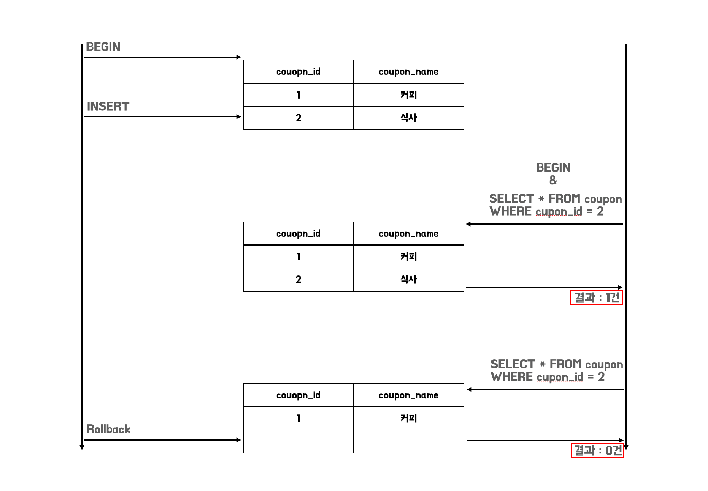
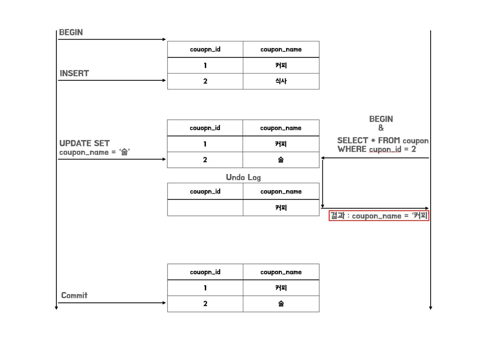
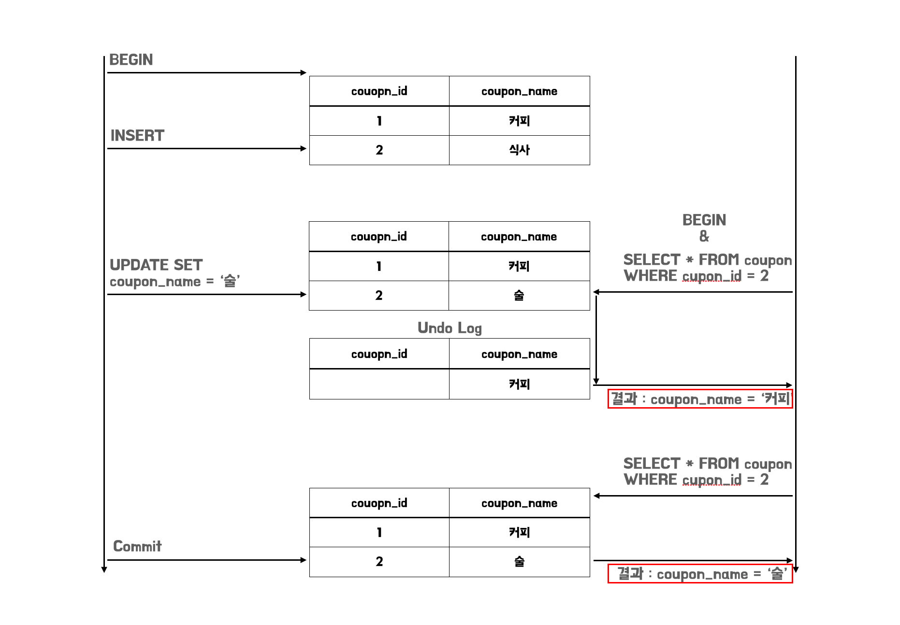
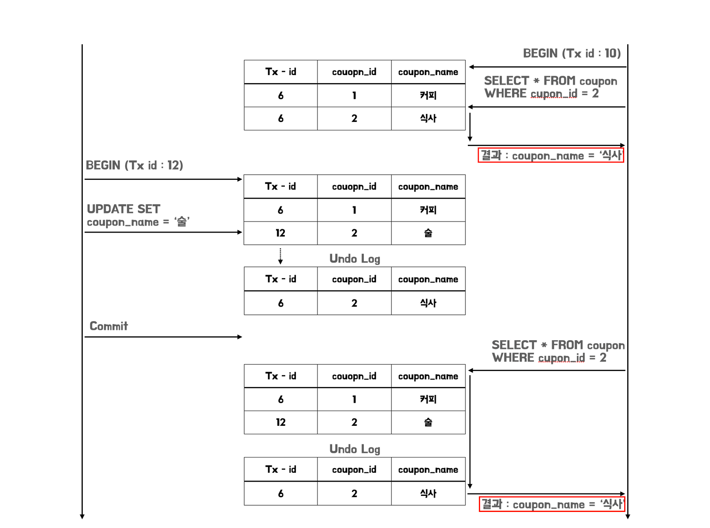

## 들어가기에 앞서..

해당 학습은 '**쿠폰의 재고 시스템은 어떻게 구현해야 할까?**' 에서 시작되었습니다. 여러명이 쿠폰을 발급받게 될 경우 어떻게 동시성 처리를 해야하는지 다양한 방법을 한번 눈으로 확인해보고 싶어서 학습을 진행하게 되었습니다.

이번 첫번째 글에서는 동시성 처리에 필요한 Transactional과 DB Lock, 그리고 스프링 Transactional이 개념에 대해서 이를 알아보는 시간을 가져보려고 합니다.

## Transactional의 개념과 격리레벨

### 트랜잭션이란?

**트랜잭션은 데이터베이스 상태를 변화시키는 하나의 논리적인 작업기능을 구성하는 단위**를 말합니다. 어떤 작업들이 성공적으로 완료되어야 구성된 작업의 결과를 반영하고, 오류가 발생했을 때는 이전에 있었던 모든 작업들이 성공적이라고 해도 없었던일 처럼 완전히 되돌리는 것이 트랜잭션의 개념이라고 할 수 있습니다.

### Lock과 Consistent Read

트랜잭션의 격리 레벨에 대해서 알아보기 전에 꼭 알아야 할 2가지의 개념을 먼저 알아보도록 하겠습니다.

첫번째로 알아볼 내용은 `Lock`입니다. `**Lock`은 트랜잭션 처리의 순차성을 보장하기 위한 방법**입니다. 이러한 `Lock`의 종류로는 대표적으로 **공유 락(Shared Lock)** 과 **베타 락(Exclusive Lock)** 이 있습니다.

**공유 락**은 데이터를 읽을 때 사용되는 `Lock` 입니다. 이러한 공유 락이 설정된 데이터는 **읽는 것은 여러 사용자가 동시에 할 수 있지만, 변경은 할 수 없습니다**. 또한, 변경이 안되기 때문에 당연히 베타 락 또한 설정할 수 없습니다.

**베타 락**은 데이터를 변경할 때 사용되는 `Lock` 입니다. 이러한 베타 락이 설정된 데이터는 읽기와 쓰기 모두 다 여러 사용자가 접근을 할 수 없습니다. 즉, 베타 락이 해제될 때까지 다른 트랜잭션은 해당 리소스에 접근이 불가능하다고 할 수 있습니다.

이렇게 `Lock`에 대해서 살펴본 이유는 **`InnoDB`에서 각각의 격리 레벨을 적용하기 위해서 `Lock`을 적용하기 때문**입니다.

두번째로 알아볼 내용은 `Consistent Read` 입니다. **`Consistent Read`는 트랜잭션 내부에서 동시에 실행중인 다른 트랙잭션에 데이터를 변경하더라도 특정 시점의 `Snapshot`을 이용해 기존과 동일한 결과를 리턴**할 수 있도록 해주는 기능을 말합니다. 이를 통해서, **Lock이 필요한 부분에서 Lock을 사용하지 않고도 동시성 제어를 할 수 있게 됩니다.**

### 트랜잭션의 격리 레벨이란 무엇인가?

트랜잭션 격리 레벨이란 **동시에 여러 트랜잭션이 처리될 때, 트랜잭션끼리 얼마나 서로 고립되어 있는지를 나타내는 것**입니다. 즉, 특정 트랜잭션이 다른 트랜잭션에 변경할 데이터를 볼 수 있도록 허용할지 말지를 결정합니다.

이를 수행하기 위해서, 트랜잭션이 독립적인 수행을 하도록 `Locking`을 통해, 트랜잭션이 DB를 다루는 동안 다른 트랜잭션이 관여하지 못하도록 막는 작업이 필요합니다.

하지만 무조건적인 `Locking`으로 동시에 수행되는 수많은 트랜잭션을 순서대로 처리하도록 설계하게 되면 데이터베이스의 동시성 성능이 떨어지게 됩니다. 이러한 성능저하를 줄이기 위해서 `Locking`의 범위를 줄인다면, 데이터 일관성이 깨지는 문제가 발생할 수도 있습니다. 따라서 최대한 효율적으로 `Locking`을 설정하는 것이 좋습니다.

## 트랜잭션 격리 레벨에 대해서 자세히 알아보자

트랜잭션 격리 레벨은 다음과 같이 4단계로 구분을 할 수 있습니다.

- READ UNCOMMITTED
- READ COMMITTED
- REPEATABLE READ
- SERIALIZABLE

4가지 키워드들을 하나씩 살펴보도록 하겠습니다.

### READ UNCOMMITTED

`Read Uncommitted`는 커밋 전의 트랜잭션의 데이터 변경 내용을 다른 트랜잭션이 읽는 것을 허용하는 격리 레벨을 말합니다. `Read Uncommitted` 에서는 `Dirty Read`현상이 발생할 수 있습니다.

`Transaction 1`에서 INSERT 로 추가된 `Coupon`이 `COMMIT` 되기 이전에 새로운 `Transaction 2`에서 `Coupon`을 조회한다고 가정해보겠습니다. 하지만 `Transaction 1`에서 오류가 발생해서 `ROLLeBACK`이 되게 되었습니다. 이 경우 `Transaction 2`는 `ROLLBACK` 여부를 확인하지 못하고 `ROLLBACK` 된 `Coupon`를 정상적인 데이터라 생각하고 작업을 계속 진행하게 됩니다.



이처럼 트랜잭션에서 처리한 작업이 완료되지 않아도 볼 수 있는 현상을 `Dirty Read`라고 합니다.

### READ COMMITTED

`Read Committed`는 `COMMIT`이 완료된 트랜잭션의 변경사항만 다른 트랜잭션에서 조회가 가능합니다. 이로 인해서, `Read Uncommitted`에서 발생하는 `Dirty Read`가 발생하지 않습니다. 이렇게 되는 이유는 `Read Committed` 부터는 `MVCC`인 `Consistent Read`로 문제를 해결하기 때문인데요.

`Read Committed`에서 데이터의 변경이 일어나게 되면 변경 전 데이터는 **언두 영역으로 복사가 됩니다**. 그리고 **다른 트랜잭션에서 해당 테이블의 데이터를 조회할 경우, 변경된 테이블 데이터를 조회하는 것이 아니라 언두 영역에 복사된(Snapshot) 레코드를 조회**하게 됩니다.



`Read Committed`는 `COMMIT` 된 데이터에 대해서는 정합성을 유지한다는 판단을 하기 때문에 `Snapshot`을 해당 `COMMIT`된 데이터로 다시 덮어쓰게 됩니다.

`Read Committed`에서는 `None Repetable Read`현상이 발생할 수 있습니다.



DB에는 `Coupon`이 2개가 있다고 가정해보겠습니다. `Transaction 1`에서 쿼리가 먼저 시작되고 나서 `Transaction 2`에서 `Coupon` 의 2번 ID를 조회하면 **커피가 조회가 되게 됩니다**. 하지만 `Transcation 1`에서 **UPDATE** 쿼리가 `COMMIT` 된 이후 `Transaction 2` 에서 다시 똑같은 **SELECT** 쿼리를 사용하여 다시 `Coupon`를 조회하게 될 경우 **UPDATE** 쿼리의 경우 **술이 조회가 되게 됩니다.**

이처럼 **하나의 트랜잭션 내에서 똑같은 SELECT 쿼리를 실행했을 때 항상 같은 결과를 가져오지 못하는 `None-Repetable Read`가 발생하게 됩니다.**

또한 앞서서 설명드렸듯이 Lock 방법에서 `Record Lock`만을 사용하기 때문에 **데이터가 중간에 삽입, 삭제 될 경우 SELECT의 결과가 다르게 나타나는 `Phantom Read` 현상도 발생**하게 됩니다.

### REPEATABLE READ

`Repeatable Read`는 트랜잭션 범위 내에서 조회한 내용이 항상 동일함을 보장합니다. 여기서 `Read Committed`와 다른 점은 **언두 영역에 백업된 레코드의 여러 버전 가운데 몇 번째 이전 버전까지 찾는지**에 있습니다. 모든 `InnoDB`의 트랜잭션은 고유한 트랜잭션 번호를 가지며, **언두 영역에 백업된 모든 레코드에는 변경을 발생시킨 트랜잭션의 번호가 포함**되어 있습니다.

밑의 그림과 같이 **자신의 트랜잭션 번호보다 작은 트랜잭션 번호만 보게 되는 것을 확인**할 수 있습니다.



추가적으로 일반적인 SQL 표준에서는 `Repetable Read` 조건일 때 `Phantom Read`가 발생한다라고 흔히 알고 있는데, 저희가 주로 사용하는 MySQL의 `InnoDB` 기준으로는 `Repetable Read` 조건에서 `Phantom Read`가 발생하지 않습니다. 그 이유는 `Record Lock`이 아닌 `Next-key Lock`을 사용하기 때문입니다.

특정 레코드에 대해서만 `Lock`을 걸지 않고 검색하고자 하는 범위 내에서 `Gap Lock`까지 걸어버리기 때문에 중간에 특정 데이터가 **추가 혹은 삭제되어 발생하는 `Phantom Read` 현상은 발생**하지 않습니다.

### Serializable

가장 단순한 격리 수준이면서, 가장 엄걱한 격리 수준입니다. 읽기 작업에 대해서도 공유 잠금을 획득해야 하며, 동시에 다른 트랜잭션은 해당 레코드의 변경이 불가능 합니다. 즉, 한 트랜잭션에서 읽고 쓰는 레코드를 다른 트랜잭션에서는 절대 접근할 수 없습니다.

MySQL `InnoDB`에서의 격리수준에서 가장 아리송할 수 있는 부분은 `Repetable Read`와 `Serializable` 둘다 `Phantom Read`가 발생하지 않도록 보장한다는 점입니다. **여기서 주의깊게 봐야 할 점은 그 보장의 방법이 다르다는 점입니다.**

`Repetable Read`는 Write 상황에서는 `x-lock`이 걸리고 Read 상황에서는 `Consistent Read`를 통해서 비 잠금 Read로 `Phantom Read` 가 발생하지 않도록 보장합니다.

반면 `Serializable`은 `Consistent Read`를 사용하지 않고, Read에 대해서만 `s-lock`을 걸어서 `Phantom Read`가 발생하지 않도록 보장하게 된다는 점이 차이가 있다고 할 수 있습니다.

## 스프링에서의 트랜잭션

### 스프링에서의 트랜잭션 작동 원리

각각의 데이터 접근 기술들(JDBC, JPA)은 트랜잭션을 처리하는 방식에 차이가 있습니다.

```java
public static void jdbcTemplate(String[] args) throws SQLException {
    Connection conn = dataSource.getConnection():
    try {
        conn.setAutoCommit(false); // (1) - 트랜잭션 시작
        bizLogic(conn);
        conn.commit(); // (2) - 로직 성공시 트랜잭션 커밋
    } catch (Exception e) {
        conn.rollback();
        throw new IllegalStateException(e);
    } finally (
        close(conn);
    }
}
```

```java
public static void jpa(String[] args) {
    EntityManagerFactory emf = Persistence.createEntityFactory("transaction");
    EntityManager em = emf.createEntityManager();
    EntityTransaction tx = em.getTransaction();
    
    try {
        tx.begin();
        bizLogic(em);
        tx.commit();
    } catch (Exception e) {
        tx.rollabck();
    } finally {
        em.close();
    }
    emf.close();
}
```

스프링은 이러한 문제를 해결하기 위해 트랜잭션 추상화를 제공합니다. `PlatformTransactionManager` 라는 인터페이스를 통해 트랜잭션을 추상화 할 수 있습니다.

```java
public interface PlatformTransactionManager extends TransactionManager {
    TransactionStatus getTransaction(@Nullable TransactionDefinition definition) throws TransactionException;
    void commit(TransactionStatus status) throws TransactionException;
    void rollback(TransactionStatus status) throws TransactionException;
}
```

또한 스프링은 **데이터 접근 기술에 대한 트랜잭션 매니저의 구현체도 제공**을 합니다. 우리는 필요한 구현체를 스프링 빈으로 등록하고 주입받아 사용하기만 하면 됩니다. 추가적으로 스프링 부트를 사용한다면 `AutoConfiguration`에 의하여 **개발자가 의존성으로 등록한 데이터 접근기술을 자동으로 인식해, 적절한 트랜잭션 메니저를 스프링 빈으로 등록**해 줍니다.

### @Transactional 등장

앞에서 설명한 스프링에서 제공하는 트랜잭션 추상화인 `PlatformTransactionManger`를 사용하는 방식은 **선언적 트랜잭션** **관리**와 **프로그래밍 방식 트랜잭션 관리**가 있습니다. 프로그래밍 방식의 트랜잭션 관리를 사용하게 되면, **애플리케이션 코드가 트랜잭션이라는 기술 코드와 강하게 결합**하게 됩니다. 이는 다음 코드를 통해서도 확인할 수 있습니다.

```java
@Service
public class UserSerivce {
    TransactionStatus status = transactionManager.getTransaction(new DefaultTransactionDefinition());
		
    try {
        bizLogic(...);
        transactionManager.commit(status);  // 성공시 커밋
    } catch (Exception e) {
        transactionManger.rollback(status); // 실패시 롤백
        throw new IllegalStateException(e);
    }
}
```

이러한 문제를 해결하기 위해, 프록시 방식을 이용한 트랜잭션 관리 방식의 트랜잭션을 사용하게 되었습니다.

```java
@Component
public class TransactionUserSerivceProxy {
    private UserService target;
		
    public void logic() {
        TransactionStatus status = transactionManger.getTransaction(..);
        try {
            target.logic();
            transactionManager.commit(status); // 성공시 커밋
        } catch (Exception e) {
            transactionManger.rollback(status); // 실패시 롤백
            throw new IllegalStateException(e);
        }
    }
}

public class MemberService {
    public void logic() {
        bizLogic(...);
    }
}
```

여기서 조금 더 발전해 스프링에서는 `@Transactional` 애노테이션을 이용해서 **`@Transactional`이 선언된 곳에 트랜잭션을 처리하는 프록시를 적용해 선언적 트랜잭션 관리 방식으로 사용을 할 수 있게 기능을 제공**합니다.

```java
@Transactional
@Service
public class MemberService {
    public void logic() {
        bizLogic(...);
    }
}
```

## 다음글에서..

이번 글에서는 Transactional과 Lock 그리고 스프링에서는 어떻게 각 데이터 접근 기술에 대해서 트랜잭션을 지원하는지를 알아보았습니다. 다음 글에서는 이제 실제 코드를 통해서 문제 상황과 해결방법을 한번 살펴보도록 하겠습니다.