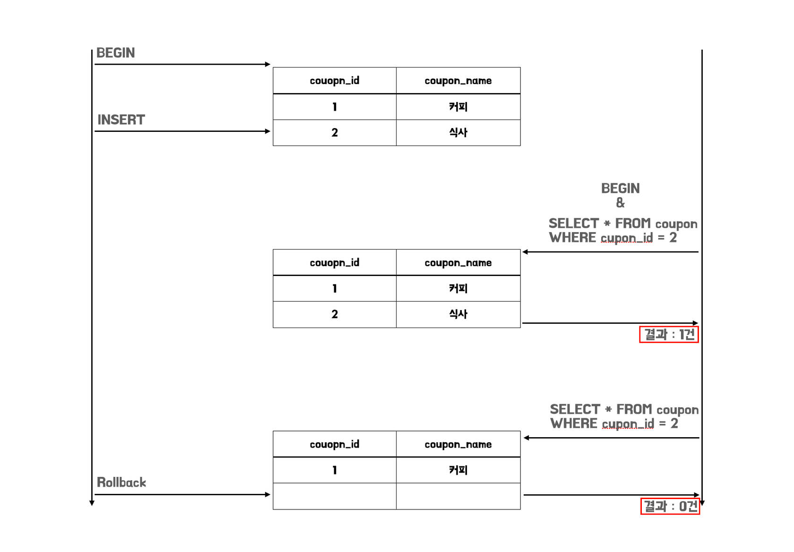
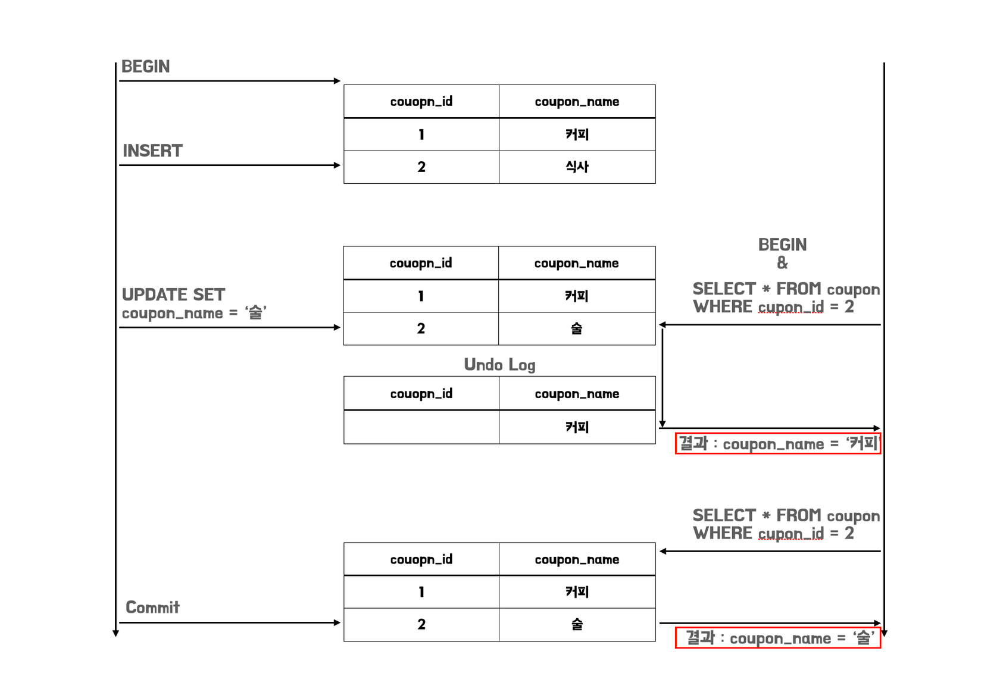
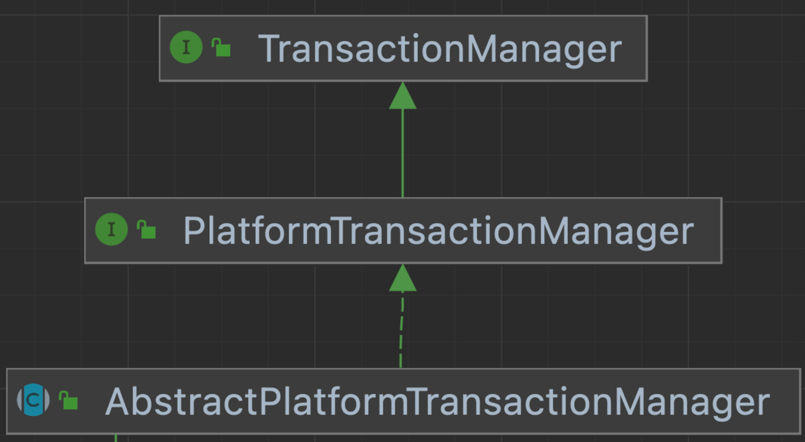

재고를 기반으로 운영되는 쿠폰 시스템은 개발자가 고려해야 할 점이 많습니다. 현재 개발되고 있는 프로젝트는 자바와 스프링을 기반으로 한 웹 어플리케이션으로 운용되고 있습니다. 이러한 어플리케이션은 기본적으로 멀티 스레드 환경에서 구동이 되기 때문에 공유 자원에 대한 경쟁 상태가 발생하지 않도록 주의를 기울여 개발을 해야 합니다.

이러한 문제를 해결하기 위해 우리는 다양한 부분에 대해서 고민을 해볼 필요성이 있습니다. 그 중의 하나가 데이터베이스의 상태를 변화시키는 작업의 단위라고 불리는 `트랜잭션` 이라고 생각합니다. 이번 글에서는 트랜잭션의 관점에서 어떻게 동시성 문제를 해결하는지 살펴보고, Spring에서는 어떻게 트랜잭션을 지원하는지 그 개념과 동작원리를 살펴보는 시간을 가져보려고 합니다.

## Transactional의 개념과 격리레벨

### 트랜잭션이란?

**트랜잭션은 데이터베이스 상태를 변화시키는 하나의 논리적인 작업기능을 구성하는 단위**를 말합니다. 어떤 작업들이 성공적으로 완료되어야 구성된 작업의 결과를 반영하고, 오류가 발생했을 때는 이전에 있었던 모든 작업들이 성공적이라고 해도 없었던일 처럼 완전히 되돌리는 것이 트랜잭션의 개념이라고 할 수 있습니다.

이러한 트랜잭션을 수행함에 있어서 동시에 여러 트랜잭션이 변경을 수행할 때 일관성을 유지하는 기능을 제공하고 안정성과 성능을 조절하기 위해서 필요한 설정이 바로 트랜잭션의 격리 레벨이라고 할 수 있습니다.

### 트랜잭션의 격리 레벨이란 무엇인가?

트랜잭션 격리 레벨이란 앞서서 말했듯이 **동시에 여러 트랜잭션이 처리될 때, 트랜잭션끼리 얼마나 서로 고립되어 있는지를 나타내는 것**입니다. 즉, 특정 트랜잭션이 다른 트랜잭션에 변경할 데이터를 볼 수 있도록 허용할지 말지를 결정합니다.

이를 수행하기 위해서, 트랜잭션이 독립적인 수행을 하도록 `Locking`을 통해, 하나의 트랜잭션이 데이터베이스를 다루는 동안 다른 트랜잭션이 해당 트랜잭션에 관여하지 못하도록 막는 작업이 필요합니다.

하지만 무조건적인 `Locking`으로 동시에 수행되는 수많은 트랜잭션을 순서대로 처리하도록 설계하게 되면 데이터베이스의 동시성 성능이 떨어지게 됩니다. 이러한 성능저하를 줄이기 위해서 `Locking`의 범위를 줄인다면, 데이터 일관성이 깨지는 문제가 발생할 수도 있습니다. 따라서 최대한 효율적으로 `Locking` 설정하는 것이 좋습니다.

### Locking Reads

기본적으로 `SELECT`문을 통해 데이터를 조회하게 되면 `Non-Locking` 상태라고 할 수 있습니다. 때문에 읽기 작업과 쓰기 작업이 하나의 트랜잭션에서 같이 발생되는 경우 다른 트랜잭션에 의해 변경될 가능성이 있습니다. InnoDB에서는 이러한 문제를 해결하기 위해 `FOR SHARE`, `FOR UPDATE` 라는 `Locking Reads`를 제공합니다.

**`SELECT … FOR SHARE`** 는 조회하는 인덱스 레코드에 `S-Lock` 을 설정합니다. 다른 트랜잭션에서 레코드를 읽을 수는 있지만, `S-Lock`을 설정한 트랜잭션이 커밋되기 전까지 레코드를 수정할 수 없으며, `X-Lock`을 설정할 수 없습니다.

**`SELECT … FOR UPDATE`** 는 조회하는 인덱스 레코드에 대해 `UPDATE` 문을 실행한 것과 동일하게 레코드 및 관련 인덱스에 `X-Lock`을 설정합니다. 다른 트랜잭션에서 레코드를 읽거나 쓰는 작업이 불가능하며, `S-Lock`이나 `X-Lock`을 설정할 수 없습니다.

이러한 `Locking Reads`를 바탕으로 `Locking`을 구현하게 됩니다.

### Locking과 Consistent Read

InnoDB에서 기본적으로 `Locking`은 트랜잭션의 격리 수준을 구현되기 위해서 사용됩니다. 이를 구현하기 위한 대표적인 방법으로 **Record Lock, Gap Lock, Next-Key Lock**을 살펴보고자 합니다.

**`Record Lock`** 은 하나의 인덱스 레코드에만 Lock을 거는 것을 말합니다. 만약 테이블에 인덱스가 정의되지 않았다고 하더라도 InnoDB를 기준으로 primary key 혹은 unique key를 통해서 Clustered Index를 생성하기 때문에 이를 활용하여 Record Lock을 적용할 수 있습니다.

만약 `SELECT content FROM coupon WHERE id = 1 FOR UPDATE;` 와 같은 쿼리를 실행하게 된다면 id가 1에 해당하는 레코드에 Record Lock이 설정되기 때문에 다른 트랜잭션에서 해당 레코드를 변경할 수 없습니다.

**`Gap Lock`** 은 인덱스 레코드간의 범위에 Lock을 거는 것을 말합니다. 최초 레코드 이전, 마지막 레코드 이후를 가상의 인덱스 레코드로 생각해서 Lock을 설정할 수 있으며, 다른 트랜잭션에서 해당 범위에 데이터를 삽입하거나 변경할 수 없습니다.

만약 `SELECT content FROM coupon WHERE id ≥ 1 FOR UPDATE;` 와 같은 쿼리를 실행하고 다른 트랜잭션이 id가 10인 데이터를 삽입하려고 한다면, 해당 id 값은 Gap Lock으로 설정되어 있기 때문에 삽입하거나 혹은 변경할 수 없습니다.

**`Next Key-Lock`** 은 Record Lock과 해당 인덱스 레코드 앞의 Gap에 대한 Gap Lock을 조합하여 Lock을 거는 것을 말합니다.

이렇게 `Locking`이 설정됨에 따라서 격리 수준을 구현할 수 있게 되었지만 동시성 성능은 떨어지게 되었습니다. MySQL의 InnoDB는 이렇게 동시성 성능이 떨어지는 문제를 해결하기 위해서 `MVCC`라는 개념을 도입하였습니다. 이는 각 트랜잭션의 격리 레벨에 따라 상이하지만, 특정 시점의 `Snapshot` 정보를 바탕으로 하여, 기존과 같이 `Locking`을 사용하지 않고도 `일관된 읽기(Consistent Read)`를 제공하여 동시성을 제어할 수 있게 됩니다.

## 트랜잭션 격리 레벨에 대해서 자세히 알아보자

지금까지의 내용들을 바탕으로 트랜잭션 격리 레벨을 구성할 수 있으며 READ UNCOMMITTED, READ COMMITTED, REPEATABLE READ, SERIALIZABLE 총 4단계로 구분할 수 있습니다.

그러면 4가지 키워드들에 대해서 하나씩 살펴보도록 하겠습니다.

### READ UNCOMMITTED

`Read Uncommitted`는 커밋 전의 트랜잭션의 데이터 변경 내용을 다른 트랜잭션이 읽는 것을 허용하는 격리 레벨을 말합니다. `Read Uncommitted` 에서는 일반적인 SELECT 문은 Non-Locking Read로 수행되지만 MVCC를 사용하지 않아 Consistent Read를 보장하지 않습니다.

`Read Uncommitted` 에서는  `Dirty Read`현상이 발생할 수 있습니다. `Transaction 1`에서 INSERT로 추가된 `Coupon`이 `COMMIT` 되기 이전에 새로운 `Transaction 2`에서 `Coupon`을 조회한다고 가정해보겠습니다. 하지만 `Transaction 1`에서 오류가 발생해서 `ROLLBACK`이 되게 되었습니다. 이 경우 `Transaction 2`는 `ROLLBACK` 여부를 확인하지 못하고 `ROLLBACK` 된 `Coupon`를 정상적인 데이터라 생각하고 작업을 계속 진행하게 됩니다.



이처럼 트랜잭션에서 처리한 작업이 완료되지 않아도 볼 수 있는 현상을 `Dirty Read` 현상을 확인할 수 있습니다.

### READ COMMITTED

`Read Committed`는 `COMMIT`이 완료된 트랜잭션의 변경사항만 다른 트랜잭션에서 조회가 가능합니다. 이로 인해서 `Read Uncommitted`에서 발생하는 `Dirty Read`가 발생하지 않습니다. 이렇게 되는 이유는 `Read Committed` 부터는 `MVCC`인 `Consistent Read`로 문제를 해결하기 때문입니다.

`Read Committed`에서 데이터의 변경이 일어나게 되면 변경 전 데이터는 **언두 영역으로 복사가 됩니다**. 그리고 **다른 트랜잭션에서 해당 테이블의 데이터를 조회할 경우, 변경된 테이블 데이터를 조회하는 것이 아니라 언두 영역에 복사된(Snapshot) 레코드를 조회**하게 됩니다. 이 때문에 발생할 수 있는 문제를 해결할 수 있습니다.


하지만 `Read Committed`는 `COMMIT` 된 데이터에 대해서는 정합성을 유지한다는 판단을 하기 때문에 `Commit`이 발생할 경우 기존 `Snapshot`을 새로운 `Snapshot`으로 다시 덮어쓰게 됩니다. 이 때문에 `Read Committed`에서는 `None Repetable Read`현상이 발생할 수 있습니다.

DB에는 `Coupon`이 2개가 있다고 가정해보겠습니다. `Transaction 1`에서 쿼리가 먼저 시작되고 나서 `Transaction 2`에서 `Coupon` 의 2번 ID를 조회하면 **커피가 조회가 되게 됩니다**. 하지만 `Transcation 1`에서 **UPDATE** 쿼리가 `COMMIT` 된 이후 `Transaction 2` 에서 다시 똑같은 **SELECT** 쿼리를 사용하여 다시 `Coupon`를 조회하게 될 경우 **UPDATE** 쿼리의 경우 **술이 조회가 되게 됩니다.**



이처럼 **하나의 트랜잭션 내에서 똑같은 SELECT 쿼리를 실행했을 때 항상 같은 결과를 가져오지 못하는 `None-Repetable Read`가 발생하게 됩니다.**

또한 Read Committed 레벨에서는 `Record Lock`만을 사용하기 때문에 **데이터가 중간에 삽입, 삭제 될 경우 SELECT의 결과가 다르게 나타나는 `Phantom Read` 현상도 발생**하게 됩니다.

### REPEATABLE READ

`Repeatable Read`는 트랜잭션 범위 내에서 조회한 내용이 항상 동일함을 보장합니다. 여기서 `Read Committed`와 다른 점은 언두 영역에 백업된 레코드의 여러 버전 가운데 몇 번째 이전의 버전을 찾는지에 있습니다. 모든 `InnoDB`의 트랜잭션은 고유한 트랜잭션 번호를 가지며, 언두 영역에 백업된 모든 레코드에는 변경을 발생시킨 트랜잭션의 번호가 포함되어 있습니다.

밑의 그림과 같이 자신의 트랜잭션 번호보다 작은 트랜잭션 번호만 보게 되는 것을 확인할 수 있습니다. 이를 통해 처음 생성된 `Snapshot`을 기반으로 하나의 트랜잭션 내에서 일관된 읽기를 제공합니다.


`Repeatable Read` 는 일반적인 SQL 표준에서는 `Phantom Read`가 발생하게 됩니다. 밑의 사진을 보게되면 조회를 하기 위해서 `SELECT … FOR UPDATE` 쿼리를 사용하고 있습니다. `FOR UPDATE` 쿼리를 사용하게 되면 레코드에 쓰기 잠금을 걸어버리게 되는데, 언두 레코드에는 이를 적용할 수 없습니다. 이 때문에, 언두 영역의 변경 전 데이터(Snapshot)를 가져오는 것이 아니라, 현재 레코드의 값을 가져오게 되어 `Phantom Read`가 발생한다고 할 수 있습니다.


하지만 저희가 주로 사용하는 MySQL의 `InnoDB` **기준으로는 `Repetable Read` 조건에서 `Phantom Read`가 발생하지 않습니다.** 그 이유는 Locking Read와 UPDATE, DELETE 문의 경우 검색 조건에 따라 사용되는 `Lock`이 다르게 적용되기 때문입니다.

- 고유한 검색 조건이 있는 고유 인덱스에 대한 쿼리는 Record Lock이 적용
- 범위 검색 조건의 경우 스캔한 인덱스 범위에 Gap Lock과 Next-key Lock이 적용

이러한 이유 때문에 중간에 특정 데이터가 추가 혹은 변경되어 발생하는 `Phantom Read` 현상은 `InnoDB`의 `Repetable Read`에서는 발생하지 않습니다.

> 그럼에도 발생할 수 있는 `Phantom Read`
>

일반적으로는 거의 발생하지 않지만 `Repetable Read` 수준임에도 불구하고 `Phantom Read`가 발생할 수 있는 상황이 있습니다.

B 트랜잭션이 추가한 레코드에 A 트랜잭션이 UPDATE 쿼리를 수행하게 될 경우, 처음 SELECT 쿼리로 생성된 `Snapshot` 에는 존재하지 않지만 실제 디스크에는 데이터가 존재하기 때문에 해당 레코드가 영향을 받게 됩니다. 이후 SELECT 쿼리를 수행할 때 `Snapshot`이 초기화되어 `Phantom Read`가 발생하게 됩니다.

하지만 해당 상황은 조금 억지스럽게 `Phantom Read`가 발생할 수 있는 상황을 연출한 것이라 해당 상황이 생길 수 있다는 것만 인지를 하고 넘어가도록 하겠습니다.

### Serializable

가장 단순한 격리 수준이면서, 가장 엄걱한 격리 수준입니다. 일반적인 읽기 작업에 대해서도 `S-Lock`을 획득해야 하며, 동시에 다른 트랜잭션은 해당 레코드의 변경이 불가능 합니다. 이 때문에 한 트랜잭션에서 읽고 쓰고 있는 레코드에 대해서는 다른 트랜잭션에서 절대 접근할 수 없습니다.

하지만 일반적인 읽기 작업에 대해서도 `S-Lock`을 통해 블로킹 처리를 수행하기 때문에 동시성이 매우 떨어지게 되어 사용하는 것을 권장하지 않습니다.

## 스프링에서의 트랜잭션

이처럼 트랜잭션은 위에서 설명한 트랜잭션의 격리 레벨을 이용하여 트랜잭션의 원칙 중 하나인 격리성을 수행한다고 할 수 있습니다. 그렇다면 스프링에서는 이러한 트랜잭션을 어떤 방식을 통해 구현하고 있을까요??

### 스프링이 제공하는 트랜잭션 기술

JDBC를 사용하는 개발자가 직접 여러 개의 작업을 하나의 트랜잭션으로 관리하기 위해서는 Connection 객체를 공유하는 작업을 추가적으로 해주어야 합니다. 이러한 로직을 매번 개발자가 작성해주어야 하기 때문에 상당히 불편한 작업이라고 할 수 있습니다.

Spring은 이러한 문제를 해결하기 위해 트랜잭션을 동기화 하는 기술을 제공하고 있습니다. `TransactionSynchronizeManager`을 통해서 트랜잭션을 시작하기 위한 Connection 객체를 특정 저장소에 보관해 두고 필요할 때 꺼내서 사용하는 방식으로 동기화를 적용할 수 있습니다. 또한 해당 동기화는 작업 스레드마다 Connection 객체를 독립적으로 관리하기 때문에 멀티 스레드 환경에서도 문제가 발생할 여지 없이 Connection 객체를 공유할 수 있습니다.

```java
TransactionSynchronizeManager.initSynchronization();
Connection connection = DataSourceUtils.getConnection(dataSource)
```

하지만 해당 코드는 JDBC만 사용했을 때 유효합니다. 만약 JPA로 코드를 변경해야 한다면 기존의 Connection을 획득하는 코드를 변경해야 할 것입니다.

Spring은 이러한 문제를 해결하기 위해 트랜잭션을 추상화 하는 기술을 제공하고 있습니다. `PlatformTransactionManger`를 통해서 각 트랜잭션 기술들의 공통점을 담은 트랜잭션 추상화 기술을 이용해 일관되게 트랜잭션을 처리할 수 있도록 기능을 제공합니다.



또한 스프링은 각 데이터 접근 기술에 대한 트랜잭션 매니저의 구현체도 제공을 하고 있습니다. 이 때문에 우리는 필요한 구현체를 스프링 빈으로 등록하고 주입받아 사용하기만 하면 트랜잭션을 사용할 수가 있습니다. 여기에 스프링 부트까지 사용한다면 `AutoConfiguration`을 통해서 의존성으로 등록한 데이터 접근 기술을 자동으로 인식해, 적절한 트랜잭션 메니저를 스프링 빈으로 등록해주어 개발자가 사용할 수 있게 됩니다.

### @Transactional 등장

이렇게 스프링에서 제공하는 동기화 기법인 `TransactionSynchronizeManager`와 추상화 기법인 `PlatformTransactionManager`를 통해서 조금 더 편리하게 개발이 가능해 졌습니다.

하지만 아직까지 문제가 있습니다. 바로 비즈니스 코드와 데이터 엑세스 기술이 코드에 강하게 결합한다는 문제가 발생합니다.

```java
@Service
public class UserSerivce {

    public void businessMethod() {
        TransactionStatus status = transactionManager.getTransaction(new DefaultTransactionDefinition());
        try {
            businessLogic(...);
            transactionManager.commit(status);  // 성공시 커밋
        } catch (Exception e) {
            transactionManger.rollback(status); // 실패시 롤백
            throw new IllegalStateException(e);
        }
    }
}
```

이는 코드의 유지보수를 어렵게 하고 중복된 코드를 만들어 개발자의 작업 생산성을 저하시킵니다. 이러한 문제를 해결하기 스프링은 **프록시 방식을 적용하여 비즈니스 코드와 데이터 엑세스 기술을 분리하여 사용할 수 있도록 기능을 제공**하고 있습니다.

```java
// 프록시 코드
@Component
public class TransactionUserSerivceProxy {

    private UserService target;
    
    public void businessMethod() {
        TransactionStatus status = transactionManager.getTransaction(new DefaultTransactionDefinition());
        try {
            target.businessMethod();
            transactionManager.commit(status);  // 성공시 커밋
        } catch (Exception e) {
            transactionManger.rollback(status); // 실패시 롤백
            throw new IllegalStateException(e);
        }
    }
}

// 실제 비즈니스 코드
public class MemberService {

    public void businessMethod() {
        businessLogic(...);
    }
}
```

또한 **Advisor 기능**과 **동적 프록시 생성기**를 이용한 **트랜잭션 애노테이션(@Transactional)** 을 통해 개발자가 조금 더 편하게 선언적으로 트랜잭션을 이용할 수 있도록 기능을 제공하고 있습니다.

```java
@Transactional
@Service
public class MemberService {

    public void businessMethod() {
        businessLogic(...);
    }
}
```

## 다음 글에서는..

이번 글에서는 트랜잭션의 관점에서 어떻게 동시성 문제를 해결하는지 살펴보고, Spring에서는 어떻게 트랜잭션을 지원하는지 그 개념과 동작원리를 살펴보는 시간을 가졌었습니다. 다음 글에서는 실제 주어진 요구사항을 해결하기 위해 필요한 추가적인 개념과 실제 코드를 통해 해결하는 과정을 살펴보도록 하겠습니다.

## 참고

- [https://dev.mysql.com/doc/refman/8.0/en/innodb-transaction-isolation-levels.html](https://dev.mysql.com/doc/refman/8.0/en/innodb-transaction-isolation-levels.html)
- [https://dev.mysql.com/doc/refman/8.0/en/innodb-locking.html](https://dev.mysql.com/doc/refman/8.0/en/innodb-locking.html)
