최근 관심가지고 학습하고 있는 부분은 “**캐시**”입니다. 이러한 캐시를 적용하는 방법은 크게 로컬 캐시와 글로벌 캐시로 구분하여 적용을 할 수 있습니다. 각각의 종류들을 수행하고자 하는 기능에 맞게 선택하여 사용할 수 있는데요. 이번 글에서는 두 종류에 대해서 알아보고 적용시 어떤 부분들을 고민해야 하는지, 어떻게 적용해야 하는지 살펴보려고 합니다.

## 로컬 캐시 vs 글로벌 캐시

### 로컬 캐시

로컬 캐시는 해당 인스턴스에만 사용되는 캐시입니다. 말 그대로 하나의 로컬 환경에서만 영향을 주기 때문에 네트워크를 탈 필요가 없어 매우 빠른 속도를 보장합니다.

하지만 분산 시스템에서 로컬 캐시를 사용하면 데이터 정합성이 깨지게 됩니다. 예를 들어, 클라이언트가 같은 리소스에 대한 요청을 여러 번 보내는 상황에서 A 서버에서는 ㄱ 데이터를 반환하지만, B 서버에서는 해당 리스소에 업데이트가 이루어진 ㄴ 데이터를 반환하여 서로 다른 상태를 가질 수도 있습니다.

### 글로벌 캐시

글로벌 캐시는 여러 서버에서 하나의 캐시 서버에 접근하여 사용되는 캐시입니다. 각각의 서버는 조회 요청이 들어오면 데이터베이스 앞 단에 있는 캐시 서버로 요청을 보내 작업을 수행하게 됩니다. 즉, 모든 요청이 하나의 캐시 서버로 들어오기 때문에 데이터 정합성을 걱정할 필요가 없습니다.

하지만 모든 요청이 하나의 캐시 서버로 오기 때문에 부하가 발생할 수 있으며, 네트워크를 한번 더 타기 때문에 상대적으로 속도가 느리다고 할 수 있습니다.

### 어떤 상황에서 무엇을 사용해야 하는가?

이 부분에 대해서 많은 고민을 해왔지만 **딱 맞는 정답은 없는 것 같습니다**. 각각의 주어진 요구사항에 따라서 속도가 중요한지, 정합성이 중요한지를 판단하여 적절한 캐시를 적용하는 것이 맞다고 생각합니다.

또한 앞선 글에서도 언급했듯이 캐시를 아예 사용하지 않는 것도 고려해볼 수 있습니다. 매번 반환하는 데이터가 달라진다면 오히려 캐시에 저장하거나 확인하는 작업으로 인해 성능이 저하될수도 있기 때문입니다.

## 로컬 캐시의 문제점을 극복할 수는 없을까?

앞서서 말했듯이 분산 환경에서의 로컬 캐시의 문제점을 해결하기 위해서 글로벌 캐시를 사용한다고 하였습니다. 하지만 글로벌 캐시를 사용하게 되면 **네트워크 I/O 비용이 추가적으로 발생**하며, **중앙 집중적으로 사용하기 때문에 SPOF 문제가 발생하면 서비스 기능 전체가 멈춰버리는 문제가 발생**할 수 있습니다. (물론 해당 문제를 클러스터링을 통해 해결할 수 있다고 합니다.)

다시 원점으로 돌아가서 로컬 캐시와 글로벌 캐시를 비교한다면 **로컬 캐시는 속도, 비용, SPOF 측면에서 유리하며 글로벌 캐시는 정합성 측면에서 유리**하다고 할 수 있습니다. 그렇다면 **로컬 캐시의 정합성만 조금 손을 보면** 글로벌 캐시의 장점을 어느정도 가져갈 수 있을 것 같다고 생각했습니다.

### ****Redis Pub/Sub을 이용한 로컬 캐시 동기화****

결국 로컬 캐시를 동기화 시키기 위해서는 어떠한 **“이벤트”**가 있어야 동기화가 이루어질 것입니다. 이러한 **“이벤트”**를 제공하기 위한 기술로 **“레디스”**를 고민해 볼 수 있습니다.

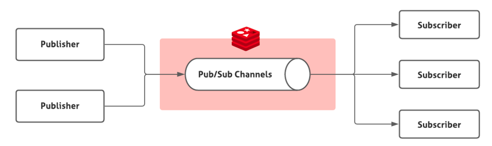

레디스는 `Pub/Sub` 라는 기능을 제공합니다. 이는 특정한 채널을 구독하는 `Subscriber` 들에게 메시지를 `BroadCast` 하는 방법이라고 할 수 있습니다. 이러한 방법을 이용해 **어떠한 애플리케이션 서버에서 캐시가 갱신되었을 때, 다른 모든 애플리케이션 서버에 메시지를 `BroadCast`** 하는 방식으로 **데이터 동기화**를 할 수 있습니다.

이러한 개념을 바탕으로 실제 분산 환경에 적용한다고 하면 밑의 그림과 같다고 할 수 있습니다. 사용하고 있는 모든 애플리케이션 서버가 `Publisher`이면서 `Consumer`가 되며, 모든 애플리케이션 서버에 메시지를 `BroadCast` 하는 구조로 동작을 하게 됩니다.

여기서 `BroadCast`를 할 수 있는 방법은 2가지 입니다. 하나는 **키와 데이터를 모두 보내는 방식**이고, 또 다른 방식은 **변경된 키만을 보내는 방식**입니다. 이번에 선택한 방법은 **키만 브로드캐스트 하는 방식** 입니다. 만약 데이터까지 같이 전송하게 된다면 실제 필요없는 애플리케이션의 로컬 캐시도 데이터가 변경되기 때문에 리스소가 낭비될 수 있기 때문입니다. 이 때문에 **갱신이 된 키만을 브로드캐스트 하여 각 어플리케이션의 로컬 캐시에 알려준 후, 갱신된 요청이 들어오면 직접 데이터베이스에 변경된 값을 요청**하는 형식으로 트래픽을 절약하여 동기화를 구현할 수 있습니다.

> `Kafka`를 사용해보는 건 어떨까??
>

처음에는 Kafka도 메시지 큐 방식이라 비슷하게 사용이 가능할 것이라 생각했는데, 작동하는 방식은 조금 다릅니다. Kafka는 구조는 동일하지만 메시지를 저장하고 있으며, 동일 `Consumer` 그룹에 여러 `Consumer`가 동일한 토픽을 구독하게 되면 한 `Consumer` 에게만 메시지가 전달되기 때문에 위에서 구상한 방법대로 사용을 할 수 없습니다.

## 로컬 캐시 종류 선택하기

로컬 캐시로는 보통 `Caffeine Cache`와 `Ehache`를 많이 사용합니다. 각각의 차이점을 한번 비교해보면서 어떤 라이브러리를 선택해야 할지 고민해보겠습니다.

### Caffeine Cache

Caffeine Cache는 공식문서를 확인해보면 **“고성능의 최적의 캐싱 라이브러리”**라는 문구로 소개를 하고 있습니다. 문구를 통해서도 알 수 있듯이 다양한 캐시들과의 성능 차이 또한 제시하고 있습니다. 이 때문에 많은 서비스에서는 캐시를 사용할 때 Caffeine Cache를 사용하는 것으로 알고 있습니다.

Caffeine Cache는 `evict` 로직이 자동으로 동작하게끔 구성이 되며, `eviction` 정책으로 `Window TinyLfu` 를 사용하여 구성하고 있습니다. 해당 알고리즘을 통해 다른 캐시 라이브러리에 비해서 최적의 적중률을 보여준다고 합니다. 관련한 글은 다음 글에서 확인할 수 있습니다.

- [Caffeine Cache Baeldung] → [https://www.baeldung.com/java-caching-caffeine](https://www.baeldung.com/java-caching-caffeine)
- [Caffeine Cache의 Window TinyLfu] → [https://www.fatalerrors.org/a/caffeine-cache-details.html](https://www.fatalerrors.org/a/caffeine-cache-details.html)

### EhCache

EhCache는 Java 진영에서 유명한 Local Cache 라이브러의 종류 중 하나입니다. EhCache는 Caffeien Cache 보다 더 많은 기능을 제공하며 대표적으로 **Distributed Caching와 Cache Listener, Off Heap에 캐싱된 데이터를 저장하는 기능을 제공**합니다.

EhCache의 많은 기능 중 관심이 갔던 부분은 `Off Heap` 입니다. **Heap 메모리 공간 이외에 데이터를 저장할 수 있는 기능을 제공**하는 것인데, 해당 기능을 사용하면 GC의 영향을 받지 않는 데이터를 보관할 수 있도록 설계가 가능할 것 같습니다. (Off Heap에 데이터를 저장하거나 반환하게 되면 추가적인 직렬화 비용이 발생합니다)

EhCache에 대해서 더 자세한 내용은 공식문서를 통해 확인할 수 있습니다.

- [EhCache Docs] → [https://www.ehcache.org/documentation/3.4/tiering.html](https://www.ehcache.org/documentation/3.4/tiering.html)

### 최종적으로는..?

최종적으로는 Caffeine Cache를 선택하기로 했습니다. 벤치마크 성능 측정 결과를 보면 모든 측면에서 Caffeine Cache가 압도적인 성능을 보여주는 것을 확인할 수 있습니다. 현재로서는 단순히 로컬 캐시에 데이터를 저장하고 반환하는 기능만 사용할 예정이기 때문에 Caffeine Cache가 적절하다고 판단했으며, 만약 부가적으로 캐시에 다른 작업을 처리해줘야 할 경우에는 EhCache를 고려해보면 될 것 같습니다.

## ****Redis Pub/Sub을 이용한 로컬 캐시 동기화 적용하기****

### 요구사항

- 쿠폰 시스템에서 쿠폰의 정보들은 캐시에 보관되며, 쿠폰이 업데이트 될 때마다 캐시를 무효화하는 작업을 수행한다.
- 무효화를 Redis의 Pub/Sub 기능을 이용해 다른 서버에 전파를 수행한다. (분산 환경)
- 캐시 매니저로는 Caffeine Cache를 사용한다.

### 로컬 캐시 적용하기

요구사항도 도출했으니 지금부터 하나씩 구현을 해보도록 하겠습니다. 먼저 가장 필요한 의존성부터 추가해주도록 하겠습니다.

다음으로 캐시 설정 값들을 정의하는 Enum 클래스를 만들어주도록 하겠습니다. yml 파일을 이용해서 설정을 할 수도 있지만 각 메서드마다 적절하게 조절해서 값을 설정할 수 있기 때문에 Enum을 활용하여 각 Cache Type을 설정해주도록 하겠습니다.

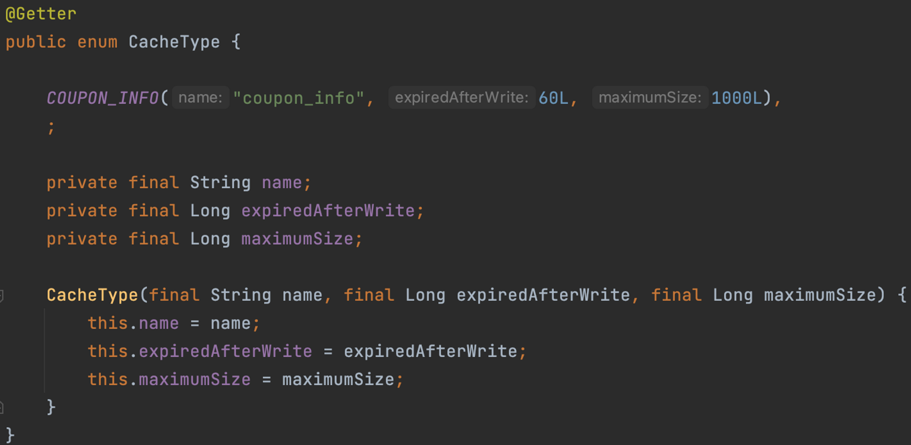

이제 실제로 캐시를 적용하고자 하는 메서드에 캐시를 지정해주도록 하겠습니다. `@Cacheable` 애노테이션을 사용하면 캐시를 적용할 수 있습니다. 위에서 적용한 캐시 이름과 캐시 키를 명시적으로 작성해주도록 하겠습니다.

> Spring에서는 어떻게 캐시 기능을 제공하지?
>

역시 믿고 쓰는 Spring 답게 등록한 빈의 메서드에 캐시를 적용할 수 있는 기능을 제공합니다. 위에서 보았듯이 다양한 캐시 서비스 구현기술을 사용할 수 있는데 **스프링은 특정 기술에 종속되지 않게 캐시 추상화를 제공**하고 있으며, **AOP를 활용하여 보다 비즈니스 코드와 결합되지 않고 캐시를 사용할 수 있도록 기능을 제공**하고 있습니다.

 

밑의 사진처럼 value 즉, **캐시의 키를 명시해주지 않으면 메소드의 파라미터를 키로 설정**하게 됩니다. 만약 **파라미터가 없는 경우에는 0이라는 키를 저장**합니다. 만약 **파라미터 값이 여러개인 경우 모든 파라미터의 hashCode() 값을 조합해서 키로 생성**하게 됩니다.

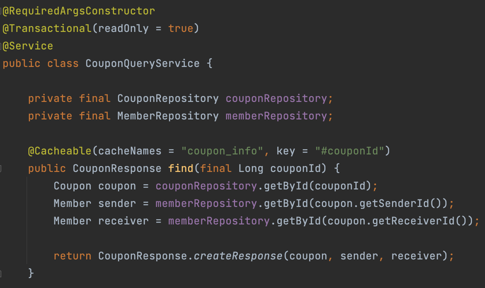

이렇게 캐시된 값이 변경되게 된다면 캐시를 제거해야 데이터 정합성을 유지할 수 있을 것입니다. `@CacheEvict` 애노테이션을 통해서 특정 메서드를 호출하면 키를 기준으로 저장되어 있는 캐시를 제거할 수 있습니다.

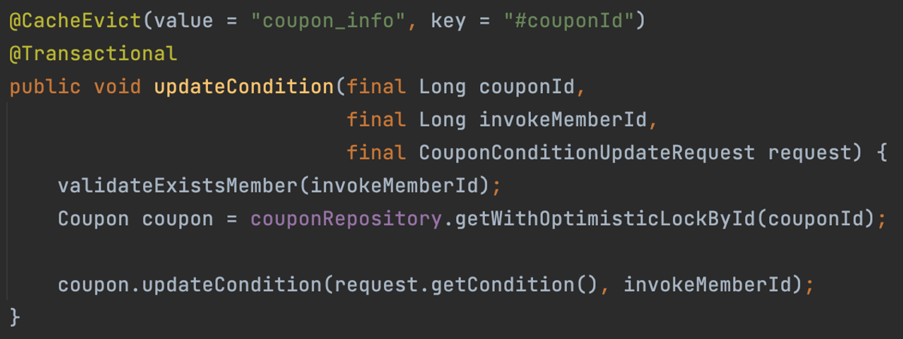

지금까지 구현한 캐시가 잘 적용되는지 테스트 코드를 통해서 한번 확인해보겠습니다.

**캐시 적용 전**

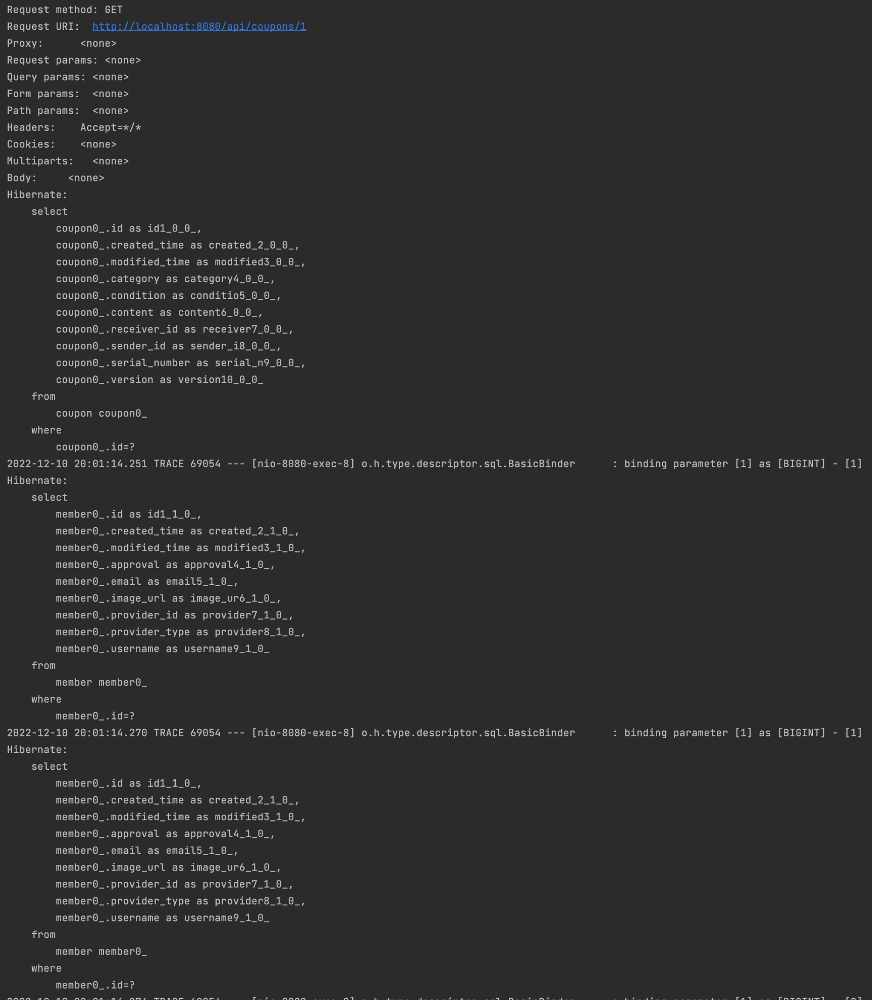

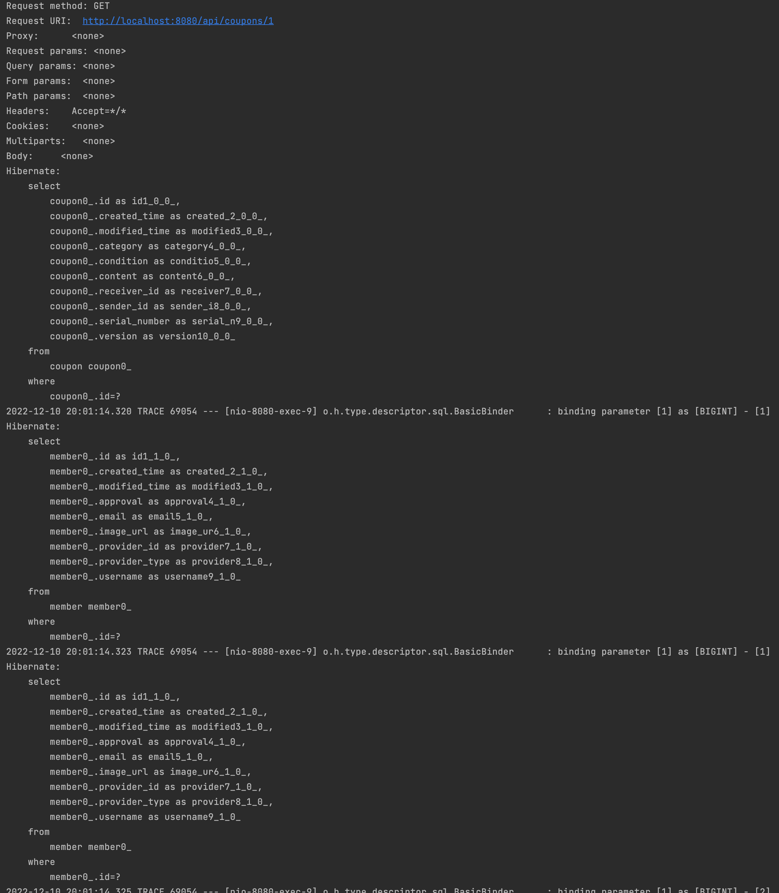

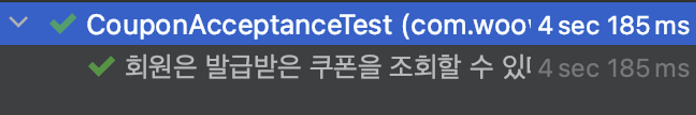

 

**캐시 적용 후**

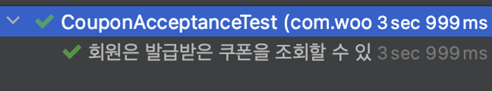

처음 메서드를 호출했을 때만 쿼리가 호출되고 이후로는 쿼리가 더 이상 호출되지 않는 것을 확인할 수 있습니다. 현재 테스트 상으로는 캐시로 인한 시간 절약이 거의 무의미한데, 실제 네트워크를 타게 된다면 훨씬 차이를 보일 것이라 예상하고 있습니다.

### 로컬 캐시 동기화 적용하기

이제 각 로컬 환경의 캐시들을 동기화 처리 해주기 위해서 레디스의 Pub/Sub를 이용한 동기화 작업을 해주도록 하겠습니다. 레디스를 사용하기 위한 `RedisTemplate`과 레디스에 발행된 데이터가 있는 확인할 수 있도록 `Listener`를 빈으로 등록해주도록 하겠습니다.

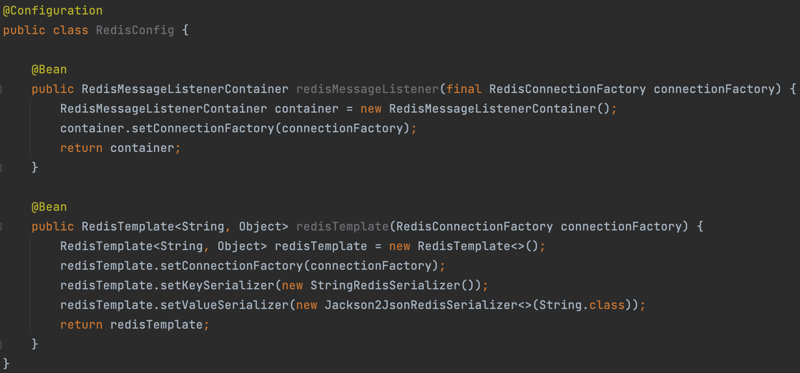

그리고 **메시지를 발행하는 기능**과 **구독하는 기능**을 각각 추가해주도록 하겠습니다.

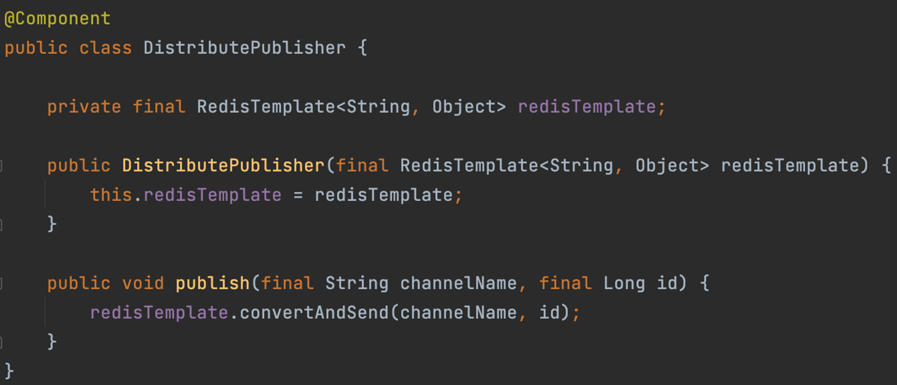

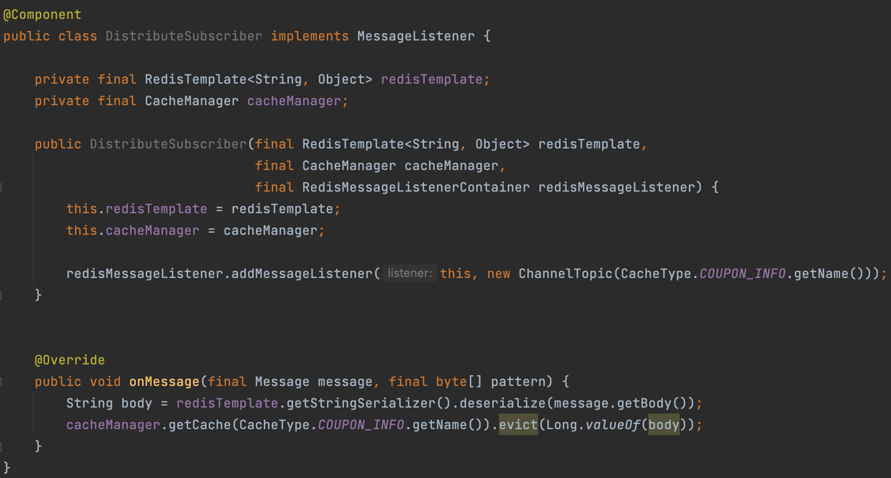

다른 애플리케이션에서 메시지를 발행하였을 때, 메시지를 구독하는 기능인 Subscriber 입니다. 생성하는 시점에서 `redisMessageListener`를 주입받은 후, `addMessageListener()`를 통해 **자기자신을 메시지 리스너로 등록하고 설정한 채널 토픽(캐시 이름)을 등록하도록 기능을 구현**합니다.

그리고 캐시 무효화가 필요한 비즈니스 로직에 이전에 구현한 Publisher를 주입받은 후, 해당하는 캐시의 채널 토픽과 키를 가지고 메시지를 발행하는 로직을 구현합니다. 이 메시지를 위에서 언급한 Subscriber가 받아 캐시를 `evict` 처리를 수행합니다.

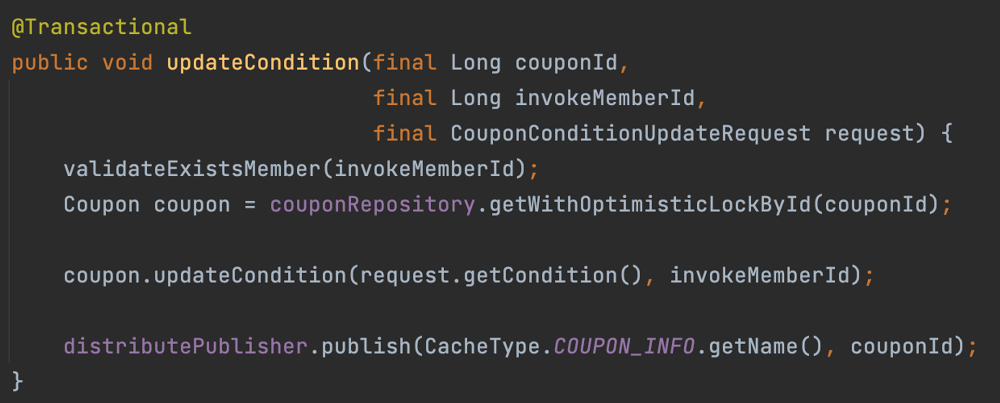

해당 과정을 통해 테스트를 수행하보면 정상적으로 각 서버의 로컬 캐시가 `evict` 처리가 이루어지는 것을 확인할 수 있습니다.

**WAS 1 에서 캐시 변경 작업**

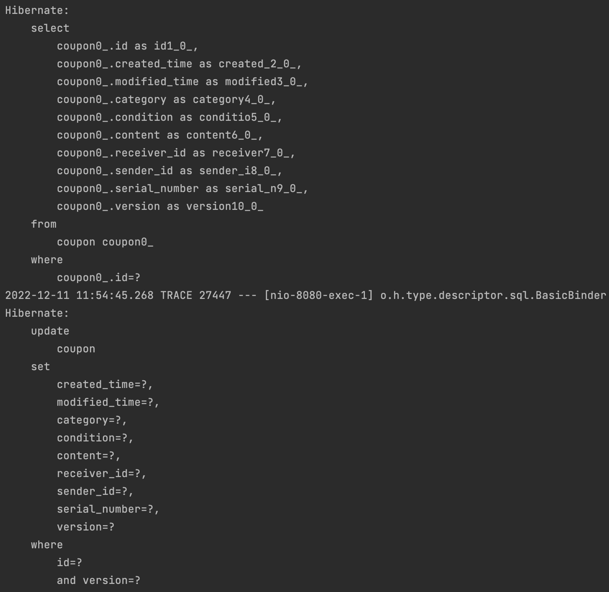

 

**WAS 2 에서 캐시가 evict 처리되어 데이터베이스 조회**

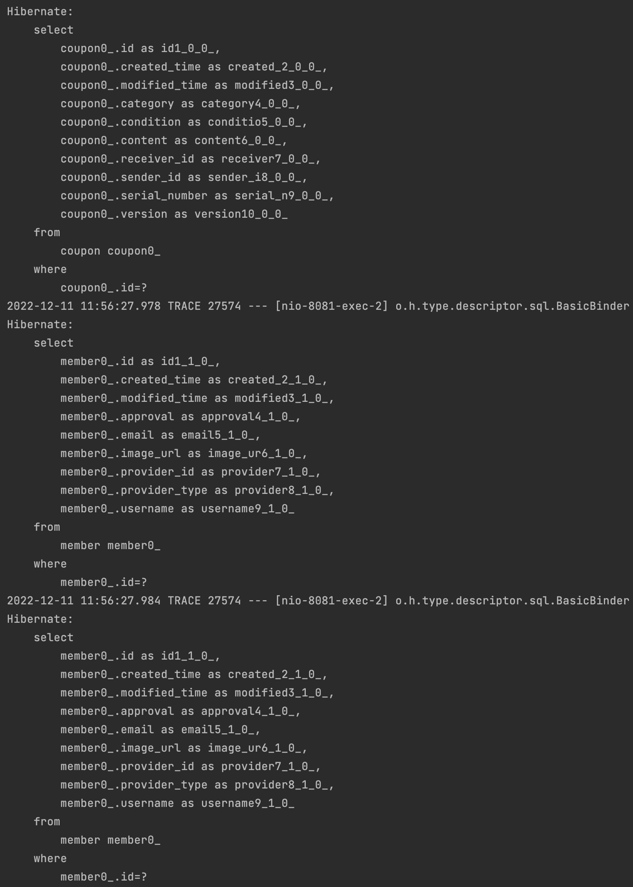

## 마무리

해당 과정들을 통해 실제 로컬 캐시를 적용해보고, 분산 환경에서 로컬 캐시를 동기화하는 과정을 구현해보았습니다. **하지만 최종적으로는 로컬 캐시의 Pub/Sub 기능을 사용하지 않기로 하였습니다.** 결국 캐시 갱신으로 인한 네트워크 비용이 발생하기 때문에 글로벌 캐시와 매우 유의미한 차이를 보이지 않은 것이라 생각했기 때문입니다. 오히려 상태 변경이라는 정합성이 조금 더 중요하기 때문에 레디스를 활용한 글로벌 캐시를 사용하는 것이 더 적절하다는 생각이 들어 해당 기능은 Deprecated 하였습니다.

추가적으로 레디스에 대해서 조금 더 공부를 해봐야겠다는 생각이 들었습니다. 기본적으로 어떠한 기능이 있다는 것을 알기만 상태에서 적용을 해보았는데 근본적으로 레디스는 어떠한 구조에서 동작하는지 등을 학습하여 조금 더 적절하게 사용할 수 있는 방법을 고민해봐야 할 것 같습니다.

## 참고

- [https://pompitzz.github.io/blog/Redis/LocalCacheSyncWithRedisPubSub.html#redis-pub-sub](https://pompitzz.github.io/blog/Redis/LocalCacheSyncWithRedisPubSub.html#redis-pub-sub)
- [https://docs.spring.io/spring-framework/docs/5.3.23/reference/html/integration.html#cache](https://docs.spring.io/spring-framework/docs/5.3.23/reference/html/integration.html#cache)
- [https://velog.io/@injoon2019/Caffeine-Cache-로컬-캐시-적용하기](https://velog.io/@injoon2019/Caffeine-Cache-%EB%A1%9C%EC%BB%AC-%EC%BA%90%EC%8B%9C-%EC%A0%81%EC%9A%A9%ED%95%98%EA%B8%B0)
- [https://brunch.co.kr/@springboot/151](https://brunch.co.kr/@springboot/151)
- [https://gngsn.tistory.com/157](https://gngsn.tistory.com/157)
- [https://medium.com/frientrip/pub-sub-잘-알고-쓰자-de9dc1b9f739](https://medium.com/frientrip/pub-sub-%EC%9E%98-%EC%95%8C%EA%B3%A0-%EC%93%B0%EC%9E%90-de9dc1b9f739)
