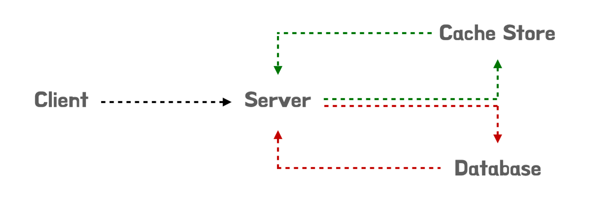
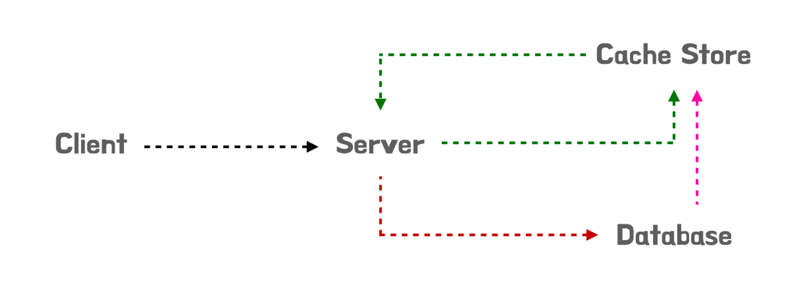

온라인 면접만 보다가 최근 처음으로 오프라인 기술 면접을 보게 되었습니다. 기술 질문 중 분산 환경에서의 캐시의 정합성을 어떻게 보장할 것인가에 대한 내용이 나왔었고 어찌어찌 대답은 했지만 썩 만족할만큼 대답을 하진 못했던 것 같습니다. 이번 글을 통해서 캐시에 대해서 한번 살펴보고 어떻게 구현을 해야할지 고민해보는 시간을 가져보려고 합니다.

## 캐시 전략이란?

캐시 전략은 웹 서비스 환경에서 시스템 성능 향상을 기대할 수 있는 중요한 기술입니다. 일반적으로 캐시는 메모리를 사용하기 때문에 기준의 RDMBS 보다 훨씬 빠르게 데이터를 응답할 수 있어 서비스 이용자들에게 빠르게 서비스를 제공할 수 있습니다. 따라서 어느 종류의 데이터를 캐시에 저장할지, 얼만큼 데이터를 캐시에 저장할지에 대해 “캐시 지침 전략”을 고민해볼 필요가 있습니다.

기본적으로 캐시를 호출하게 되면 `cache hit` 와 `cache miss`로 동작한다고 할 수 있습니다.

- cache hit : 캐시 스토어에 데이터가 있을 경우 바로 가져옴
- cache miss : 캐시 스토어에 데이터가 없을 경우 데이터베이스 에서 가져옴

캐시를 사용하게 되면 반드시 고려해야 하는 문제가 있습니다. 바로 **데이터 정합성** 입니다.

데이터 정합성이란, 어느 한 데이터가 캐시와 데이터베이스 두 곳에서 같이 관리되어 같은 데이터임에도 불구하고 **데이터 정보값이 서로 다른 현상**을 말합니다. 이전에는 그냥 데이터베이스에서 데이터 조회와 변경을 처리하였기 때문에 정합성 문제가 발생하지 않았지만, 캐시라는 다른 데이터 저장소를 이용하기 때문에 두 저장소에 저장된 값이 서로 다른 현상이 일어날 수 있는 것입니다.

이러한 기본 개념을 바탕으로 캐시 전략을 어떻게 수립할지 각 패턴에 대해서 한번 살펴보도록 하겠습니다.

## 캐시 전략의 패턴

### 캐시 읽기 전략 - Cashe Aside 패턴

데이터를 찾을 때 **우선 캐시에 저장된 데이터가 있는지 우선적으로 확인하는 전략**을 말합니다. 만일 캐시에 데이터가 없을 경우 DB에서 조회를 하는 방식으로 동작합니다.

읽기가 많은 경우에 적합하며, 가용성 측면에서 Cache 서버에 장애가 발생해도 데이터베이스를 통해 문제 없이 서비스를 운용할 수 있습니다. 다만 캐시에 붙어있는 Connection이 많다면 데이터베이스에 부하가 발생하는 문제가 생길 수 있습니다. 또한 Cashe 서버와 데이터베이스 간의 데이터 정합성 문제가 발생할 수 있으며, 초기 요청은 반드시 데이터베이스를 호출해야 하는 단점이 있습니다.

이 때문에 반복적으로 동일 쿼리를 수행하는 서비스에 적합한 아키텍처라고 할 수 있습니다.

### 캐시 읽기 전략 - Read Through 패턴

데이터를 찾을 때 **무조건 캐시에서만 데이터를 읽어오는 전략**을 말합니다. 만일 캐시에 데이터가 없을 경우 DB에서 조회를 하는 방식으로 동작합니다. Cashe Aside와 비슷하지만 데이터 동기화를 라이브러리 혹은 캐시 제공자에게 위임하는 방식이 차이점이 있습니다.

읽기가 많은 경우에 적합하며, 캐시와 데이터베이스의 데이터 정합성이 보장되기 때문에 정합성에 대한 고민을 하지 않고 서비스를 운용할 수 있습니다. 다만 캐시가 문제가 발생했을 경우 서비스 전체가 중단되어 버리는 문제가 발생할 수 있습니다. 이 때문에 캐시 스토어를 가용성 측면에서 Replication과 Cluster로 구성하여 문제가 없도록 설계해야 합니다.

즉, 반복적으로 동일 쿼리를 수행하는 서비스 중 정합성이 보장되어야 하는 서비스에 적합한 아키텍처라고 할 수 있습니다.

### 캐시 쓰기 전략 - Write Back 패턴

데이터를 저장할 때 **데이터베이스에 바로 저장하지 않고 캐시에 모아서 일정 주기로 배치 작업을 수행해서 데이터베이스에 반영하는 전략**을 말합니다.

한번에 데이터를 저장하기 때문에 쓰기 쿼리 커넥션의 회수 비용과 부하를 줄일 수 있어 쓰기가 빈번하면서 일기 작업시 많은 양의 자원이 소모되는 서비스에 적합하다고 할 수 있습니다. 또한 서버는 캐시만 바라보고 있기 때문에 데이터 정합성을 확보할 수 있습니다. 다만 캐시에서 오류가 발생할 경우 서비스 전체가 중단되는 문제가 있습니다. 이 때문에 캐시 스토어를 가용성 측면에서 `Replicaiton`과 `Cluster`로 구성하여 문제가 없도록 설계해야 합니다. 또한 자주 사용되지 않는 데이터가 저장되어 캐시의 리소스 낭비가 발생할 수 있기 때문에 `TTL`을 유의미하게 사용해야 합니다.

즉, 쓰기가 빈번하고 읽기 작업에 많은 리소스가 소모되면서 정합성이 보장되어야 하는 서비스에 적합한 아키텍처라고 할 수 있습니다.

### 캐시 쓰기 전략 - Write Through 패턴

데이터를 저장할 때 **캐시와 데이터베이스에 동시에 데이터를 저장하는 전략**을 말합니다.

캐시와 데이터베이스가 항상 동기화 되어 있어, 캐시의 데이터는 항상 최신 상태로 유지되기 때문에 안정적으로 데이터 정합성을 확보해야 하는 서비스에 적합하다고 할 수 있습니다. 다만 매번 두번의 쓰기 요청이 발생하기 때문에 빈번한 수정, 생성이 발생하는 서비스에서는 성능 이슈가 발생할 수 있습니다. 다만 자주 사용되지 않는 데이터가 저장되어 캐시의 리소스 낭비가 발생할 수 있기 때문에 `TTL`을 유의미하게 사용해야 합니다.

즉, 안정적으로 데이터 정합성을 보장해야 하는 서비스에 적합한 아키텍처라고 할 수 있습니다.

### 캐시 쓰기 전략 - Write Around 패턴

데이터를 저장할 때 데이터베이스에 데이터를 저장하는 전략을 말합니다.

캐시를 거치지 않기 때문에 속도가 매우 빠릅니다. 하지만 `cashe miss`가 발생해야만 데이터베이스와 동기화를 수행하기 때문에, 캐시와 데이터베이스간의 불일치가 발생할 수 있습니다. 이 때문에 저장된 데이터가 수정, 삭제될 때마다 캐시 또한 삭제하거나 변경하는 작업을 수행해야 하며, 캐시의 `Expire`를 짧게 조정하는 하도록 설계해야 합니다.

즉, 데이터가 한 번 쓰여지고, 덜 자주 읽어지는 서비스에 적합한 아키텍처라고 할 수 있습니다.

## 캐시 전략 조합해보기

일반적으로는 `Lock Aside` + `Write Around`를 사용하지만 정확성 보장이 되지 않습니다.

이러한 내용을 보안하기 위해 `Read Through` + `Write Around` 조합을 통해 데이터 정합성 이슈에 대한 안정 장치를 구성할 수 있습니다.

정말 정합성이 중요한 서비스라면, 항상 캐시에 데이터를 먼저 쓰는 방식인 `Read Through` + `Write Through` 방식을 통해 완전하게 데이터 정합성 문제를 해결하는 방법을 선택할 수 있습니다.

## 캐시 저장 방식 지침

캐시 솔루션은 자주 사용되면서 자주 변경되지 않는 데이터의 경우 캐시 스토어에 적용하여 반영할 경우 높은 성능 향상을 이뤄낼 수 있습니다. 이를 `Cashe Hit Rating` 이라고 합니다.

또한 캐시를 저장하는 곳이 **메모리이기 때문에 휘발될 수 있다는 점에 주의**를 해야합니다.

이러한 내용들을 바탕으로 캐시 스토어에 저장되는 내용은 중요한 정보, 민감 정보등은 저장하지 않는 것이 좋으며, 캐시 스토어가 장애가 발생했을 경우 대응할 수 있는 방안을 고려하여 설계하는 것이 바람직 합니다.

## 캐시 삭제 방식 지침

캐시에 저장된 데이터의 경우 캐시 서버에만 단독으로 저장되는 경우도 있을 수 있지만, 대부분의 경우 영구 저장소에 저장된 데이터를 바탕으로 하여 복사된 데이터를 기준으로 동작하는 경우가 많습니다. 즉, 영구 저장소의 데이터와 캐시 스토어의 데이터를 동기화 하는 작업이 반드시 필요하다고 할 수 있습니다.

만약 캐시의 만료 정책이 제대로 구현되지 않은 경우 클라이언트는 데이터가 변경되었음에도 오래된 정보가 캐싱되어 있어 데이터 정합성이 맞지 않는 문제가 발생할 수 있다고 할 수 있습니다.

따라서 캐시를 구성할 때는 기본 만료 정책을 구성해야 하며, 캐시된 데이터가 기간이 만료되면 데이터를 제거하고 원래의 영구 저장소에서 데이터를 검색해서 사용자에게 제공해야 합니다. 추가적으로 고려해야 할 점은 캐시의 만료 주기가 너무 짧으면 캐시를 사용하는 이점이 줄어들기 때문에 시스템에 맞게 적절한 만료주기를 구성하여 적용하는 것이 바람직 합니다.

## 캐시 공유 방식 지침

보통 분산 환경에서 어플리케이션을 운용하기 때문에 캐시는 여러 인스턴스에서 공유되어 사용됩니다. 이 때문에 각 어플리케이션에서 캐시의 데이터를 읽고 수정할 수 있습니다. 따라서 **캐시에 보관되어 있는 데이터 정합성에 문제가 발생**할 수 있습니다.

이를 해결하기 위해서 첫 번째로 고민한 방식은 캐시 데이터를 변경하기 직전에 데이터가 검색된 이후 변경되지 않았는지 확인하는 방법입니다. 변경되지 않았다면 즉시 업데이트를 하고, 변경되었다면 업데이트 여부를 애플리케이션 레벨에서 결정하도록 수정하는 방식을 취할 수 있습니다.

해당 방식은 업데이트가 적게 발생하고, 충돌이 잘 발생하지 않는 상황에서 적용하기 용이하다고 할 수 있습니다.

두 번째로 고민한 방법은 캐시 데이터를 업데이트 하기 전에 Lock을 잡는 방식입니다. 해당하는 경우 조금 더 안전하게 정합성 문제를 해결할 수 있지만 Lock으로 인해 대기현상이 발생하게 됩니다.

해당 방식은 데이터의 사이즈가 작아 빠르게 업데이트가 가능한 업무와 빈번한 업데이트가 발생하는 상황에 적용하기 용이하다고 할 수 있습니다.

## 마무리..

기본적으로 캐시에 대해서 어떻게 사용해야 하는지, 전략은 어떤 방식이 있는지 알아볼 수 있는 시간이였습니다. 이후로는 단일 서버와 분산 서버 환경에서 어떻게 캐시를 구현하는지, 가용성을 올리기 위해서는 어떤 부분을 고민해야 하는지를 계속 학습해보려고 합니다.

## 참고

- [https://inpa.tistory.com/entry/REDIS-📚-캐시Cache-설계-전략-지침-총정리](https://inpa.tistory.com/entry/REDIS-%F0%9F%93%9A-%EC%BA%90%EC%8B%9CCache-%EC%84%A4%EA%B3%84-%EC%A0%84%EB%9E%B5-%EC%A7%80%EC%B9%A8-%EC%B4%9D%EC%A0%95%EB%A6%AC)
- [https://learn.microsoft.com/ko-kr/azure/architecture/patterns/cache-aside](https://learn.microsoft.com/ko-kr/azure/architecture/patterns/cache-aside)
- [https://dzone.com/articles/using-read-through-amp-write-through-in-distribute](https://dzone.com/articles/using-read-through-amp-write-through-in-distribute)
- [https://brunch.co.kr/@springboot/151](https://brunch.co.kr/@springboot/151)
