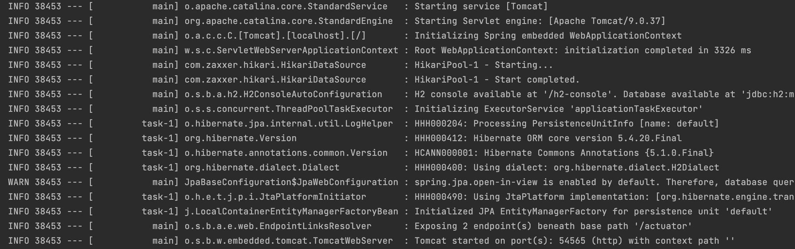
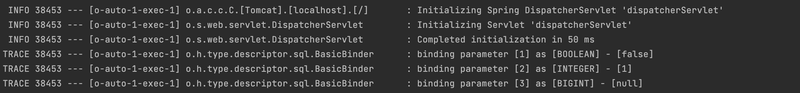
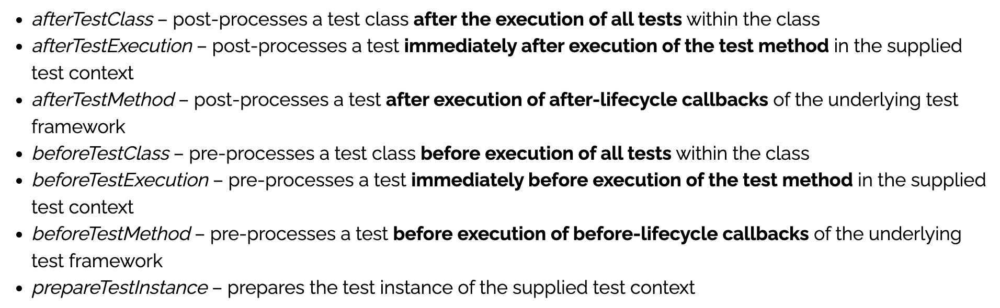
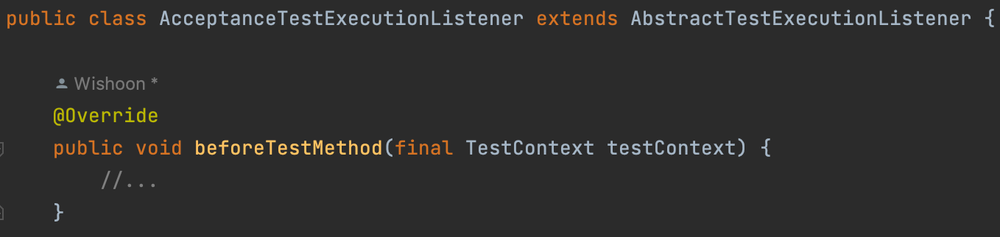
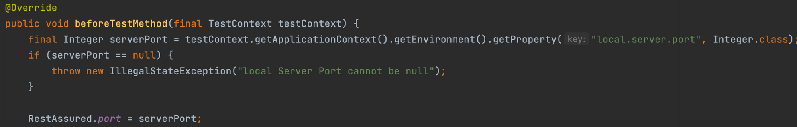
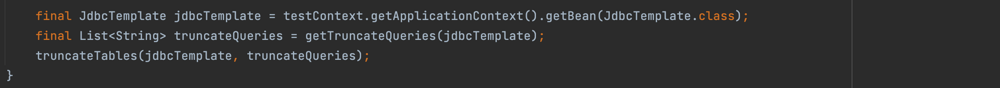
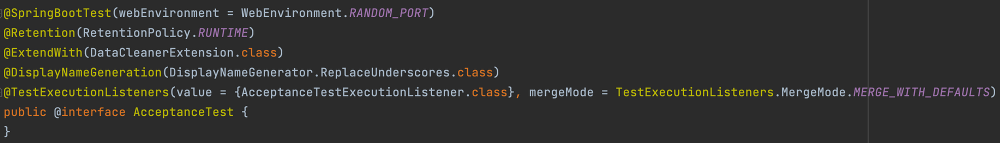

테스트 격리를 위해서는 데이터를 롤백시키는 과정이 필요합니다. 하지만 이 과정에서 잘못된 방법을 사용할 경우 몇가지 문제가 발생할 수 있는데요. 이번 포스팅에서는 문제가 생길 수 있는 상황들과 테스트 격리 방법을 조금 더 고도화하기 위해서 고민했던 내용에 대해서 작성해보려고 합니다.

## SpringBootTest는 @Transactional로 롤백되지 않을 수도 있다

`@DataJpaTest`를 사용하면 영속성 계층에 대해서 편리하게 테스트를 할 수 있습니다. `@DataJpaTest` 안에 `@Transactional`이 있어서 테스트가 끝나면 트랜잭션을 롤백시키기 때문에, 각각의 테이블이 비워지면서 모든 테스트가 격리되게 됩니다.

그렇다면 `@SpringBootTest`에서는 어떻게 데이터를 롤백해야 할까요?? `@SpringBootTest`를 보면 `@Transactional`이 사용되지 않고 있습니다. 그렇다면 `@Transactional`만 잘 추가해주면 롤백이 잘 수행된다고 할 수 있을까요??

### SpringBootTest의 테스트 환경

기본적으로 `@SpringBootTest`는 서버를 시작하지 않습니다. 그래서 `webEnvironment` 설정을 통해 테스트를 어떤 환경에서 시작할 건지 설정을 할 수 있습니다. 설정값은 다음과 같습니다.

- MOCK (default) : 내장 서버가 실행되지 않는다. mock 기반 테스트를 실행
- RANDOM_PORT : 랜덤 포트 번호로 실제 웹 서버와 함께 WebServerApplicaitonContext가 로드됨
- DEFINE_PORT : 설정된 포트 번호로 실제 웹 서버와 함께 WebServerApplicaitonContext가 로드됨
- NONE : SpringApplicaiton을 통해 ApplicaitonContext를 로드하지만 어떠한 웹 환경도 제공하지 않음

여기서 실제 서블릿 환경을 실행시키기 위해 `RANDOM_PORT`와 `DEFINE_PORT`로 설정을 하고 `@Transactional`을 작동시키면 롤백이 되지 않는 것을 확인할 수 있습니다. 즉, 테스트들이 격리되지 않아서 전체 테스트에 실패를 하게 됩니다. 왜 이런 현상이 발생하게 되는 걸까요??





이렇게 **서블릿 환경을 실행시키게 되면, 별도의 스레드에서 스프링 컨테이너가 실행**되게 됩니다. 이후 테스트가 종료되고 나서 이를 롤백시키기 위해서는, 하나의 트랜잭션으로 묶여야 하는데, **스프링 컨테이너가 실제로 구동되어 테스트와 다른 스레드에서 실행이 되게 되어 `@Transactional`을 적용해도 롤백이 되지 않는 것**입니다.

### 테스트 환경 격리시키기

결국 실제 서블릿 환경을 실행시키는 인수 테스트를 할 때는, 모든 테이블의 데이터를 삭제해서 초기화해주는 방법이 가장 깔끔한 것 같습니다. 이를 구현하기 위해서 많은 방법들이 있겠지만 저는 `TRUNCATE` 명령어를 통해서 모든 테이블의 데이터를 제거해주도록 하겠습니다.

`TRUNCATE`를 활용한 테스트 격리는 다음 순으로 이루어집니다.

1. 테스트가 끝나면 모든 테이블에 대한 TRUNCATE TABLE 명령어를 얻어옴
2. 제약조건 무호화 명령어 실행
3. 모든 TRUNCATE TABLE 명령어를 실행시킴
4. 제약조건 재설정 명령어를 실행시킴

위의 방법들을 이용해서 `TRUNCATE` 명령어를 수행하는 로직을 구현하는 것 까지는 일반적으로 할 수 있습니다. `JPA`의 `EntityManager`를 통해서 구현할 수도 있고, `JPA` 의존이 싫다고 하면 `JdbcTemplate`을 통해서 작성도 가능합니다.

하지만 이를 적용하기 위해서는 구현한 클래스에 대해서 모든 테스트 클래스에 상속을 적용해줘야 합니다. 상속 자체가 나쁜건 아니지만, 꼭 필요한 시점에 다른 상속이 필요할 때도 있고, 상위 `AcceptanceTest`에 어떠한 다른 코드가 추가되어 기존 인수 테스트에 영향을 줄 수 있는 여지가 있기 때문에 상속보다는 다른 방법으로 이를 해결하고 싶었습니다.

이를 해결하기 위해서 `TestExecutionListener`, `Custom Annotation`, `Environment`를 활용하면 상속을 사용하지 않고도 인수테스트 환경을 구성할 수 있습니다. `Spring`은 테스트의 실행 주기에 개입할 수 있도록 리스너 인터페이스인 `TestExecutionListener` 를 제공하고 있습니다. 이 구현체를 만들어 테스트 실행 시점에 등록한다면 특정 시점에 개입 할 수 있게 됩니다.  제공되는 각각의 메서드들은 다음과 같습니다.



여기서 우리는 각각의 테스트들이 실행되기 전 `TRUNCATE`를 해주면 되기 때문에 `beforeTestMethod`를 이용해서 구현을 하면 되겠습니다.

추가적으로 자바 8 이후로 등장한 `AbstractTestExecutionListener`를 사용한다면 필요한 메서드만 오버라이딩 해서 사용할 수 있습니다.



여기서 저희가 작성해야 할 기능은 크게 두 가지입니다. 하나는 기존과 같이 `TRUNCATE`를 해주는 기능이고, 또 하나는`RestAssured`을 수행하기 위해서 사용할 `Port`를 등록해주는 것입니다. `Environment` 를 통해 이러한 Port를 얻어올 수 있습니다.



그리고 기존과 동일하게 `TRUNCATE` 기능을 작성해주겠습니다.



지금까지 만든 `TestExecutionListener`를 테스트 실행 시에 등록하기 위해서 `@TestExecutionListeners`를 사용해주면 됩니다. 같이 사용한 `mergeMode` 속성은 `Default` 로 존재하는 다른 리스너들을 대체할 것인지를 설정하는 것인데, `Default` 리스너를 함께 사용하도록 하면 됩니다.

그리고 `Custom Annotation`을 만들어 각 인수테스트에서 사용하도록 하면 깔끔하게 테스트 환경을 격리시킬 수 있습니다.



## AcceptanceTest가 아닌 다른 테스트에서의 @Transactional

위의 인수테스트에서는 `@Transactional`을 사용하지 않고 테스트를 수행했습니다. 그렇다면 `Random Port`를 사용하지 않아도 괜찮은 `Application Layer`에서는 `@Transactional`을 사용해도 괜찮을까요?? 다음 상황을 통해 한번 살펴보도록 하겠습니다.

### 운영 코드와 테스트 코드의 괴리

만약 운영코드에 실수로 `@Transactional`을 작성하지 않았다고 가정해보겠습니다. 아니면 작성이 되어있다가 운영코드에서 `@Transactional`이 지워지는 상황도 발생할 수 있겠네요. 이렇게 될 경우, `LazyInitializationException` 이 발생하게 됩니다.

이유는 생각보다 간단합니다. 서비스 계층에서 트랜잭션이 걸려있지 않아 `Lazy Fetching`이 불가능하기 때문입니다. `@Transactional`이 존재하지 않아 세션이 이미 종료된 상태인데 `DataBase`에 `Lazy`로 또 접근하려 하기 때문입니다.

하지만 테스트는 정상적으로 작동하게 됩니다. **그 이유는 테스트 환경에서는 `@Transactional`이 작성되어 있기 때문에 세션이 유지되기 때문**입니다. 이러한 구조는 운영 코드와 테스트 코드간에 괴리를 유발하며, 추후 장애가 발생할 수 있는 요인 중 하나라고 할 수 있습니다.

### 영속성 컨텍스트에서 새로운 데이터가 조회되지 않을 수 있다

보통 `JPA`를 사용한 프로젝트에서 테스트 코드에 `@Transacitonal`을 붙이게 되면, 메서드 단위로 트랜잭션이 적용되게 됩니다. 이는 **테스트 대상의 메서드가 트랜잭션을 이어받게 됨을 의미**하는데요. 이 경우 **트랜잭션 커밋이 메서드 종료시점에 수행**되므로 `Repository`를 통해 객체를 조회할 때 예상과 다르게 조회가 될 수 있습니다.

```kotlin
@Transactional
@SpringBootTest
class CouponService @Autowired constructor(
    private val couponService: CouponService,
    private val couponRepository: CouponRepository,
    private val userRepository: UserRepository,
    private val userHistoryRepository: UserHistoryRepository,
) {
    @Test
    fun createCoupon() {
        // given
        couponRepository.save(Coupon("커피 쿠폰"))
        val savedUser = userRepository.save(User("루키", null))
        userHistoryRepository.save(UserHistory(savedUser, "커피 쿠폰"))
        val request = CouponResponse("루키", "커피 쿠폰")

        // when
        couponService.returnCoupon(request) 

        // then
        val results = userHistoryRepository.findAll()
        assertThat(results).hasSize(1)
    }
}
```

위의 코드 중, `couponService.returnCoupon()`은 `userRepository.findById()`을 호출해서 `User` 객체를 가져오게 되는데, 가져온 `User` 객체는 영속성 컨텍스트에서 캐싱된 객체로서 아직 `userHistory` 컬렉션에 객체가 추가되지 않은 상태입니다. 이러한 현상은 `userHistoryRepository.save()` 가 **상위 트랜잭션을 이어받아 하나의 트랜잭션에서 수행되어 커밋이 일어나지 않았기 때문**입니다.

이를 해결하는 방법은 간단합니다. `@Transactional`을 제거한다면, 새로운 트랜잭션에서 요청이 수행되면서 정상적으로 테스트가 성공하게 됩니다.

## 마무리

이 포스팅 주제와는 관련이 없는데, 레벨 2 쯤이였나.. 주말에 수달이랑 프롤로그 근로 때문에 인수테스트를 같이 살펴보고 있었는데 지나가던 포비가 말을 걸어주셔서 인수테스트 관련으로 잠깐 얘기한 적이 있었습니다. 당시 인수테스트의 가독성 향상과 속도 향상에 빠져있던 시기라 포비에게 이것저것 여쭤봤었고, 그 중에 한가지가 기억이 남았습니다.

**‘현업에서도 인수테스트에 대해서 고민을 많이하고, 지금의 코드처럼 상속을 통해서 해결하기도 해요. 하지만 상속으로 하면 제약사항이 생기게 되잖아요?? 이 부분에 대해서 한번 고민해보는 것도 좋을 것 같아요.’**

당시에 이 말을 듣고, 여려 방면으로 인수테스트에서의 상속 제거에 대해서 고민해보고 시도해봤는데 번번히 실패를 했어서 잠시 포기를 했었습니다… 그러다가 최근 구구의 JdbcTemplate 미션 때문에 검색하던 도중 `AbstractTestExecutionListener`라는 방법과 `Property`를 가져올 수 있는 방법을 알게되어서 이 문제를 해결할 수 있었습니다.

아직 인수 테스트에서의 제가 고민하고 있는 부분들은 완벽하게 해결되지는 않았습니다. **테스트의 가독성이라는 고민**은 계속해서 남아있는 상황인데, 프롤로그에서 사용하고 있는 `BDD` 기반의 `Cucumber`를 사용하지 않고도 가독성있게 테스트를 작성할 수 있는 방법을 계속 고민해보고 시도해보려고 합니다.

> 참고
>
- [https://docs.spring.io/spring-boot/docs/2.1.6.RELEASE/reference/html/boot-features-testing.html](https://docs.spring.io/spring-boot/docs/2.1.6.RELEASE/reference/html/boot-features-testing.html)
- [https://www.baeldung.com/spring-testexecutionlistener](https://www.baeldung.com/spring-testexecutionlistener)
- [https://github.com/next-step/atdd-subway-path](https://github.com/next-step/atdd-subway-path)
- [https://github.com/woowacourse/jwp-refactoring/pull/334/commits/2fa9080066998b4c7e4ba36e3aab7d99433f9861](https://github.com/woowacourse/jwp-refactoring/pull/334/commits/2fa9080066998b4c7e4ba36e3aab7d99433f9861)