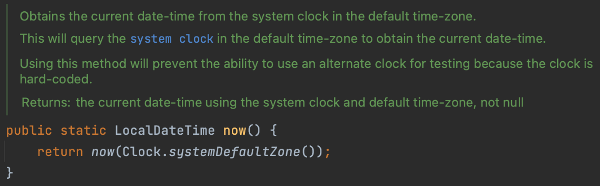
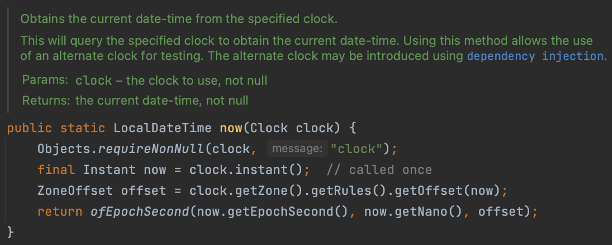
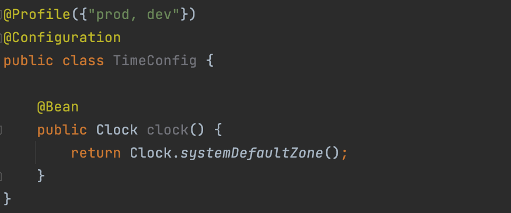
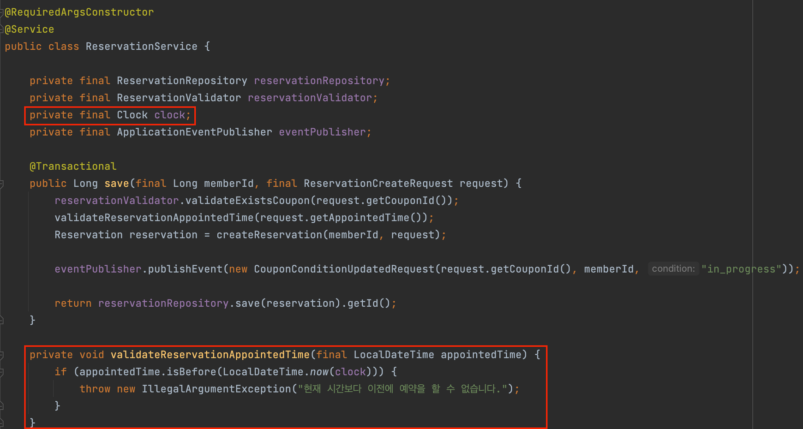
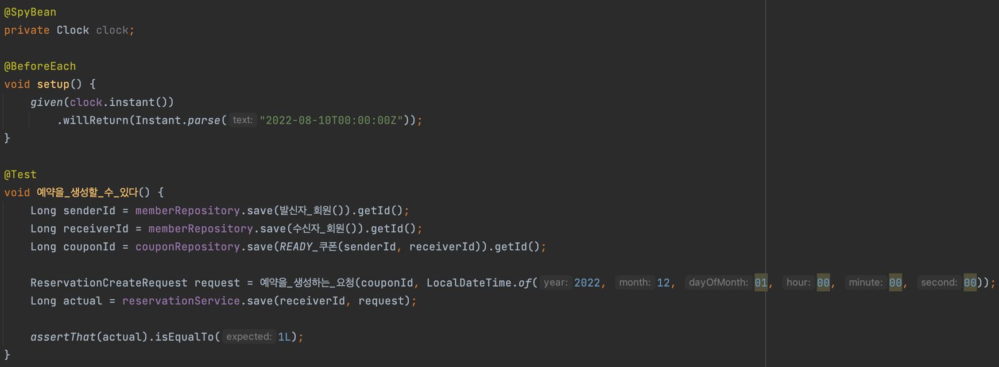
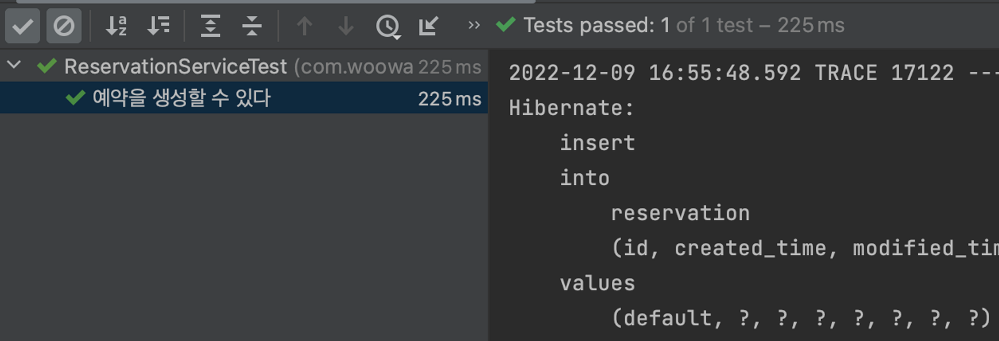
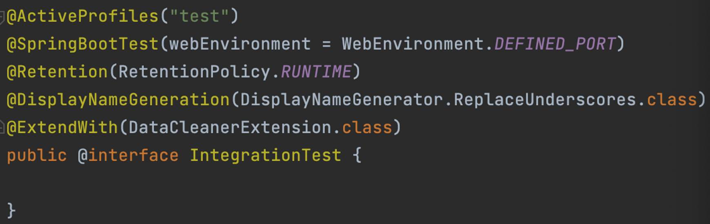
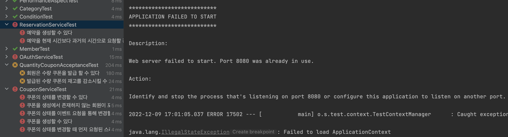
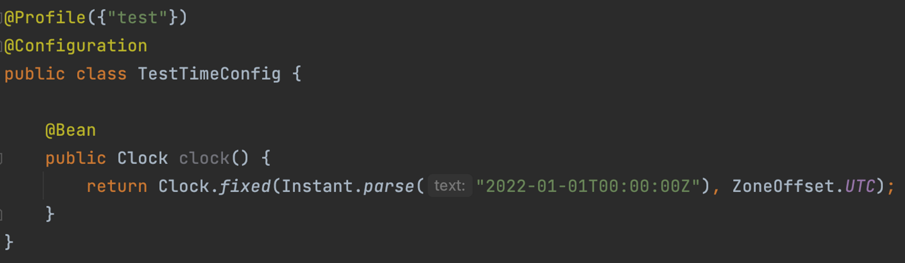

현재 우아한테크코스 기간동안 진행했던 프로젝트인 “꼭꼭” 프로젝트를 개선하는 작업을 개인적으로 해보고 있습니다. 개선사항으로 느꼈던 부분 중 하나가 바로 “현재 시간을 검증해야 하는 로직”이였는데요. 이번 글에서는 해당 부분을 개선하기 위해서 어떤 방법을 고민했었는지를 작성해보는 시간을 가져보려고 합니다.

## 문제 사항은 무엇인가?

제작하고 있는 어플리케이션은 쿠폰을 발급하고, 사용을 신청하고, 사용을 승인하는 상태 변경 흐름을 기반으로 동작하게 됩니다. 이때 발급된 쿠폰에 대하여 사용 신청을 하는 로직을 구성하면서 몇가지 고민 상황을 만나게 됩니다.

## 고민 1. 시간을 검증하는 책임을 어디에 둘 것인가?

### 생성자에서 검증하기

비즈니스 로직을 작성하면서 가장 먼저 만났던 문제는 **“시간을 검증하는 책임을 어디에 맡길 것인가?”** 였습니다. 현재 검증하고자 하는 시간은 **“예약을 할 때 필요한 시간”**입니다. 예약시간은 현재 시간 이전으로는 설정할 수 없다는 비즈니스 로직을 가지기 때문에, 객체 응집도를 위해서 **도메인 내부에서 검증**을 하는 것이 좋을 것이라 생각하였습니다.

```java
public class Reservation {
    // ...
    public Reservation(final Long id,
                       // ...
                       final LocalDateTime appointedTime,
                       final Condition condition) {
        validateReservationAppointedTime(appointedTime);
        this.id = id;
        this.appointedTime = appointedTime;
        this.condition = condition;
    }

    private void validateReservationAppointedTime(final LocalDateTime appointedTime) {
        if (appointedTime.isBefore(LocalDateTime.now())) {
            throw new IllegalArgumentException("현재 시간보다 이전에 예약을 할 수 없습니다.");
        }
    }
}
```

하지만 이러한 설계는 한 가지 문제를 가지게 됩니다. 바로 예약 도메인을 반환할 때 문제가 생기는 것인데요. 위의 로직을 보게 되면 생성자에서 이를 검증해주고 있습니다. 예약을 생성하는 로직에서는 이러한 검증은 올바르다고 할 수 있지만, **예약을 조회하는 로직에서 해당 검증은 적절**하다고 할 수 있을까요??

예약을 한 시간보다 이후에 예약을 조회하는 경우 해당 검증으로 인해 예외가 발생할 수 밖에 없습니다. 이러한 문제상황 때문에 생성자에서 `Validate`를 하는 것은 적절하지 못하다는 판단을 하게 되었습니다.

### Domain Layer의 정적 팩터리 메서드를 활용해 검증하기

그렇다면 예약을 생성하는 로직에만 시간 검증을 포함해주면 발생하고 있는 문제를 해결할 수 있을 것이라 생각하였습니다. 다음과 같이 **예약을 생성하는 정적 팩터리 메서드를 활용**한다면 문제를 해결할 수 있을 것 같습니다.

```java
public class Reservation {
    // ...

    public Reservation(final Long id,
                       // ...
                       final LocalDateTime appointedTime,
                       final Condition condition) {
        this.id = id;
        this.appointedTime = appointedTime;
        this.condition = condition;
    }

    public static Reservation create(final Long id,
                                     // ...
                                     final LocalDateTime appointedTime,
                                     final Condition condition) {
        validateReservationAppointedTime(appointedTime);
        return new Reservation(id, ..., appointedTime, condition);
    }

    private void validateReservationAppointedTime(final LocalDateTime appointedTime) {
        if (appointedTime.isBefore(LocalDateTime.now())) {
            throw new IllegalArgumentException("현재 시간보다 이전에 예약을 할 수 없습니다.");
        }
    }
}
```

하지만 해당 로직을 사용하기에는 몇가지 문제점이 있었는데요. 뒤에서도 설명하겠지만 첫번째로는 **`LocalDateTime`을 사용하는 테스트 로직에서 문제가 발생**합니다. 이는 뒤에서 자세하게 설명하겠습니다.

두번째로는 **객체 생성을 할 수 있는 기능이 두 곳이라는 점**입니다. 생성자로도 예약을 생성할 수 있고, 정적 팩터리 메서드로도 예약을 생성할 수 있기 때문에 협업을 하는 프로젝트에서는 착각의 소지를 줄 수 있는 여지를 남기게 됩니다. 이러한 점 때문에 정적 팩터리 메서드를 사용하는 방법에 대해서도 반려를 하게 되었습니다.

### Application Layer에서 검증하기

마지막으로 고민한 방법이면서 최종 채택한 방법으로 **`Application Layer`에서 검증하는 방법**을 선택하였습니다. 사실 어찌보면 가장 단순한 해결책이라고 할 수도 있습니다. 하지만 무분별하게 `Application Layer`에서 검증을 수행하게 되면 도메인 로직이 외부로 드러나게 되고, 응집도가 낮아지는 문제가 발생할 수 있기 때문에 정말 필요할 때만 이를 사용하고 있습니다.

해당 기능에서 `Application Layer`에서 시간 검증을 수행한 이유는 다음과 같습니다.

- 예약을 생성하는 로직에서 현재 시간을 검증하는 로직은 오직 한 곳에서만 이루어진다.
- 시간 관련 테스트가 수월해진다. (뒤에서 설명)
- 예약을 생성하는 요청에 대한 검증이기 때문에 어떻게 보면 도메인 검증이라고 보기 어려울 수 있다.

다음과 같은 내용들을 근거로 해서 최종적으로 `Application Layer`에서 시간 검증을 수행해주기로 하엿습니다.

```java
@RequiredArgsConstructor
@Service
public class ReservationService {

    private final ReservationRepository reservationRepository;
    private final ReservationValidator reservationValidator;
  
    @Transactional
    public Long save(final Long memberId, final ReservationCreateRequest request) {
        reservationValidator.validateExistsCoupon(request.getCouponId());
        validateReservationAppointedTime(request.getAppointedTime());
        Reservation reservation = createReservation(memberId, request);

        return reservationRepository.save(reservation).getId();
    }

    private void validateReservationAppointedTime(final LocalDateTime appointedTime) {
        if (appointedTime.isBefore(LocalDateTime.now(clock))) {
            throw new IllegalArgumentException("현재 시간보다 이전에 예약을 할 수 없습니다.");
        }
    }
}
```

## 고민 2. 현재 시간을 검증하는 로직을 어떻게 구성할 것인가?

사실 이번 글의 핵심이라고도 할 수 있습니다. 검증을 수행해야 하는 부분이 **“현재 시간”**은 매번 테스트할 때마다 시간이 달라지기 때문입니다. 따라서 **지금 작성한 테스트 코드가 시간이 지나면 실패하는 테스트 코드로 변경**될 수 있습니다. 어떻게 하면 위의 문제를 해결할 수 있을까요??

### LocalDateTime.now()는 모킹이 가능할까??

일차적으로는 `LocalDateTime.now()` 에 대한 값을 모킹하는 것을 고려해볼 수 있습니다. 하지만 Mockito의 코어 라이브러리는 `mockito-core` 에서는 `LocalDateTime.now()` 와 같은 `static method`를 모킹하는 기능을 기본적으로 제공하지 않습니다.

왜 `static method`에 대해서 모킹하는 기능을 제공하지 않을까요?? 이를 가능하게 하려면 추가적인 라이브러리를 적용해야 하고, private 메서드, final 클래스 등이 테스트가 가능한 상태가 되어버립니다. 즉 `private method`도 테스트할 수 있는 상태가 되어버리기게 됩니다. `private method`에 대한 테스트 불필요성은 검색만 해보면 쉽게 확인할 수 있기 때문에 생략하도록 하겠습니다.

### Clock을 통한 문제 해결

`LocalDateTime.now()`의 코드를 확인해보면 밑의 사진과 같은 코드를 확인할 수 있습니다.



해당 코드를 확인해보면 `Clock`이라는 클래스를 확인할 수 있습니다. `now(Clock.systemDefaultZone());`을 확인해보면 접근 제어자가 `public`으로 되어있는 것을 확인할 수 있습니다.



즉, 매개변수인 `Clock`을 `Bean`으로 등록하여 우리가 원하는 시간으로 설정한다면 `LocalDateTime.now()`을 우리가 원하는 결과로 만들 수 있을 것으로 보입니다.

그러면 하나씩 적용을 해보도록 하겠습니다. 앞에서 언급한 것처럼 `Clock`을 빈으로 등록해 줍니다.



그리고 `Application Layer`에서 검증을 위해 사용되고 있는 `LocalDateTime.now()`에 매개변수 `Clock`을 넣어줍니다.



그리고 해당 로직을 검증할 테스트 코드에서 `clock.instant()`를 모킹하여 우리가 원하는 시간으로 변경하는 작업을 수행해줍니다.



이러한 작업을 통해 성공적으로 현재 시간에 대한 테스트를 수행할 수 있습니다.



## 고민 3. 해당 검증을 하는 테스트 환경을 어떻게 구성할 것인가?

### Mocking으로 인한 테스크 코드 실행시간의 문제

일반적으로는 위의 방법을 통해 문제를 해결할 수 있지만 한 가지 고려해야 할 점이 있습니다. 바로 `Mocking`을 한다는 점입니다. Mocking을 하게 되면 기본의 빈과는 다르기 때문에 `Spring Context`가 새로 띄어지게 됩니다. 이는 곧 **테스트 코드 실행 시간의 증가를 의미**합니다.

실제로 실행 로그를 통해 확인해보면 새로운 `Spring Context`가 띄워지는 것을 확인할 수 있습니다.


<br>


### 프로젝트 테스트 구성 환경의 문제

현재 통합 테스트의 환경을 설정하는 애노테이션인 `@IntegrationTest`는 `DEFINED_PORT`를 사용하고 있습니다.



이 때문에 같은 환경 내에서 한번 더 `Spring Context`가 띄워질 경우 포트 충돌이 발생하게 됩니다.



이러한 문제를 해결하기 위해 저는 테스트 환경에서 하나의 `LocalDateTime.now`를 가지도록 해주기 위해서 `Clock`을 빈으로 등록하는 시점에 시간을 설정하는 방법을 선택하였습니다.



이를 통해 `Clock`을 모킹할 때 마다 `Spring Context`가 새로 띄워지는 문제를 제거하여 테스트 코드 실행 시간을 단축할 수 있었고, 전체 테스트를 구동했을 때 포트 충돌이 발생하는 문제를 해결할 수 있었습니다.

하지만 해당 방법이 완벽한 것은 아닙니다. 모킹된 `LocalDateTime`이 전역적으로 모든 테스트에 설정된다는 점인데요. 이 때문에 협업 시에 문제가 발생할 수 있습니다. 이러한 부분은 `Trade-Off` 라고 보고 있는데, 문서화를 통해 같이 작업하는 사람들에게 미리 공지를 하는 방법으로 해결을 할 수 있을 것이라 생각합니다.

## 참고

- [https://stackoverflow.com/questions/68340718/mockito-mock-static-function-does-not-work-if-the-function-is-called-in-a-thread](https://stackoverflow.com/questions/68340718/mockito-mock-static-function-does-not-work-if-the-function-is-called-in-a-thread)
- [https://docs.oracle.com/javase/8/docs/api/java/time/LocalDate.html#now-java.time.Clock-](https://docs.oracle.com/javase/8/docs/api/java/time/LocalDate.html#now-java.time.Clock-)
